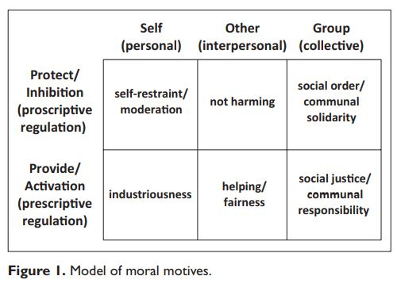

# Week 10
This week, we will be discussing how understanding studying morality can inform political disagreement and bridge divides.

.highlight-blue[In week 10:]

- **Why do conservatives and liberals disagree on so many moral issues?**
- What is similar about the moral minds of liberals and conservatives?
- Is it possible to compromise on political issues?

---

# Activity

.pull-left[ 
**Instructions**: For each issue on the right, consider the following: 

1. In the US, where do liberals and conservatives typically stand on the issue?

2. Are the stances *moral* ones on both sides? 

After you're done...

3. What unites these platforms? 

]
.pull-right[

  
**.red[`Issues`]**

Abortion 

Taxes

Immigration

Gay marriage

Climate Change

Gun reform]

---
# Republicans and Democrats

.pull-left[.tiny-picture-center[]  

Pro-life

Lower taxes

Build a wall

Traditional marriage

Doubts climate change is real

Right to bear arms
]

.pull-right[.tiny-picture-center[]  

Pro-choice

Tax to pay for social programs

Expand paths to citizenship

Marriage is a right for all

Climate change is a real and present threat

Reform gun laws
]

---
#Four perspectives

Today, we are going to talk about four perspectives on why liberals and conservatives tend to take opposing stances on moral issues

- Moral intuitions 
 
- Moral motives 

- Moral metaphors 

- Moral circles 
---

# Moral intuitions
.footnote[Haidt & Joseph (2007); Koleva et al. (2012)]

**Moral foundations theory** posits that there are (at least) six moral intuitions
.smaller[- **Harm/care** - We should care for and not harm vulnerable others.
- **Fairness/cheating** - We should get back what we put forward; we should not cheat.
- **Ingroup/ betrayal** - We should be loyal to our groups (e.g., family, nation).
- **Authority/ subversion** - We should respect authority and tradition.
- **Purity/ Degradation** - We should not violate norms of decency and purity by doing certain things with our bodies.
- **Liberty/ Oppression** - People should not restrict the freedom of others.

]
  

---
# Moral intuitions
#### The moral foundations questionaire
.footnote[Graham, Haidt, & Nosek (2009)]
When you decide whether something is right or wrong, to what extent are the following considerations relevant to your thinking? 1 = not at all relevant TO 5 = extremely relevant 

.smaller[
1. Whether or not someone suffered emotionally. (Care) 
2. Whether or not someone acted unfairly. (Fairness) 
3. Whether or not someone did something to betray his or her group. (Ingroup) 
4. Whether or not someone showed a lack of respect for authority. (Authority) 
5. Whether or not someone violated standards of purity and decency. (Purity)
]
---
# Moral intuitions 
.footnote[Graham, Haidt, & Nosek (2009)]

####Results

.smallish-centered-picture[]

---
# Moral intuitions
.footnote[Graham, Haidt, & Nosek (2009)]

####Moral trade-offs

> Try to imagine actually doing the following things, and indicate how
much money someone would have to pay you (anonymously and
secretly) to be willing to do each thing. For each action, assume that
nothing bad would happen to you afterwards. Also assume that you
cannot use the money to make up for your action.

**Options**: $0 (I’d do it for free), $10, $100, $1,000, $10,000, $100,000, a million dollars, and
never for any amount of money.
---
# Moral intuitions 
.footnote[Graham, Haidt, & Nosek (2009)]

#### Moral trade-offs

.left-column-black-text[.blue[
$0 (I’d do it for free)   $10   $100   $1,000  $10,000   $100,000   a million dollars  
never for any amount of money]]

.right-column-black-text[.smallish[Kick a dog in the head, hard. ________

Say no to a friend’s request to help him move into a new apartment, after he helped you move the month before. ________

Burn your country’s flag, in private (nobody else sees you) ________

Slap your father in the face (with his permission) as part of a
comedy skit. ________

Attend a performance art piece in which all participants (including
you) have to act like animals for 30 minutes, including crawling
around naked and urinating on stage. ________]]

???

Give them time to fill it out
---
# Moral intuitions
.footnote[Graham, Haidt, & Nosek (2009)]

####Results

.smallish-centered-picture[]

???

Average amount required to violate foundation-related taboo trade-offs across political identity,
Study 3. Response scale was as follows: 1 = $0 (I’d do it for free), 2 = $10, 3 = $100, 4 = $1,000, 5 = $10,000,
6 = $100,000, 7 = a million dollars, 8 = never for any amount of money

---
# Disgust sensitivity
.footnote[Inbar, Pizarro, & Bloom (2009); Haidt et al. (1994)]

*Please indicate how much you agree with each of the following statements, or how true it is about you.*

1. I might be willing to try eating monkey meat, under some circumstances.

2. If I see someone vomit, it makes me sick to my stomach.

3. Seeing a cockroach in someone else’s house does not bother me. (Reverse coded)

4. Even if I was hungry, I would not drink a bowl of my favourite soup if it had been stirred by
a used but thoroughly washed fly swatter.

---
# Disgust sensitivity
.footnote[Inbar, Pizarro, & Bloom (2009); Haidt et al. (1994)]

*How disgusting would you find each of the following experiences?*

5. You see maggots on a piece of meat in an outdoor garbage pail.

6. While you are walking through a tunnel under a railroad track, you smell urine.

7. A friend offers you a piece of chocolate shaped like dog-doo.

8. You see a bowel movement left unflushed in a public toilet.

---

# Disgust  and conservatism
.footnote[Inbar et al. (2012)]
#### Results

.smaller-picture[]

---

# Purity  and conservatism
.footnote[Inbar, Pizarro, & Bloom (2009)]

.left-column-small[

#### Results
- Disgust sensitivity predicted responses to purity related issues, such as abortion and gay marriage but not for issues not related to purity, like gun control or unions 
]
.right-column-big[
]

???
Tax cuts were a surprising significant result (people high in disgust sensitivity want to cut taxes)
---
# Moral intuitions

####Discussion questions

1. These results suggest that conservatives are hypersensitive to disgust. Why do you think conservatives tend to be more disgust sensitive? Do you think that it is innate or learned?

2. Why do you think conservatives might moralize authority and loyalty more than liberals? 

???

City living vs. rural living? Political ideology/ moral values tends to be inherited. 

Religion? 
---
# Moral motives
.footnote[Schweder et al. (1997)]

.left-column-med[.smaller[
- **The ethic of autonomy**
Some actions are wrong because they infringe upon the rights of others

- **The ethic of community** Some actions are wrong because they infringe upon ones duties to their community  

- **The ethic of divinity**: Some actions are wrong because they disrespect God, or otherwise degrade the body/soul 
]]

.right-column-med[

**Schweder's Big Three and MFT**

]

---
# Moral motives
.footnote[Schweder et al. (1997); Haidt & Joseph (2007); Koleva et al. (2012)]

.left-column-med[

- Person-focused care and fairness  are sometimes called **individualizing** foundations

- Group-focused loyalty, authority, and purity are sometimes called **binding** foundations

- One criticism of the moral foundations approach is that it concludes that liberals **do not have group concerns**

]

.right-column-med[

**Schweder's Big Three and MFT**

]

???

What if liberal community and purity concerns just look different than conservative and purity community concerns?

---

# Moral motives
.footnote[Schweder et al. (1997); Haidt & Joseph (2007); Koleva et al. (2012)]

.left-column-med[

- Person-focused care and fairness  are sometimes called **individualizing** foundations

- Group-focused loyalty, authority, and purity are sometimes called **binding** foundations

- One criticism of the moral foundations approach is that it concludes that liberals **do not have group concerns**

]
.right-column-med[

**Schweder's Big Three and MFT**

.red[Do liberals really not care about duties that they have to their community? ]]

---

# Moral motives

#### The Model of Moral Motives
.smaller[
- All moral motives can be classified by the two **motivational systems** (approach or avoid) and the **focus of moral concern** (the self, another person, or the group)

  - **Motivational systems**: our approach motivational system designates moral beliefs about what we *ought to do* (called prescriptive morality) and our avoidance motivational system designates moral beliefs about what we *ought not to do* (called proscriptive morality)
  
  - **Focus of moral concern**: we have moral beliefs concerning what is virtuous for the self, for another person, and for the group]

.footnote[Janoff-Bulman & Carnes (2013)]
---
# Moral motives

#### The Model of Moral Motives 

.footnote[Janoff-Bulman & Carnes (2013)]

.pull-right[]
.pull-left[
- We should protect the self by avoiding certain behaviors and resisting temptation 

- E.g., the seven deadly sins (lust, gluttony, pride, envy, wrath, greed, sloth)
]

---
# Moral motives
#### The Model of Moral Motives 

.footnote[Janoff-Bulman & Carnes (2013)]

.pull-right[]
.pull-left[
- We should provide for the self in order to contribute to the group (rather than be a burden)

- E.g., virtues (hard work, conscientiousness, persistence)
]

---
# Moral motives
#### The Model of Moral Motives 

.footnote[Janoff-Bulman & Carnes (2013)]

.pull-right[]
.pull-left[
- We need to protect others and not harm them 

- E.g., protect children from abuse, protect family by carrying a gun, punish cheaters 
]

---

# Moral motives
#### The Model of Moral Motives 

.footnote[Janoff-Bulman & Carnes (2013)]

.pull-right[]
.pull-left[
- We need to provide for others by helping them 

- E.g., welfare, donations, importance of treating others fairly 
]

---

# Moral motives
#### The Model of Moral Motives 

.footnote[Janoff-Bulman & Carnes (2013)]

.pull-right[]
.pull-left[
- We need to protect the group from danger or threats (including threats to identity)

- E.g., limit immigration, respect tradition

]

---
# Moral motives
#### The Model of Moral Motives 

.footnote[Janoff-Bulman & Carnes (2013)]

.pull-right[]
.pull-left[
- We need to provide for the welfare of the group)

- E.g., fight for social justice/ equity across groups 

]

---
# Moral motives
#### The Model of Moral Motives 
.footnote[Janoff-Bulman & Carnes (2013)]

.pull-right[]

.pull-left[
.red[Which of the six moral motives apply more to liberals than conservatives? More to conservatives than liberals?]
]

---
# Moral motives
.footnote[Janoff-Bulman & Carnes (2013); Janoff-Bulman (2009)]

.pull-left[#### The Model of Moral Motives 
.smaller2[*"Attunement to danger and threats is essentially the default mode for conservatives and not
liberals; liberals will respond to specific instances of
apparent danger as they arise, but an avoidance-based
concern with protection and security does not pervade
their worldviews. Likewise conservatives will respond
to salient instances of need, but concern for others’
social welfare does not define their worldview."* .right[-Janoff-Bulman (2009)]]]

.pull-right[
]

---

# Moral motives
.footnote[Janoff-Bulman & Carnes (2013)]
#### The Model of Moral Motives and MFT

.pull-left[]

.pull-right[]

---
# Moral motives
.footnote[Janoff-Bulman, Sheikh, & Baldacci (2008)]
#### The Moral Motives Scale

.smallish[
1. It’s particularly important to me to demonstrate self-control in
the face of temptation.

2. We should all be responsible for improving the welfare of others
beyond our immediate circle of friends and family.

3. Giving people the freedom to choose the way they live threatens
the societal bonds that hold us together.

4. I’m willing to put the necessary time and effort into providing
for my own well-being and success.

5. It’s an obligation, not a matter of personal preference, to provide for people worse off even if we're not close to them.
]
---

# Moral motives
.footnote[Janoff-Bulman, Sheikh, & Baldacci (2008)]

.pull-left[#### The Model of Moral Motives 
- Avoidance motives are related to conservative group-focused positions (e.g., no abortion, no stem cell research)
- Approach motives are related to liberal group-focused positions (e.g., affirmative action, environmental tax)]

.pull-right[
]

---
# Moral metaphors
.footnote[Lakoff (2016)]

We tend to think and talk in metaphor

- E.g., when we think about fairness, we use an accounting metaphor:
  - If you do me a favor, I "owe" you one
  - If I hurt you, I need to respond with an equally positive good act to make up for it
- E.g., to talk about moral behavior, we use a standing metaphor:
  - "They are an upstanding citizen"
  - "He went low"
  - "She fell from grace"
  

---

# Moral metaphors
.footnote[Lakoff (2016)]

.pull-left[#### The nation as family metaphor

- The nation is a family

- The government is a parent

- The citizens are the children
]
--
.pull-right[
Conservatives and liberals disagree *about how to parent*, which bleeds into their disagreements about how to run a government]

---
# Moral metaphors
.footnote[Lakoff (2016)]

.right-column-small[]

.left-column-big[
The .red[conservative] worldview is a **strict father model**

- Life is difficult and the world is dangerous

- The father has primary responsibility to protect the family and set strict rules and expectations; he enforces rules through punishment

- The mother takes care of the home and upholds the father's authority]

---

# Moral metaphors
.footnote[Lakoff (2016)]

.right-column-small[]

.left-column-big[
The .red[conservative] worldview is a **strict father model**

- Children are expected to respect and obey their parents for their own safety; doing so builds self-discipline and self-reliance 

- Once children are mature, they no longer rely on their parents but instead on their self-discipline; they are on their own to sink or swim
]

---

# Moral metaphors
.footnote[Lakoff (2016)]

.right-column-small[]

.left-column-big[
The .blue[liberal] worldview is a **nurturant parent model**
.smaller[
- In the household, if there is more than one parent, the parents share responsibilities

- The world is full of dangers (e.g., lead paint, pesticides) and that the parents must shield their vulnerable children from 

- Children are believed to become self-disciplined and self-reliant through love and empathy
]

]

---

# Moral metaphors
.footnote[Lakoff (2016)]

.right-column-small[]

.left-column-big[
The .blue[liberal] worldview is a **nurturant parent model**

.smaller[
- Children obey their parents out of love and respect rather than fear of punishment

- Parents are expected to communicate the reasoning behind decisions to legitimize them; children are encouraged and expected to question authority

- The parents' role is to help the child  develop their own values, explore the world, and find fulfillment
]

]

---

# Moral metaphors
.footnote[Lakoff (2016)]

.pull-left[.tiny-picture-center[]
  

**Strict father model**

.smaller2[
- Emphasizes moral strength (having enough strength to resist evil)

- Respect obedience and authority; obedience leads to self-discipline, which leads to success

- Success is obtained through competition only by those who are self-disciplined; therefore, success is moral 
]]

.pull-right[.tiny-picture-center[]
  

**Nurturant parent model**

.smaller2[
- Emphasizes empathy for others who need help

- Children learn to care for others by treating others how their parents treat them

- Competition should be minimized because it leads to aggression; cooperation is moral
]
]

---

# Moral metaphors
.footnote[Lakoff (2016)]

.pull-left[.tiny-picture-center[]
  

**Strict father model**

.smaller2[
-  Conservatives oppose welfare spending; they view welfare recipients as lacking self-discipline

- Conservatives want to increase military spending; the role of the parent is to protect their children

- Conservatives oppose legalizing drugs; they view drug use as a failure of moral strength
]]

.pull-right[.tiny-picture-center[]
  

**Nurturant parent model**

.smaller2[
- Liberals want to give money for welfare; they believe it is immoral to not care for those who need it

- Liberals don't want to increase military spending; they would rather spend the money on social programs

- Liberals want to legalize drugs; they see drug problems as side effects of a bad situation rather than of character
]]

---

# Moral circle

.footnote[Waytz et al. (2019)]

.pull-right[]
.pull-left[.smaller[
- **Parochial moral circle**: Having moral concerns only for socially closer individuals

- **Universalist moral circle:** Having moral concerns about both socially closer and socially distant individuals

- Liberals tend to have more universalist moral concerns than conservatives do, extending their moral concern far beyond their family or community
]
]

---
# Moral circle
.footnote[Waytz et al. (2019)]

  

---
# Moral circle
.footnote[Waytz et al. (2019)]

 

---
# Moral circle
.footnote[Waytz et al. (2019)]

 

---
# Moral circle
.footnote[Waytz et al. (2019)]

 

---
# Moral circle
.footnote[Waytz et al. (2019)]

---

#Summary

.smallish[
- Moral foundations theory says that liberals have more moral concerns related to individualizing (care and fairness) and conservatives have more moral concerns related to binding foundations (loyalty, authority, and purity)

- The moral model of motives argues that rather than a individualizing-binding distinction, conservatives have an innate preference for proscriptive moral regulation (i.e., what to avoid) while liberals for prescriptive moral regulation (i.e., what to approach)

- Differing parental models affect how an individual thinks a government should be run; conservatives think the government should act like a strict father, while liberals think the government should act like a nurturant parent 

- Conservatives have more parochial moral concerns, while liberals have more universalist moral concerns]

.highlight-blue[Next class:] moral understanding