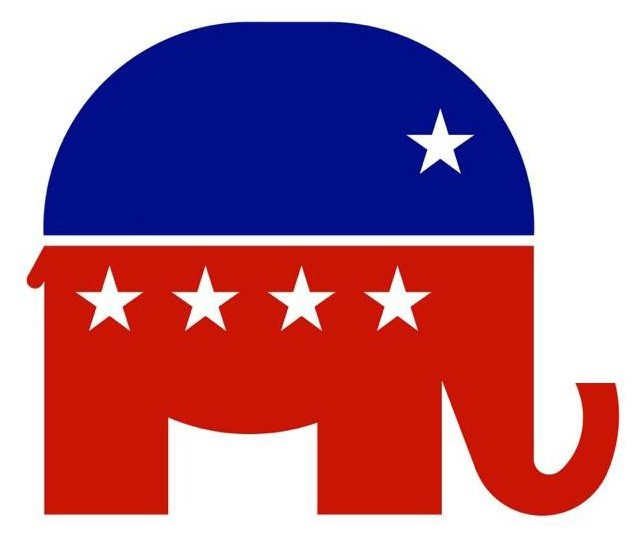
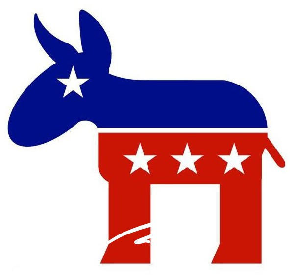
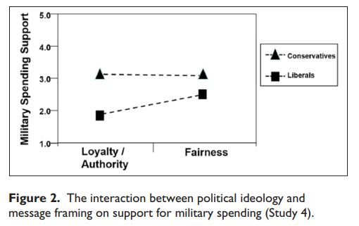

# Week 10
This week, we will be discussing how understanding studying morality can inform political disagreement and bridge divides

.highlight-gray[In week 10:]

- Why do conservatives and liberals disagree on so many moral issues?

- **What is similar about the moral minds of liberals and conservatives?**

- **Is it possible to compromise on political issues?** 


---
# The group polarization effect
.footnote[Sunstein, Hastie, & Schkade (2007)]
#### Method

- Researchers collected two samples

  - Boulder, CO - mostly liberal
  
  - Colorado Springs, CO - mostly conservative

- Participants first privately reported their views on three political topics


---

# The group polarization effect
.footnote[Sunstein, Hastie, & Schkade (2007)]

#### Method

.smaller-picture[]<br><br><br>

1. The United States should sign an international agreement to reduce the greenhouse gases produced in this country that contribute to global warming.

2. When different applicants for the same job or educational opportunity are almost equal on relevant criteria, then the job or admission shuold be given to members of groups in society that have been discriminated against in the past.

3. Two adults of the same sex should be able to form a "civil union," which would entitle them to certain legal rights such as joint home ownership, or access to the other's retirement or medical benefits. 
---
# The group polarization effect
.footnote[Sunstein, Hastie, & Schkade (2007)]

#### Method

- Participants next met with their group and each person explained their own personal opinions, trying to convince others that they should move closer to their opinion

- The groups were relatively homogeneous; everyone held very similar views on each topic

- After the discussion was over, participants privately rated their opinions again

---
# The group polarization effect
.footnote[Sunstein, Hastie, & Schkade (2007)]

.left-column-black-text[
- Discussing political issues with people with similar views made overall average opinions more *extreme*
]

.right-column-black-text[
```{r, echo = FALSE, message = FALSE, warning = FALSE, fig.height = 3}
library(tidyverse)
orientation <- c(rep("liberal",3),
                rep("conservative", 3))
issue <- c(rep(c("Global \nwarming",
           "Affirmative \naction",
           "Civil \nunions"),2))
pre <- c(9.19, 5.81, 9.22, 5.13, 2.84, 2.48)
post <- c(9.44, 6.38, 9.69, 2.97, 1.61, 2.19)

data <- cbind(orientation, issue, pre, post) %>% 
  as.data.frame()

data <- data %>% 
  pivot_longer(cols = c(pre,post),
               names_to = "time",
               values_to = "score") 

libs <- data %>% filter(orientation == "liberal") %>% 
  mutate(score = as.numeric(score))
cons <- data %>% filter(orientation == "conservative") %>% 
    mutate(score = as.numeric(score))


ggplot() +  
  geom_line(data =libs, aes(x=score, y=issue), size =2, color = "#94bdff")+
  geom_point(data= libs, aes(x=score, y=issue, color = time), size = 5)+
  scale_color_manual(values = c("#0062ff", "#94bdff"))+
  ggnewscale::new_scale_color()+
  geom_line(data =cons, aes(x=score, y=issue), size =2, color = "#ff9494")+
  geom_point(data= cons, aes(x=score, y=issue, color = time), size = 5)+
  scale_color_manual(values = c("#f50000", "#ff9494"))+
  theme_bw(base_size = 15)+
  labs(title = "Discussion amongst one's group leads to polarization",
       x= "",
       y= "")+
  theme(legend.position = "none",
        plot.title = element_text(hjust = 1))+
  scale_x_continuous(expand = c(0,0),
                    limits = c(1, 10),
                    breaks = c(1:10))+
  ggrepel::geom_text_repel(data = subset(cons, issue == "Global \nwarming"),
                           aes(x = score, y = issue, label = c("pre-discussion \nmean", "post-discussion \n mean")),
                           seed = 42, box.padding = 0.5, segment.color = "black", min.segment.length = 0) 
```
]


---

# The group polarization effect


Group discussion among people with similar views tends to lead to a more extreme position by group members


.highlight-gray[Discussion question:] Why do you think this is the case?

???
Possible answers -
  * Discussion exposes us to more arguments supporting the issue 

  * Shift in comparison group (you are above average at X, new comparison group but need to remain above average)
  
  * People like you believe this
  
  * You feel more certain that you are right because of consensus 
  
---
# The group polarization effect

`r fontawesome::fa("facebook-square", fill = "#3b5998", height = 100)`

`r fontawesome::fa("twitter-square", fill = "#1DA1F2", height = 100)`

`r fontawesome::fa("tumblr-square", fill = "#34526f", height = 100)`

`r fontawesome::fa("youtube-square", fill = "#c4302b", height = 100)`

`r fontawesome::fa("reddit-square", fill = "#FF5700", height = 100)`

`r fontawesome::fa("tiktok", fill = "#010101", height = 100)`

`r fontawesome::fa("instagram-square", fill = "#E1306C", height = 100)`

.highlight-gray[Discussion question]: What features are embedded into these platforms that may make views on political/ moral issues more polarizing? 

???
-Friending/ following
-Algorithms/ suggestions
-Very easy to only see people you agree with

---

#Political polarization

.pull-left[]
.pull-right[]
.pull-left[]
.pull-right[]

???

Here is the state of our country - two sides that disagree strongly and don't seem to hear or understand each other. It's leading to violence and instability 

---


# US political polarization, 1994-2017

.footnote[Pew Research Center (2017)]

We are more divided than ever in ideological beliefs


---
# Moral differences
.footnote[Graham, Haidt, & Nosek (2009)]

.pull-left[]

.pull-right[

We disagree even about how we should determine if something is right or wrong (liberals tend to dismiss concerns of loyalty, authority, and purity)]

---

# Moral convinctions
.footnote[Skitka (2021)]


We have different *moral convictions*, which have the following properties

- Perceived Objectivity and Universality

- Authority and Peer Independence

- Ends Justify the Means Thinking

- Intolerance and Unwillingness to Compromise

- Political Participation

- Emotional

---

# Confirmation Bias

.footnote[Frimera, Skitka, & Motyl (2017)]

.pull-right[]

.pull-left[#### We don't want to listen to other side
- “How interested are you in each of these activities?” -100 = very uninterested to 100 = very interested

  - Having a tooth pulled (-78)
  
  - Hearing from a typical [Obama/
Romney] voter about why they voted for [Obama/Romney]

  - Going for a walk on a sunny day (+64)]

???
  
  Romney supporters were slightly
more motivated to not hear from Obama supporters compared to the
vice versa
---

# Political polarization

#### Summary 
- There are two "Americas" who do not fundamentally understand each other and do not want to hear from each other

- Each group has strong, opposing moral convictions

  - They believe that their beliefs should be universal
  
  - They are intolerant of the other group and unwilling to compromise
  
  - Their beliefs are independent of peers and the law
  
  - They believe that the ends justify the means

--

- There are big problems that we need to work on together (e.g., climate change, healthcare, immigration, diseases like COVID19...)

--

<center> *How do we fix this?*


---
# Political polarization

#### Possible ways to increase moral understanding
- Moral reframing

- The theory of dyadic morality

- Personal experiences

---

# Moral reframing

**Moral reframing**: a persuasion technique where one frames an issue in a different way so that it is consistent with the target's moral values

.pull-left[.tiny-picture[]
**Conservative frame**<br>It is patriotic to social distance and wear a mask]

.pull-right[.tiny-picture[]
**Liberal frame**<br>We must social distance and wear a mask to protect the vulnerable elderly]

---

# Moral reframing
.footnote[Feinberg & Willer (2013)]

.left-column-big[**Environment**
- Participants were randomly assigned to see an environmental message that was framed in care/harm, purity/sanctity, or neutral

  - **Harm**: Humans are causing harm and destruction to the environment; it's important that people instead care for it 
  
  - **Purity**: The earth has become polluted/ contaminated and it is important for people to clean and purify it
  
  - **Neutral**: An apolitical message (the history of neckties)]
  
.right-column-small[<center>Harm

<br><br>
Purity

]

---

# Moral reframing
.footnote[Feinberg & Willer (2013)]

.pull-left[
**Environment**
- After the persuasive message, participants indicated their attitudes towards the environment, e.g., “It is 
important to protect the environment”

- Liberals always endorsed pro-environental attitudes

- Conservatives endorsed pro-environmental attitudes when they were framed with a purity appeal
]
.pull-right[]

---

# Moral reframing
.footnote[Feinberg & Willer (2015)]
.pull-left[
**Affordable Care Act**
- Fairness frame: "In its current state healthcare in the U.S. is inherently unfair and unjust. We need reform to ensure that 
everyone, not just the rich and the fortunate, has access to the doctors and the medicine they need. "

- Purity frame: "The absence of universal healthcare in the United States practically ensures that we will have unclean, 
infected, and diseased Americans walking among us."]

.pull-right[]
---

# Moral reframing
.footnote[Feinberg & Willer (2015)]

.pull-left[
**Military spending**
- Fairness: "Recently people have suggested cutting 
military funding. Such cuts will limit the military’s ability to offer equal opportunity to minorities and the poor"

- Loyalty: "We must take pride in our military. It makes no sense to cut funding to what makes us the greatest 
superpower the world has ever seen"
]
.pull-right[]

---
# Moral reframing
.footnote[Feinberg & Willer (2015)]

.pull-left[
**Same-sex marriage**
- Loyalty: "Although gay couples in America have different sexual preferences, they are still proud Americans like you 
and me... contribut[ing] just as much to the economy [and] mak[ing] up a large portion of our nation’s military. "

- Fairness: "Preventing marriage among homosexuals is a direct form of discrimination. The law requires that all citizens be treated equally and have the same opportunity to 
pursue happiness."
]
.pull-right[]

---
# Moral reframing activity

**Instructions**: For these issues, reframe one position so that it would persuade the other side (e.g., to convince a democrat to build a wall)


.pull-left[.tiny-picture-center[]<br><br><br><center>
Pro-life

Build a wall

Right to bear arms
]

.pull-right[.tiny-picture-center[]<br><br><br><center>
Pro-choice

Expand paths to citizenship

Reform gun laws
]

---


# Moral reframing

#### Discussion question

> Moral reframing appears to be pretty successful in getting individuals to agree on political issues. Why do you think it is rarely used by politicians?

???

- They may not realize it will work
- It might feel unethical or inauthentic
- They don't know how to, e.g., they may not understand the morals of the other side
- It may feel like betrayal to your group to talk in someone else's morals

---

# The theory of dyadic morality

.footnote[Gray, Waytz, & Young (2012)]
<center>

Acts that cause harm to a defenseless victim are the prototypical moral violation, the most accessible moral violation
---
# The theory of dyadic morality

.footnote[Gray, Waytz, & Young (2012)]
<center>

This causes agent/patient to become a cognitive template for a moral violation

---
# The theory of dyadic morality

.footnote[Gray, Waytz, & Young (2012)]
<center> </center>
The immoral agent/patient cognitive template can sometimes lead individuals to perceive a victim that others do not see


---
# The theory of dyadic morality
.footnote[Schein & Gray (2015)]
- Liberals and conservatives do not have different moral minds (like MFT suggests); they share a harm-based template of morality

  - When a person perceives an agent harming a victim, they condemn the act
  
  - The disagreements lie in if harm is occurring
  
---

# The theory of dyadic morality

> **Instructions**: List an act that is morally wrong. Write down whatever comes to your mind first.


---
# The theory of dyadic morality
.footnote[Schein & Gray (2015)]

.pull-left[<center> <br><br>
**Morally wrong acts**

Murder 44%

Stealing 17%

Adultery 11%

Abuse 7%

Cheating 5%

Rape 4%

Lying 2%]


---

# The theory of dyadic morality
.footnote[Schein & Gray (2015)]

.pull-left[<center> <br><br>
**Morally wrong acts**

Murder 44%

Stealing 17%

Adultery 11%

Abuse 7%

Cheating 5%

Rape 4%

Lying 2%]

.pull-right[<br>

- The large majority of acts that were recalled were self-categorized as "harmful" over unfair, disobediant, disloyal, or gross]

???

Participants labeled their act, as mostly harmful, unfair, disloyal, disobedient, or gross

---
# The theory of dyadic morality
.footnote[Schein & Gray (2015)]


.pull-left[
**Harm and immorality**
- Participants rated 40 words on whether the act was harmful/ not harmful and whether the act was immoral/ not immoral
]

.pull-right[<center><br>
**Example words**

Bullying

Lying

Cheating

Rape

Kidnap

Bribery

Gossip

]

---
# The theory of dyadic morality
.footnote[Schein & Gray (2015)]


.pull-left[
**Harm and immorality**
- Participants rated 40 words on whether the act was harmful/ not harmful and whether the act was immoral/ not immoral

- When a person quickly perceived harm, they also quickly categorized the act as immoral
]

.pull-right[
]


---
# The theory of dyadic morality
.footnote[Schein & Gray (2015)]


.pull-left[
**Harm and immorality**


- The relationship between harm and immorality was the same for liberals and conservatives]

.pull-right[
]


---
# The theory of dyadic morality
.footnote[Schein & Gray (2015)]

#### Conclusions
- There are no underlying cognitive differences between conservatives and liberals; instead, there are differences in beliefs about what causes harm

  - Atheists may not believe that purity violations are immoral because they may not believe that one has a soul to be damaged

  - Those who support drastic environmental reform may not see the harm it will cause certain individuals in rural areas (e.g., job loss) 

---
# The theory of dyadic morality
.footnote[Schein & Gray (2015)]

#### Conclusions

> *" If people all 
speak the same moral “language” of harm, 
we should be able to translate moral issues across partisan 
divides. More specifically, by granting legitimacy to our 
political opponent’s perceptions of harm, we may be more 
accepting of their views and more willing to engage in 
discussion." *

---

# The theory of dyadic morality

**Instructions**: For these issues, think of how these differences may be caused by differences in beliefs what causes harm/ who the victim is


.pull-left[.tiny-picture-center[]<br><br><br><center>
Pro-life

Build a wall

Right to bear arms
]

.pull-right[.tiny-picture-center[]<br><br><br><center>
Pro-choice

Expand paths to citizenship

Reform gun laws
]
---
# Personal experiences
.footnote[Kubin et al. (2021)]

#### Respect as a goal of moral understanding

- Working together to solve big problems requires more than just an ability to persuade each other, or a method for finding common ground 

- Instead of persuasion, a goal may be to *respect* each other's moral differences

---
# Personal experiences
.footnote[Kubin et al. (2021)]

.pull-left[Free response question: "Imagine someone disagrees
with you on moral issues. What would make you respect their opinion?"
]
.pull-right[]

---

# Personal experiences
.footnote[Kubin et al. (2021)]

.pull-left[Free response question: "Imagine someone disagrees
with you on moral issues. What would make you respect their opinion?"

- Individuals believe that facts and evidence would garner respect

- They are wrong...
]
.pull-right[]

---
# Personal experiences
.footnote[Kubin et al. (2021)]

.pull-left[#### Personal experience and respect

- Gave participants either a real world gun-related personal experience or a real gun policy statistic (e.g., "murder rates were
19.3% higher when the Federal assault weapon ban was in effect") to justify a position

- Providing a personal experience fostered more respect than giving facts, even when the personal experience was low in harm]

.pull-right[]

???
Also, people were more willing to interact with people who gave a high harm personal experience as a reason for their position, over someone who gave facts
---

# Personal experiences
.footnote[Kubin et al. (2021)]

.pull-left[#### Personal experience and perceived truth
- For moral matters, individuals did not trust facts when they disagreed with their moral values, *but they did trust experiences that disagreed with their moral values*

- Because people doubt facts that support a different moral position than theirs, facts do not lead to respect

]
.pull-right[]

---

# Personal experiences

**Instructions**: For these issues, think of a personal experience that may garner respect from a person of the opposing political party


.pull-left[.tiny-picture-center[]<br><br><br><center>
Pro-life

Build a wall

Right to bear arms
]

.pull-right[.tiny-picture-center[]<br><br><br><center>
Pro-choice

Expand paths to citizenship

Reform gun laws
]
---
# Summary

- Talking with people who hold similar values to our own make our values more extreme

- The increased availability of spaces to share our moral values (e.g., through social media) has contributed to political polarization in America

- There are a few ways we may be able to better understand and work with people who have moralities that are different from our own

  - Moral reframing allows us to persuade others of our position, even when they have different moral intuitions
  
  - The theory of dyadic morality suggests that we may be better able to understand each other when we understand that others may perceive harm where we do not
  
  - Personal experiences may be more useful tools than facts when talking to those we disagree with on moral issues
