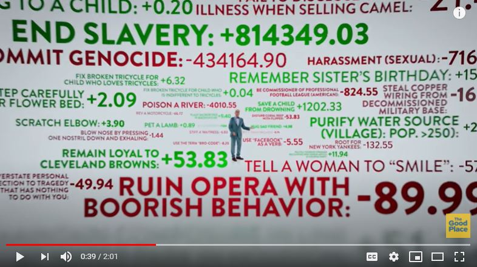

# Purpose

.highlight[Moral psychology] is the scientific study of morality. But what is morality and how do humans understand it?

In today's lecture:
- How has morality been understood and defined?
- How do psychologists measure it?

---

#The Good Place: How Your Life is Scored

.center[
<iframe width="560" height="315" src="https://www.youtube.com/embed/ut0ai4s4mjU" frameborder="0" allow="accelerometer; autoplay; clipboard-write; encrypted-media; gyroscope; picture-in-picture" allowfullscreen></iframe>
]

The Good Place is a TV series set in the afterlife. In the show, when you die, if you've been a 'good person' you go to the Good Place, and if you've been a 'bad person', you go to the Bad Place. This is a clip from the first episode where the characters are introduced to how their goodness was determined.
 
---
# Central claims

.smaller-picture[]
<br><br><br><br><br><br>
<br><br><br>

1. All behavior is "good" or "bad"

2. Some actions are more "bad" than others

3. Behavior can be assigned an objective moral score


???
For example, committing genocide gives you -430,000 points, while not tipping a waitress was determined to be only -4 points
---
# Which actions are "good"?

Let's test these claims. On a piece of paper, order the following actions from right to wrong. Once you're done, compare your rank order with your neighbor(s) and note any disagreements.

  - Donating to a charity.
  - Developing a vaccine.
  - Leaving a restaurant without tipping a waitress.
  - Helping your friend.
  - Cheating on a test.

???
Question for class: what did you disagree on and why?
---
# What people think is "moral" varies

.pull-left[<u><center><b>Actions</b></u></center>
- Donating to a charity.
- Developing a vaccine.
- Leaving a restaurant without tipping a waitress.
- Helping your friend.
- Cheating on a test.

]

.pull-right[<u><center><b>Source of variability</b></u></center>
- Intentions or consequences
- Beliefs
- Culture
- Context
- Principles
]

???
1. Our actions may be harmful, even when we have good intentions, e.g., not all charities ultimately help who they intend to help (charities) 
2. We differ in what we believe to be true about our environment, e.g., vaccines are harmful (vaccines), babies are born with souls (abortion)
3. Cultures differences e.g., in some East Asian cultures, tipping can be perceived as rude (tipping)
4. Actions may be "good" in some contexts but not others, e.g., helping your friend study would be good, but helping your friend rob a bank may not be as good.
5. We may value some moral principles over others, e.g., someone may only consider something immoral when there is obvious harm to someone
---

#Defining morality

Definitions of morality are either **descriptive** or **normative**

.footnote[Zalta et al., 2020]
--

- **Normative**: morality is a code of conduct that would be agreed upon by all "rational" persons 

  - Shared beliefs about how we *ought* to act
  - Morality is like it has been defined in the Good Place. Moral philosophers can ultimately determine what what behaviors we should and should not do
  - But how do we define who are "rational persons"?

---

#Normative definitions of morality

.left-column-big[**Utilitarianism** is the *normative* moral theory that an action is morally right if it .highlight[benefits the most people.]

- Utilitarianism is a <u>consequentialist</u> theory, meaning that it focuses on the consequences of the action.


> "[Morality can be defined as...] the rules and precepts for human conduct, by the observance of which [a happy existence] might be, to the greatest extent possible, secured to all mankind.

.right[-John Stuart Mill, 1861]]
.right-column-small[
<center><b>John Stuart Mill</b>, <i>Philosopher</i></center>]

???
John Stuart Mill is a 19th century British philosopher. 


---

#Normative definitions of morality

.left-column-big[**Deontology** is the *normative moral* theory that the determination that an action is right or wrong should depend on .highlight[a set of predetermined rules], rather than on the consequences of the action.

>"A lie always harms another; if not some human being, then it nevertheless does harm to humanity in general, inasmuch as it vitiates the very source of right." 

.right[-Immanuel Kant]]

.right-column-small[
<center><b>Immanuel Kant</b>, <i>Philosopher</i></center>]

---
#A moral dilemma

What *ought* you do in this scenario?

>You are a doctor. You have five patients, each of whom is about to die due to a failing organ of some kind. A new person is rushed into the hospital after a serious car accident. This person is critically injured, and will die without immediate surgery. It is likely you can save
this accident victim, though it would involve long and complicated surgery. You realize that if you purposely cut his
carotid artery during surgery it would cause his death and no
one would ever know. Then you could harvest his organs for
transplant into the bodies of the other five patients. If you do
this, the other five patients will live, but the accident victim
will die. Is it appropriate for you to kill the accident victim
in order to save your five patients? 

.footnote[Aktas et al. (2017)]
---
#Utilitarianism vs. deontology

What we *ought* to do:

- A utilitarian, whose philosophy says that we should **increase the happiness for the most amount of people**, would say that the surgeon ought to save the lives of the five by harvesting the organs of the one.

- A deontologist, whose philosophy relies **on predetermined rules**, may say that it is never okay to violate the person's rights, regardless of the consequences.

---

# Insights from normative theories

- The purpose of ethics is to optimize happiness and minimize suffering in a society
- In order to do so, we need to create a code of conduct that can be agreed upon

---
#Defining morality

Definitions of morality are either **descriptive** or **normative**

- **Normative**: morality is a code of conduct that would be agreed upon by all "rational" persons 
- **Descriptive**: morality is a system of morals that are endorsed by an individual or a group

  - Morality is whatever a group or individual thinks is moral
  - E.g., Catholic morality, Democrat morality, Nazi morality
  
.footnote[Zalta et al. (2020)]


---

#Defining morality

Definitions of morality are either **descriptive** or **normative**

- **Normative**: morality is a code of conduct that would be agreed upon by all "rational" persons 
- **Descriptive**: morality is a system of morals that are endorsed by an individual or a group

Most of our normative theories come from philosophers, who have long debated what people *ought* to think is moral. Most of our descriptive theories of morality come from anthropologists and psychologists, who describe the the moral systems endorsed by groups of people or cultures
- Descriptive definitions allow for moral disagreements

.footnote[Zalta et al., (2020)]

---
#Descriptive definitions of morality

- A descriptive moral theory describes which abstract guiding principles or concrete actions are endorsed by an individual or a group as moral

--

- If you wanted to study the morality of a society through observational methods only, what would you do?

--

  + You might look at laws, religious texts, etiquette books, observe behavior, etc.
    + But how do we determine moral rules (e.g., do not punch your teacher) from social conventions (e.g., wearing a uniform to school)?

---

# Descriptive definitions of morality

.left-column-big[Moral rules are different from social conventions

>"Social-convential acts, in themselves are arbitrary in that they are not instrinsically prescriptive. For example... mode of dress is arbitrarily designated, that is, an alternative mode of dress could be designated to serve the same function... In the moral domain... the existence of social regulation is not necceasry for an individual to view an event as a moral transgression."

.right[-Larry Nucci, 1981]]

.right-column-small[]
<center><b>Larry Nucci</b>, <i>Developmental Psychologist </i></center>

???
Social conventions are arbitrarily designated and can be replaced with another rule to serve the same function, e.g., a dress code, whereas moral rules are moral even when there are not explicit laws prohibiting the action from taking place 

---
#Descriptive definitions of morality

.left-column-big[- Many psychologists take **functionalist** approaches to defining morality, meaning they ask "what is the *function* of moral rules"?

>"Moral systems are interlocking sets of values, virtues, norms, practices, identities, institutions, technologies, and evolved psychological mechanisms that work together to **suppress or regulate selfishness and make cooperative social life possible.**"

.right[-Jonathan Haidt, 2010]]

.right-column-small[ 
<center><b>Jonathan Haidt</b>, <i>Social Psychologist</i></center>]

---

#Measuring morality

---

#Moral foundations theory

- There are (at least) five moral intuitions or principles that vary in a population
  - **Harm/care** - We should care for a protect vulnerable others.
  - **Fairness/cheating** - We should treat everyone fairly.
  - **Ingroup/ betrayal** - We should be loyal to our groups.
  - **Authority/ subversion** - We should respect authority and tradition.
  - **Purity/ Degradation** - We should not violate norms of decency and purity by doing certain things with your body.

--

A candidate for a 6th foundation:

  - **Liberty/ Oppression** - There should not be people restricting the freedom of others.
  
.footnote[Graham, Haidt, & Nosek (2009); Koleva et al. (2012)]

---
# Moral foundations theory

```{r, include = FALSE}
library(tidyverse)
library(kableExtra)
```

```{r, echo = FALSE}
Foundation <- c(".small[**Care/ Harm**]", ".small[**Fairness/ Cheating**]", ".small[**Ingroup/ Betrayal**]", ".small[**Authority/ Subversion**]", ".small[**Purity/ Degradation**]")

Definition <- c(".small[Do not harm.]", ".small[Treat others fairly.]", ".small[Be loyal.]", ".small[Respect authority and tradition.]", ".small[Do not violate purity norms.]")

Adaptation <- c(".small[Protect vulnerable children.]", ".small[Benefit from partnerships.]", ".small[Form coalitions.]", ".small[Forge relationships within hierarchies.]", ".small[Avoid communicable diseases.]")

Triggers <- c(".small[Suffering, pictures of baby seals]", ".small[Deception, marital infidelity]", ".small[Treason, sports teams]", ".small[Respect for bosses, parents]", ".small['Deviant' sexual behavior, food]")

Emotions <- c(".small[Compassion for victim; anger at perpretator]", ".small[Anger, gratitude, guilt]", ".small[Group pride, rage at traitors]", ".small[Respect, fear]", ".small[Disgust]")

cbind(Foundation, Definition, Adaptation, Triggers, Emotions) %>% kbl()

```

.footnote[Graham et al. (2013)]

???
An act could violate more than one moral principle, e.g., marital infidelity: harm, fairness, and purity
---
# Moral foundations questionnaire


```{r, echo = FALSE}
`MFQ30 Item` <- c(".small[\"It can never be right to kill a human being.\"]", ".small[\"I think it’s morally wrong that rich children inherit a lot of money while poor children inherit nothing.\"]",".small[\"People should be loyal to their family members, even when they have done something wrong.\"]", ".small[\"If I were a soldier and disagreed with my commanding officer’s orders, I would obey anyway because that is my duty.\"]", ".small[\"People should not do things that are disgusting, even if no one is harmed.\"]")

cbind(Foundation, Definition, `MFQ30 Item`) %>% kbl()
```

.footnote[Graham et al. (2008)]


---
# Defining morality

.left-column-big[- Some psychologists argue that all foundations can be mapped onto a single harm principle, e.g., authority provides a way to reduce conflict peacefully, purity provides a way to reduce harm from diseases

"Morality is essentially represented by a cognitive template that combines a **perceived intentional agent** with **a perceived suffering patient.**" 

.right[-Kurt Gray and colleagues, 2012]]

.right-column-small[
<center><b>Kurt Gray</b>, <i>Social Psychologist<i></center>]

 