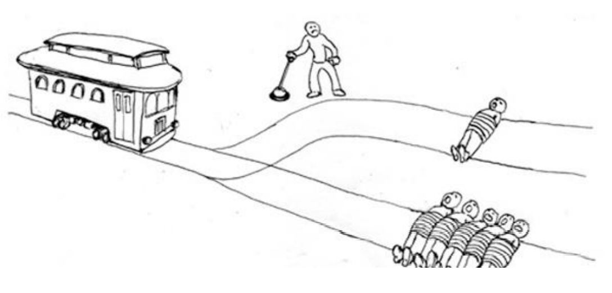

# Week 1

In the first week, after a review of the syllabus, we will be exploring how scientists have understood and scientifically measured morality.

.highlight[In week 1:]
- How will the course be structured? 
- How will my learning be assessed? 
- How has morality been understood and defined?
- How do scientists measure morality?

---

# Moral Psychology

Individuals develop variable and sometimes even opposing intuitions about what themselves and others should and should never do. **Moral psychology** is the scientific study of how individuals judge behaviors and character traits as right or wrong/ good or bad, and act (or fail to act) in a way that they would consider virtuous. In this course, we will explore questions like:

- How do we come to the conclusion that a behavior is wrong?
- How do we judge if someone else is a good or bad person?
- How do we lie, cheat, steal, and hurt others with a clear conscience? 
- Why do different groups of people come to different conclusions about what is right? 
- How do we persuade others to reconsider their stance on moral issues?

---
# Structure of the course

- Week 1-2: introduction, measurement, evolution, and development
- Weeks 3-8: moral reasoning, moral judgments, moral behavior, moral emotions, and the moral self

- Weeks 9-10: applications of moral psychology (politics, religion, the law)

.footnote[Ellemers et al. (2019)]


---
# Assignments

Your course grade will be determined by the following assignments:


```{r, include = FALSE}
library(kableExtra)
library(tidyverse)
```

```{r, echo = FALSE}
Assignment <- c("Midterm exam", "Final paper", "Quizzes (25 points x4)", "Homework (20 points x4)", "Participation", "")
Points <- c(rep("100 points", 3), "80 points", "20 points", "= 400 points")
grade_table <- cbind(Assignment, Points) %>% 
  as.data.frame()

grade_table %>% kbl() %>% 
  kable_styling(c("striped"), position = "left")
```


---

# Exams 

- The midterm exam is scheduled for **the sixth week** of the course. The exam will consist of matching, fill-in-the-blank, multiple choice, and  short answer questions.

- The final research paper will be due during **finals week**.  You will choose a research question to explore from a list of topics.

---

#Weekly assignments

- Every week, there will be an assignment due at **11:59pm on Sunday**
- The assignments will alternate between quizzes and structured homework assignments

---

# Classroom climate

While studying moral psychology, we are bound to hear from others who do not agree with our moral values. I do not expect to agree with you on everything, and I do not expect you to agree with your classmates on everything. We are a group with diverse backgrounds and experiences. We must therefore make it a priority that everyone in this class (students and instructor) have the opportunity to offer their ideas, hear one another’s ideas, and make arguments and challenge ideas. 

That being said, if you do not feel comfortable participating in a class discussion or believe there is more that I could be doing to promote a more effective learning environment, I urge you to come talk to me. I will always listen to your concerns with respect and an open mind and will make adjustments when appropriate.


---

# Classroom climate

Some important ground rules:
1. Criticize ideas and not people
2. Avoid making assumptions about others
3. Allow others to make mistakes and learn from them
4. Keep an open mind - don’t assume your beliefs are fully formed and that you can’t learn from others
5. Treat others with respect, even when you disagree

---

# Course website

- www.sdimakis.github.io/moral_psychology
- Course content, syllabus, readings, lectures, and assignments are all posted here

Any questions? 

--

Let's get started!
---


#The Good Place: How Your Life is Scored

.center[
<iframe width="560" height="315" src="https://www.youtube.com/embed/ut0ai4s4mjU" frameborder="0" allow="accelerometer; autoplay; clipboard-write; encrypted-media; gyroscope; picture-in-picture" allowfullscreen></iframe>
]

The Good Place is a TV series set in the afterlife. In the show, when you die, if you've been a 'good person' you go to the Good Place, and if you've been a 'bad person', you go to the Bad Place. This is a clip from the first episode where the characters are introduced to how their goodness was determined.
 
---
# the good place's moral claims

1. All behavior is "good" or "bad"

2. Some actions are more "bad" than others

3. Behavior can be assigned an objective moral score


???
For example, committing genocide gives you -430,000 points, while not tipping a waitress was determined to be only -4 points
---
# Which actions are "good"?

Let's test these claims. On a piece of paper, order the following actions from right to wrong. Once you're done, compare your rank order with your neighbor(s) and note any disagreements.

  - Donating to a charity.
  - Developing a vaccine.
  - Leaving a restaurant without tipping a waitress.
  - Helping your friend.
  - Eating a chicken sandwich.

---

# Which actions are "good"?

Let's test these claims. On a piece of paper, order the following actions from right to wrong. Once you're done, compare your rank order with your neighbor(s) and note any disagreements.

  - Donating to a charity.
  - Developing a vaccine.
  - Leaving a restaurant without tipping a waitress.
  - Helping your friend.
  - Eating a chicken sandwich.

.highlight[Discussion question:] what did you disagree on and why?
---
# What people think is "moral" varies

.pull-left[<u><center><b>Actions</b></u></center>
- Donating to a charity.
- Developing a vaccine.
- Leaving a restaurant without tipping a waitress.
- Helping your friend.
- Eating a chicken sandwich.

]

.pull-right[<u><center><b>Source of variability</b></u></center>
]

---

# What people think is "moral" varies

.pull-left[<u><center><b>Actions</b></u></center>
- Donating to a charity.
- Developing a vaccine.
- Leaving a restaurant without tipping a waitress.
- Helping your friend.
- Eating a chicken sandwich.

]

.pull-right[<u><center><b>Source of variability</b></u></center>
- Intentions or consequences
]

???
Our actions may be harmful, even when we have good intentions, so do we determine an action is moral by the intentions of the person, or the consequences? e.g., not all charities ultimately help who they intend to help (charities), or, someone was drugged and then harmed someone

---

# What people think is "moral" varies

.pull-left[<u><center><b>Actions</b></u></center>
- Donating to a charity.
- Developing a vaccine.
- Leaving a restaurant without tipping a waitress.
- Helping your friend.
- Eating a chicken sandwich.

]

.pull-right[<u><center><b>Source of variability</b></u></center>
- Intentions or consequences
- Beliefs
]

???
We differ in what we believe to be true about our environment, e.g., vaccines are harmful (vaccines), fetuses have souls (abortion)


---

# What people think is "moral" varies

.pull-left[<u><center><b>Actions</b></u></center>
- Donating to a charity.
- Developing a vaccine.
- Leaving a restaurant without tipping a waitress.
- Helping your friend.
- Eating a chicken sandwich.

]

.pull-right[<u><center><b>Source of variability</b></u></center>
- Intentions or consequences
- Beliefs
- Culture
]

???

Cultures differ e.g., in some East Asian cultures, tipping can be perceived as rude (tipping)
---

# What people think is "moral" varies

.pull-left[<u><center><b>Actions</b></u></center>
- Donating to a charity.
- Developing a vaccine.
- Leaving a restaurant without tipping a waitress.
- Helping your friend.
- Eating a chicken sandwich.

]

.pull-right[<u><center><b>Source of variability</b></u></center>
- Intentions or consequences
- Beliefs
- Culture
- Context

]

???
Actions may be "good" in some contexts but not others, e.g., helping your friend study would be good, but helping your friend rob a bank may not be as good.

---

# What people think is "moral" varies

.pull-left[<u><center><b>Actions</b></u></center>
- Donating to a charity.
- Developing a vaccine.
- Leaving a restaurant without tipping a waitress.
- Helping your friend.
- Eating a chicken sandwich.

]

.pull-right[<u><center><b>Source of variability</b></u></center>
- Intentions or consequences
- Beliefs
- Culture
- Context
- Who deserves moral concern
]

???

Some people think that we should care about harming animals, while others don't; some people think that we should help others suffering in other countries, while others don't
---

#Defining morality

Definitions of morality are either **descriptive** or **normative**

.footnote[Zalta et al., 2020]
--

- **Normative**: morality is a code of conduct that would be agreed upon by all "rational" persons 

  - Morality is shared beliefs about how we *ought* to act
  - Morality is like it has been defined by writers of The Good Place 
  - Moral philosophers can ultimately determine what what behaviors we should and should never do
  - But how do we define who are "rational persons"?

---

#Normative definitions of morality

.left-column-big[**Utilitarianism** is the *normative* moral theory that an action is morally right if it .highlight[benefits the most people.]

- Utilitarianism is a <u>consequentialist</u> theory, meaning that it focuses on the consequences of the action.


> "[Morality can be defined as...] the rules and precepts for human conduct, by the observance of which [a happy existence] might be, to the greatest extent possible, secured to all mankind.

.right[-John Stuart Mill, 1861]]
.right-column-small[
<center><b>John Stuart Mill</b>, <i>Philosopher</i></center>]

???
John Stuart Mill is a 19th century British philosopher. 


---

#Normative definitions of morality

.left-column-big[**Deontology** is the *normative moral* theory that the determination that an action is right or wrong should depend on .highlight[a set of predetermined rules], rather than on the consequences of the action.

>"A lie always harms another; if not some human being, then it nevertheless does harm to humanity in general, inasmuch as it vitiates the very source of right." 

.right[-Immanuel Kant]]

.right-column-small[
<center><b>Immanuel Kant</b>, <i>Philosopher</i></center>]

---
#A moral dilemma

What *ought* you do in this scenario?

>You are a doctor. You have five patients, each of whom is about to die due to a failing organ of some kind. A new person is rushed into the hospital after a serious car accident. This person is critically injured, and will die without immediate surgery. It is likely you can save
this accident victim, though it would involve long and complicated surgery. You realize that if you purposely cut his
carotid artery during surgery it would cause his death and no
one would ever know. Then you could harvest his organs for
transplant into the bodies of the other five patients. If you do
this, the other five patients will live, but the accident victim
will die. Is it appropriate for you to kill the accident victim
in order to save your five patients? 

.footnote[Aktas et al. (2017)]
---
#Utilitarianism vs. deontology

Utilitarians and deontologists are sometimes in conflict about what they agree is right. For example,

- A utilitarian, who says that we should **increase the utility for the most amount of people**, may argue that the surgeon ought to save the lives of the five by harvesting the organs of the one.

- A deontologist, who relies **on predetermined rules** to decide what is moral, may argue that it is never okay to violate a person's right to life, regardless of the consequences. Thus, there is a predetermined rule that says that we cannot sacrifice a human life for the greater good.

These theories often don't capture how people really think about morality


---
#Defining morality

Definitions of morality are either **descriptive** or **normative**

- **Normative**: morality is a code of conduct that would be agreed upon by all "rational" persons 
- **Descriptive**: morality is a system of morals that are endorsed by an individual or a group

  - Morality is whatever a group or individual thinks is moral
  - E.g., Catholic morality, Democrat morality, Nazi morality
  
.footnote[Zalta et al. (2020)]


---

#Defining morality

Definitions of morality are either **descriptive** or **normative**

- **Normative**: morality is a code of conduct that would be agreed upon by all "rational" persons 
- **Descriptive**: morality is a system of morals that are endorsed by an individual or a group

Most of our normative theories come from philosophers, who have long debated what people *ought* to think is moral. Most of our descriptive theories of morality come from anthropologists and psychologists, who describe the moral systems endorsed by groups of people or cultures
- Descriptive definitions allow for different people or groups to come to different conclusions about what is moral

.footnote[Zalta et al. (2020)]

---
#Descriptive definitions of morality

- A descriptive moral theory describes which abstract guiding principles or concrete actions are endorsed by an individual or a group as moral

--

- .highlight[Discussion question:] If you wanted to study the morality of a society through observational methods only, what would you do?

--

  + You might look at laws, religious texts, etiquette books, observe behavior, etc.
    + But how do we determine moral rules (e.g., do not punch your teacher) from social conventions (e.g., wearing a uniform to school)?

---

# Descriptive theories

.left-column-big[Moral rules are different from social conventions

>"Social-convential acts, in themselves are arbitrary in that they are not instrinsically prescriptive. For example... mode of dress is arbitrarily designated, that is, an alternative mode of dress could be designated to serve the same function. In the moral domain... the existence of social regulation is not neccesary for an individual to view an event as a moral transgression."

.right[-Larry Nucci, 1981]]

.right-column-small[]
<center><b>Larry Nucci</b>, <i>Developmental Psychologist </i></center>

???
Social conventions are arbitrarily designated and can be replaced with another rule to serve the same function, e.g., a dress code (blue pants will serve the same function as yellow pants), whereas moral rules are moral even when there are not explicit laws prohibiting the action from taking place 

---
# Descriptive theories
.footnote[Janoff-Bulman & Carnes (2013)]

.left-column-big[Others theorize that morality requires us to regulate our behavior; we need to overcome temptations or desires to doing bad and motivate ourselves to do good.

"Morality is generally recognized as a system of rules that facilitate and coordinate group living; as such **it involves behavioral regulation so as to optimize our existence as social beings.**" .right[-Janoff-Bulman & Carnes, 2013]]

.right-column-small[
<center><b>Ronnie Janoff-Bulman</b>, <i>Social Psychology</i></center>]

---
# Descriptive theories

.left-column-big[Many psychologists take **functionalist** approaches to defining morality, meaning they ask "what is the *function* of moral rules"? This allows for an understanding of morality that can vary across cultures

>"Moral systems are interlocking sets of values, virtues, norms, practices, identities, institutions, technologies, and evolved psychological mechanisms that work together to **suppress or regulate selfishness and make cooperative social life possible.**"

.right[-Jonathan Haidt, 2010]]

.right-column-small[ 
<center><b>Jonathan Haidt</b>, <i>Social Psychologist</i></center>]

---

# Descriptive theories

- Haidt proposed **moral foundations theory**, which posits that there are (at least) five moral intuitions. Individuals vary in how much they are willing to endorse or prioritize their moral intuitions
  - **Harm/care** - We should care for and not harm vulnerable others.
  - **Fairness/cheating** - We should get back what we put forward; we should not cheat.
  - **Ingroup/ betrayal** - We should be loyal to our groups (e.g., family, nation).
  - **Authority/ subversion** - We should respect authority and tradition.
  - **Purity/ Degradation** - We should not violate norms of decency and purity by doing certain things with your body.

.footnote[Haidt & Joseph (2007); Koleva et al. (2012)]

---

# Descriptive theories

- Haidt proposed **moral foundations theory**, which posits that there are (at least) five moral intuitions
  - **Harm/care** - We should care for and not harm vulnerable others.
  - **Fairness/cheating** - We should get back what we put forward; we should not cheat.
  - **Ingroup/ betrayal** - We should be loyal to our groups (e.g., family, nation).
  - **Authority/ subversion** - We should respect authority and tradition.
  - **Purity/ Degradation** - We should not violate norms of decency and purity by doing certain things with our bodies.

.footnote[Haidt & Joseph (2007); Koleva et al. (2012)]


A candidate for a 6th intuition:

  - **Liberty/ Oppression** - People should not restrict the freedom of others.
  

---
# Descriptive theories

.left-column-big[However, some psychologists argue that all foundations can be mapped onto a single harm principle, e.g., authority provides a way to reduce conflict peacefully, purity provides a way to reduce harm from diseases.

"Morality is essentially represented by a cognitive template that combines a **perceived intentional agent** with **a perceived suffering patient.**" 

.right[-Kurt Gray and colleagues, 2012]]

.right-column-small[
<center><b>Kurt Gray</b>, <i>Social Psychologist<i></center>]


---

# Descriptive theories

.left-column-big[And last, others recognize that the the determination if an action is right cannot be determined outside of its social-relational context. 

"We must reconceptualize moral psychology as **embedded in our social-relational cognition**, such that moral judgments and behaviors emerge out of the specific obligations and transgressions entailed by particular types of social relationships."
.right[Rai & Fiske, 2011]]

.right-column-small[
<center><b>Tage Rai</b>,<br> <i>Social Psychologist</i> ]

---

# A working definition of morality

To summarize:

- Morality pertains to how we ought to behave (and also how we think we ought to behave, which varies from individual to individual)
- Moral rules are different from social conventions in that they are not arbitrarily designated
- Being moral often requires us to regulate selfish desires
- Morality may have evolved because people with virtuous traits (e.g., trustworthiness, selflessness) cooperated better with each other
- Moral violations often involve an intentional agent and a suffering victim, but we also sometimes see victimless actions as moral violations
- Morality cannot be understood without taking into account the context in which the action takes place

---

#Measuring morality

Psychologists generally measure morality through...

- Self-report of behaviors or traits
- Hypothetical moral dilemmas
- Endorsement of abstract moral rules
- Position on specific moral issues
- Behavior

.footnote[Ellemers et al. (2019)]

---

# Self-report of behaviors or traits

.footnote[Lee & Ashton (2018)]

- An example of a self-report measure of morality would be The HEXACO Personality Inventory **Honesty-Humility subscale**

- Individuals who score high on Honesty-Humility say that they don't manipulate others for personal gain and feel little temptation to break rules

--

Example items on the scale:

1. If I want something from a person I dislike, I will act very nicely toward that person in order to get it. (R)

2. I’d be tempted to use counterfeit money, if I were sure I could get away with it. (R)

---

# Hypothetical moral dilemmas 

A runaway trolley is headed for five people who will be killed if it proceeds on its present course. The only way to save them is to hit a switch that will turn the trolley onto an alternate set of tracks where it will kill one person instead of five. Should you turn the trolley in order to save five people at the expense of one?

.footnote[Thomson (1976)]

.smaller-picture[]

---

# Hypothetical moral dilemmas 

A trolley threatens to kill five people. You are
standing next to a large stranger on a footbridge
that spans the tracks, in between the oncoming
trolley and the five people. In this scenario, the
only way to save the five people is to push this
stranger off the bridge, onto the tracks below. He
will die if you do this, but his body will stop the
trolley from reaching the others. In order to save
the five others, should you push this stranger to
his death? 

.footnote[Thomson (1976)]

.smaller-picture[]
---

# Hypothetical moral dilemmas 
- Nearly everyone concludes that it is acceptable to sacrifice one life for five in the switch case but not in the footbridge case
- In both cases, we are sacrificing one person for five, but they lead to different answers
- We can study responses to hypothetical dilemmas like these to understand how we make moral decisions

---
#Abstract moral rules 

- We can also measure how likely individuals are to endorse abstract principles.

--

- For example, Haidt's **moral foundations theory** proposes that there are (at least) five moral intuitions
  - **Harm/care** - We should care for and not harm vulnerable others.
  - **Fairness/cheating** - We should get back what we put forward; we should not cheat.
  - **Ingroup/ betrayal** - We should be loyal to our groups (e.g., family, nation).
  - **Authority/ subversion** - We should respect authority and tradition.
  - **Purity/ Degradation** - We should not violate norms of decency and purity by doing certain things with our bodies.

.footnote[Haidt & Joseph (2007); Koleva et al. (2012)]


---
# Abstract moral rules

```{r, include = FALSE}
library(tidyverse)
library(kableExtra)
```

```{r, echo = FALSE}

Foundation <- c(".small[**Care/ Harm**]", ".small[**Fairness/ Cheating**]", ".small[**Ingroup/ Betrayal**]", ".small[**Authority/ Subversion**]", ".small[**Purity/ Degradation**]")

Definition <- c(".small[Do not harm.]", ".small[Treat others fairly.]", ".small[Be loyal.]", ".small[Respect authority and tradition.]", ".small[Do not violate purity norms.]")

`MFQ30 Item` <- c(".small[\"It can never be right to kill a human being.\"]", ".small[\"I think it’s morally wrong that rich children inherit a lot of money while poor children inherit nothing.\"]",".small[\"People should be loyal to their family members, even when they have done something wrong.\"]", ".small[\"If I were a soldier and disagreed with my commanding officer’s orders, I would obey anyway because that is my duty.\"]", ".small[\"People should not do things that are disgusting, even if no one is harmed.\"]")

cbind(Foundation, Definition, `MFQ30 Item`) %>% kbl()
```

.footnote[Graham et al. (2008)]

---
# Position on specific moral issues

- We can give participants scales inquiring information about their position on a specific moral issue
  - "Do you think abortion is wrong"?
  - "Do you think it is immoral to eat meat?"

---
# Behavioral measures

- Economic sharing games (e.g., prisoners dilemma, the dictator game, the ultimatum game)
  - **The dictator game:** Participants in a lab experiment are paired up. One player is randomly assigned to be the "dictator." The "dictator" can give the other player as much money as they want. Researchers measure how much money the "dictator"  gives away.

--
- Participants are given a task to do that earns them money. At the end, the researcher asks if the participant would be willing to donate some of their earnings. The researcher records how much money is donated.

--
- Researchers leave wallets across the country with a return address. They measure how many wallets get returned. 

???
Cohn et al. 2019 for wallet study
---

# Summary

- There are many ways that psychologists have studied moral thinking and behavior. They have...
  - Asked individuals about their character traits
  - Asked individuals if they endorse abstract principles
  - Asked individuals if they belief specific acts are right or wrong 
  - Tested moral decisions in hypothetical moral situations
  - Measured moral/immoral behavior in a laboratory (e.g., economic games) and in naturalistic settings (e.g., wallets) by designing creative experiments