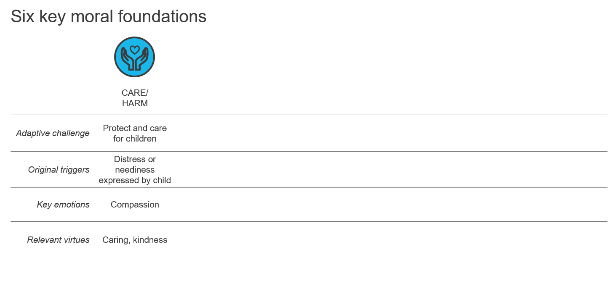
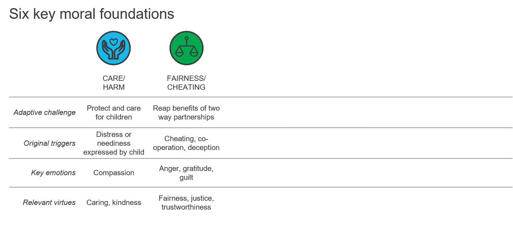
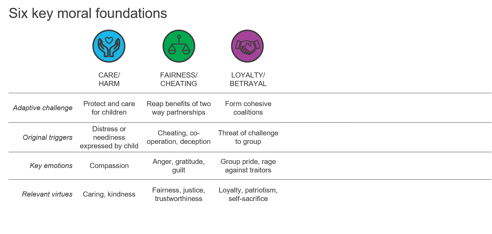
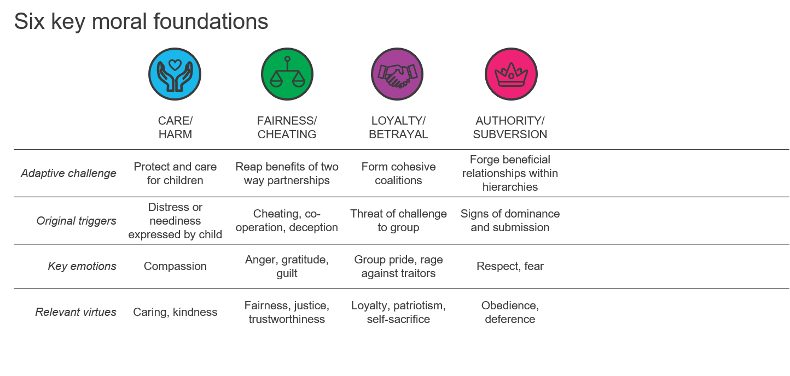
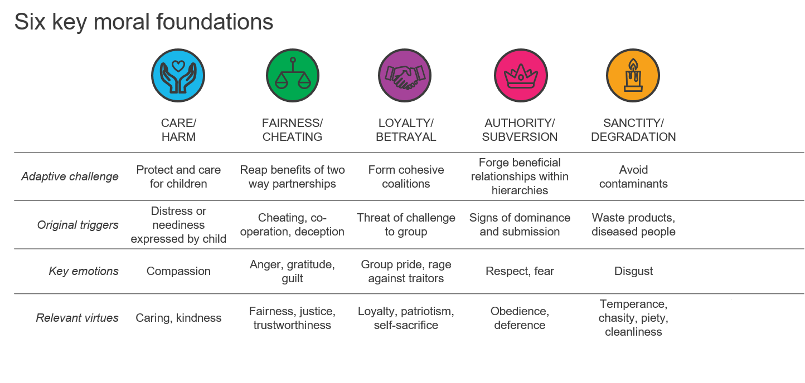
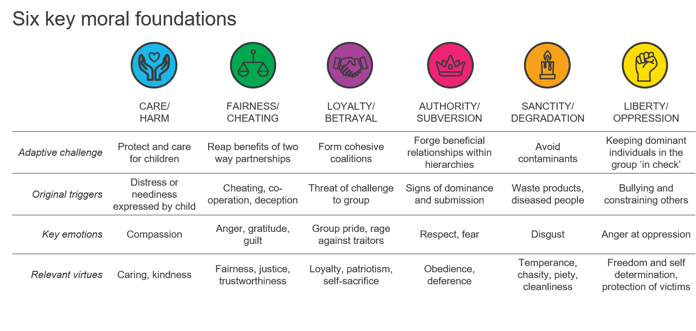
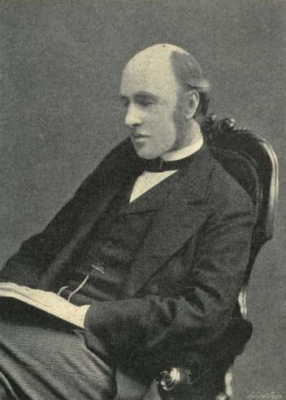
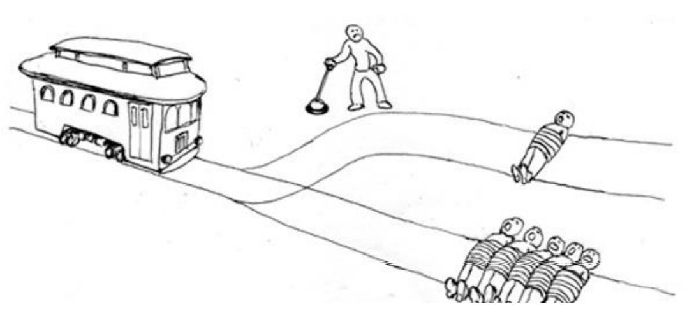

# Week 1

In the first week, after a review of the syllabus, we will be discussing how morality has been defined by philosophers and psychologists and  measured empirically. 

.highlight-blue[In week 1:]
- How will the course be structured and your learning assessed?

- How do philosophers define morality?

- **How do psychologists define morality?**

- **How do psychologists measure morality?**

---
#Defining morality

Definitions of morality are either **descriptive** or **normative**

- **Normative**: morality is a code of conduct that would be agreed upon by all "rational" persons 
- **Descriptive**: morality is a system of morals that are endorsed by an individual or a group

  - Morality is whatever a group or individual thinks is moral
  - E.g., Catholic morality, Democrat morality, Nazi morality
  
.footnote[Gert (2020)]
---

#Defining morality

- Philosophers generally develop normative theories, debating what we *ought* to think is moral and how we *ought* to make moral judgments

- Social scientists generally theorize descriptively, .highlight-blue[recording how individuals disagree about what is moral or immoral] and theorizing about the psychological mechanisms underlying those moral disagreements 


.footnote[Gert (2020)]


---

# Five descriptive theories

A good descriptive theory of morality needs to account for the moral differences within and between populations of individuals

  - It should be able to describe why one sibling is "pro-life" and the other "pro-choice" and why some cultures endorse "honor killings" while others find the practice abhorrent
  
--

.dq[Name a moral issue that you disagree with another person on.]

???
Gay rights, social distancing/ mask wearing/ vaccination 

---

# Five descriptive theories

1. **Moral foundations theory**
2. The theory of dyadic morality
3. The model of moral motives
4. Relationship regulation
5. Circle of moral concern

---
# Moral foundations theory

.left-column-big[Haidt has taken a **functionalist** approaches to defining morality; he describes an act as moral if it fulfills a particular *function*.

>.smallish["Moral systems are interlocking sets of values, virtues, norms, practices, identities, institutions, technologies, and evolved psychological mechanisms that work together to .highlight-blue[suppress or regulate selfishness and make cooperative social life possible.]"]
.right[-Jonathan Haidt, 2010]]

.right-column-small[ 
<center><b>Jonathan Haidt</b>, <i>Social Psychologist</i></center>]


???
So anything that regulates/ suppresses selfishness can be considered moral by someone under this definition
---

# Moral foundations theory
.footnote[Haidt & Joseph (2007); Koleva et al. (2012)]

- Haidt proposed **moral foundations theory**, which theorizes that there are (at least) six moral foundations

  - Moral foundations are taste receptors of the moral mind

  - Everyone is capable of these moral intuitions, but forces (e.g., culture, experiences) shape how they are presented in a given individual

???

"The human tongue has five discrete taste receptors (for
sweet, sour, salt, bitter, and umami). Cultures vary enormously in their cuisines, which are cultural constructions shaped by historical events, yet the
world’s many cuisines must ultimately please tongues equipped with just five
innate and universal taste receptors"

- Language example. Everyone is born being capable of speaking all languages, but we lose the ability to be easily able to speak certain sounds without practice so we lose the ability to talk in certain languages naturally. Everyone is theorized to be born capable of having these moral intuitions

---

# Moral foundations theory

.footnote[Haidt & Joseph (2007); Koleva et al. (2012)]

  - **Care/harm** - We should care for and not harm vulnerable others.
  - **Fairness/cheating** - We should get back what we put forward; we should not cheat.
  - **Ingroup/ betrayal** - We should be loyal to our groups (e.g., family, nation).
  - **Authority/ subversion** - We should respect authority and tradition.
  - **Purity/ Degradation** - We should not violate norms of decency and purity by doing certain things with our bodies.
  - **Liberty/ Oppression** - People should not restrict the freedom of others.


---

# Moral foundations theory

.footnote[Haidt & Joseph (2007); Koleva et al. (2012)]


---

# Moral foundations theory

.footnote[Haidt & Joseph (2007); Koleva et al. (2012)]



---

# Moral foundations theory

.footnote[Haidt & Joseph (2007); Koleva et al. (2012)]


---

# Moral foundations theory

.footnote[Haidt & Joseph (2007); Koleva et al. (2012)]


---
# Moral foundations theory

.footnote[Haidt & Joseph (2007); Koleva et al. (2012)]



---
# Moral foundations theory

.footnote[Haidt & Joseph (2007); Koleva et al. (2012)]



---
# Moral foundations theory

.footnote[Haidt & Joseph (2007); Koleva et al. (2012)]

.smallish[- **Care/harm** - We should care for and not harm vulnerable others.
- **Fairness/cheating** - We should get back what we put forward; we should not cheat.
- **Ingroup/ betrayal** - We should be loyal to our groups (e.g., family, nation).
- **Authority/ subversion** - We should respect authority and tradition.
- **Purity/ Degradation** - We should not violate norms of decency and purity by doing certain things with our bodies.
- **Liberty/ Oppression** - People should not restrict the freedom of others.]


.smallish[.dq[Do any of these foundations seem more or less central to your conception of morality? ]]

---

# Five descriptive theories

1. Moral foundations theory
2. **The theory of dyadic morality**
3. The model of moral motives
4. Relationship regulation
5. Circle of moral concern

---
# The theory of dyadic morality


.left-column-big[Rather than *moral pluralism* (there are 5+ distinct moral intuitions), Gray argues for *harm pluralism*. We perceive an act as immoral when it causes harm (e.g., to an individual, a soul, a group, society).

> "Dyadic morality suggests that moral disagreement typically occurs through .highlight-blue[different informational assumptions] about who or what is vulnerable to harm." 

.right[-Kurt Gray and colleagues, 2012]]

.right-column-small[
<center><b>Kurt Gray</b>, <i>Social Psychologist<i></center>]

---
# The theory of dyadic morality

.footnote[Gray, Waytz, & Young (2012)]

<center></center>
- The most prototypical moral acts are ones where there is an agent causing harm to a victim (e.g., murder, theft, rape, assault)

- These acts are the most accessible and they are judged the harshest
---
# The theory of dyadic morality
.footnote[Gray, Waytz, & Young (2012)]
<center></center>
- "Agent" causing harm to a "patient" becomes a cognitive template for a moral violation

---
# The theory of dyadic morality
.footnote[Gray, Waytz, & Young (2012)]
<center> </center>
- When a person believes that you can harm the dead, a soul, animals, or groups through an action, it is perceived as immoral

---
# The theory of dyadic morality
.footnote[Gray, Waytz, & Young (2012)]

Thus, people do not have fundamentally different moralities; they just sometimes disagree that certain act are harmful

- For example, if you believe that fetuses are babies that feel pain and have souls, then you would be more likely to consider abortion morally wrong

--

.dq[.smallish[Name a moral disagreement that may occur because two people disagree that the act is harmful.]]
---
# Five descriptive theories

1. Moral foundations theory
2. The theory of dyadic morality
3. **The model of moral motives**
4. Relationship regulation
5. Circle of moral concern

---
# The model of moral motives
.footnote[Janoff-Bulman & Carnes (2013)]

.left-column-big[Janoff-Bulman has theorized that differences in moral judgments are caused by individual differences in motivation to do good versus to avoid doing bad.

>.smallish["Morality is generally recognized as a system of rules that facilitate and coordinate group living; as such it involves .highlight-blue[ behavioral regulation] so as to optimize our existence as social beings."] .right[-Janoff-Bulman & Carnes, 2013]]
.right-column-small[
<center><b>Ronnie Janoff-Bulman</b>, <i>Social Psychologist</i></center>]

---
# The model of moral motives
.footnote[Janoff-Bulman & Carnes (2013)]

- All moral motives can be classified by the two **motivational systems** (approach or avoid) and the **focus of moral concern** (the self, another person, or the group)

  - **Motivational systems**: our approach motivational system designates moral beliefs about what we *ought to do* (called prescriptive morality) and our avoidance motivational system designates moral beliefs about what we *ought not to do* (called proscriptive morality)
  
  - **Focus of moral concern**: we have moral beliefs concerning what is virtuous for the self, for another person, and for the group

---
# The model of moral motives


.footnote[Janoff-Bulman & Carnes (2013)]

.pull-right[]
.pull-left[
- We should protect the self by avoiding certain behaviors and resisting temptation 

- E.g., the seven deadly sins (lust, gluttony, pride, envy, wrath, greed, sloth)
]


---
# The model of moral motives

.footnote[Janoff-Bulman & Carnes (2013)]

.pull-right[]
.pull-left[
- We should provide for the self in order to contribute to the group (rather than be a burden)

- E.g., virtues (hard work, conscientiousness, persistence)
]

---
# The model of moral motives

.footnote[Janoff-Bulman & Carnes (2013)]

.pull-right[]
.pull-left[
- We need to protect others and not harm them 

- E.g., protect children from abuse, protect family by carrying a gun, punish cheaters 
]

---

# The model of moral motives

.footnote[Janoff-Bulman & Carnes (2013)]

.pull-right[]
.pull-left[
- We need to provide for others by helping them 

- E.g., welfare, donations, importance of treating others fairly 
]

---

# The model of moral motives

.footnote[Janoff-Bulman & Carnes (2013)]

.pull-right[]
.pull-left[
- We need to protect the group from danger or threats (including threats to identity)

- E.g., limit immigration, respect tradition

]

---
# The model of moral motives

.footnote[Janoff-Bulman & Carnes (2013)]

.pull-right[]
.pull-left[
- We need to provide for the welfare of the group)

- E.g., fight for social justice/ equity across groups 

]

---

# The model of moral motives

.footnote[Janoff-Bulman & Carnes (2013)]

.pull-right[]
.pull-left[
- Some individuals naturally tend towards proscriptive regulation, to avoid doing bad

- Other individuals  naturally tend towards prescriptive regulation, to do good 
]

---

# Five descriptive theories

1. Moral foundations theory
2. The theory of dyadic morality
3. The model of moral motives
4. **Relationship regulation**
5. Circle of moral concern
---

# Relationship regulation
.footnote[Rai & Fiske (2011)]

.left-column-big[Rai argues that moral differences occur when individuals differ in how a social relationship should be construed. 

> .smallish["We must reconceptualize moral psychology as .highlight-blue[embedded in our social-relational cognition], such that moral judgments and behaviors emerge out of the specific obligations and transgressions entailed by particular types of social relationships."]
.right[-Rai & Fiske, 2011]]

.right-column-small[
<center><b>Tage Rai</b>,<br> <i>Social Psychologist</i> ]

---


# Relationship regulation
.footnote[Fiske (2000); Fiske & Haslam (2005)]

**Relational models theory** states that there are four different types of relationships.

.highlight-blue[Communal sharing:] individuals treat each other as equivalent, give and receive according to need, long term

--

.dq[.smallish[Name a relationship that typically involves communal sharing.]]


???

A family, a team
  
  
---
# Relationship regulation
.footnote[Fiske (2000); Fiske & Haslam (2005)]


**Relational models theory** states that there are four different types of relationships.

.highlight-blue[Authority ranking:] individuals are ranked along a social dimension, those who are higher in rank must protect those lower in rank

--

.dq[.smallish[Name a relationship that typically involves authority ranking.]]

???
Adults and children, military officers and soldiers
---
# Relationship regulation
.footnote[Fiske (2000); Fiske & Haslam (2005)]

**Relational models theory** states that there are four different types of relationships.

.highlight-blue[Equality matching:] relationship based on balance and reciprocity, requires record keeping to know what has been exchanged, turn-based

--


.dq[.smallish[Name a relationship that typically involves equality matching.]]

???
e.g., exchanging Christmas cards

---
# Relationship regulation
.footnote[Fiske (2000); Fiske & Haslam (2005)]

**Relational models theory** states that there are four different types of relationships.

.highlight-blue[ Market pricing:] based on proportionality, each person gets what they deserve

--


.dq[.smallish[Name a relationship that typically involves equality matching.]]

???
e.g., buying and selling


---
# Relationship regulation
.footnote[Rai & Fiske (2011)]

- Two people can employ different relational mental models at different times

> Two friends may share tapes and records freely with each other (CS), work on a task at which one is an expert and imperiously directs the other (AR), divide equally the cost of gas (EM), and transfer a bicycle from one to the other for a market-value price (MP)
.right[-Goldman (1993, pp. 344-345). ]


---
# Relationship regulation
.footnote[Rai & Fiske (2011)]

- Cultural differences or meaningful differences in a population can arise when there are disagreements about which relational model is appropriate 

  - For example, one might perceive a family charging their child for rent as unethical if they believe a family relationship should be a communal sharing one (not a market pricing one)

--

.dq[.smallish[Name a moral disagreement that may arise from differences in perceived relational models.]]

???
Some people think that a child-parent relationship should be a more communal one than authority ranking

In a CS model, violence should not be directed towards ingroups (but might be ok against outgroups)

In EM, violence should be committed only when it has been committed towards you 

People differ in what is "fair" - is it fair to share equally, to share proportionally with the work 
---


# Five descriptive theories

1. Moral foundations theory
2. The theory of dyadic morality
3. The model of moral motives
4. Relationship regulation
5. **Circle of moral concern**

---
# Circle of moral concern
.left-column-big[Meaningful differences arise when people differ in *who* they include in their moral circle. 

> "At one time the benevolent affections embrace merely the family, soon .highlight-blue[the circle expanding] includes first a class, then a nation, then a coalition of nations, then all humanity and finally, its influence is felt in the dealings of man with the animal world."
.right[-W.E.H. Lecky, 1869]]

.right-column-small[]
<center><b>W.E.H. Lecky</b><br> <i>Historian, philosopher</i>

???

This idea was first theorized by W.E.H. Lecky and then later popularized by modern philosopher Peter Singer.
---

# Circle of moral concern
.right-column-big[]
.left-column-small[- Psychologist have found that individuals differ in who they have moral concerns for
- For example, children are more egocentric and many vegetarians/ vegans have higher moral concern for animals than meat-eaters do]


---

#Measuring morality

Psychologists generally measure morality through

1. **Self-report of behaviors or traits**
2. Hypothetical moral dilemmas
3. Endorsement of abstract moral rules
4. Position on specific moral issues
5. Behavior

.footnote[Ellemers et al. (2019)]

---

# Self-report

.footnote[Lee & Ashton (2018)]

- An example of a self-report measure of morality would be The HEXACO Personality Inventory **Honesty-Humility subscale**

- Individuals who score high on Honesty-Humility say that they don't manipulate others for personal gain and feel little temptation to break rules

--

Example item:

1. I’d be tempted to use counterfeit money, if I were sure I could get away with it. 

???

2. If I want something from a person I dislike, I will act very nicely toward that person in order to get it.

---
#Measuring morality

Psychologists generally measure morality through

1. Self-report of behaviors or traits
2. **Hypothetical moral dilemmas**
3. Endorsement of abstract moral rules
4. Position on specific moral issues
5. Behavior

.footnote[Ellemers et al. (2019)]

---

# Hypothetical moral dilemmas 

A runaway trolley is headed for five people who will be killed if it proceeds on its present course. The only way to save them is to hit a switch that will turn the trolley onto an alternate set of tracks where it will kill one person instead of five. Should you turn the trolley in order to save five people at the expense of one?

.footnote[Thomson (1976)]

.smaller-picture[]

---

#Measuring morality

Psychologists generally measure morality through

1. Self-report of behaviors or traits
2. Hypothetical moral dilemmas
3. **Endorsement of abstract moral rules**
4. Position on specific moral issues
5. Behavior

.footnote[Ellemers et al. (2019)]

---

#Abstract moral rules 

.br-small[]

```{r, include = FALSE}
library(tidyverse)
library(kableExtra)
```

```{r, echo = FALSE}
Foundation <- c(".small[**Care/ Harm**]", ".small[**Fairness/ Cheating**]", ".small[**Ingroup/ Betrayal**]", ".small[**Authority/ Subversion**]", ".small[**Purity/ Degradation**]")
Definition <- c(".small[Do not harm.]", ".small[Treat others fairly.]", ".small[Be loyal.]", ".small[Respect authority and tradition.]", ".small[Do not violate purity norms.]")
`MFQ30 Item` <- c(".small[\"It can never be right to kill a human being.\"]", ".small[\"I think it’s morally wrong that rich children inherit a lot of money while poor children inherit nothing.\"]",".small[\"People should be loyal to their family members, even when they have done something wrong.\"]", ".small[\"If I were a soldier and disagreed with my commanding officer’s orders, I would obey anyway because that is my duty.\"]", ".small[\"People should not do things that are disgusting, even if no one is harmed.\"]")
cbind(Foundation, Definition, `MFQ30 Item`) %>% kbl()
```

.footnote[Graham et al. (2008)]

---

#Measuring morality
.footnote[Ellemers et al. (2019)]

Psychologists generally measure morality through

1. Self-report of behaviors or traits
2. Hypothetical moral dilemmas
3. Endorsement of abstract moral rules
4. **Position on specific moral issues**
5. Behavior


---
# Specific moral issues


- We can give participants scales inquiring information about their position on specific moral issues

  - "Do you think abortion is wrong"?
  - "Do you think it is immoral to eat meat?"
---

#Measuring morality
.footnote[Ellemers et al. (2019)]

Psychologists generally measure morality through

1. Self-report of behaviors or traits
2. Hypothetical moral dilemmas
3. Endorsement of abstract moral rules
4. Position on specific moral issues
5. **Behavior**

---
# Behavioral measures

Psychologists can manipulate situations in a lab and measure whether the participants acting morally or immorally
  - **The dictator game:** participants in a lab experiment are paired up. One player is randomly assigned to be the "dictator." The "dictator" can give the other player as much money as they want. Researchers measure how much money the "dictator"  gives away.
  
<center>

???

  - Participants are given a task to do that earns them money. At the end, the researcher asks if the participant would be willing to donate some of their earnings. The researcher records how much money is donated.

---

#Behavioral measures

- Psychologists can also try to measure moral behavior in naturalistic settings (i.e., in the real world)

  - Researchers can drop wallets across the country with a return address and measure how many get returned
  
  - Researchers can send random people holiday cards and see if they get one back


---

# Summary

- Individuals differ in:
  - How strongly they endorse moral foundations
  - What they believe is harmful
  - How motivated they are to do good or avoid harm
  - Employment of relational models
  - Who they feel moral concern for
  

- Psychologists measure morality mainly through... 
  - Self-report, moral dilemmas, and behavioral observation

.highlight-blue[Due Sunday:] Homework 1