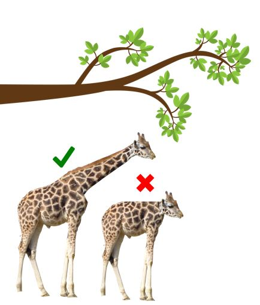
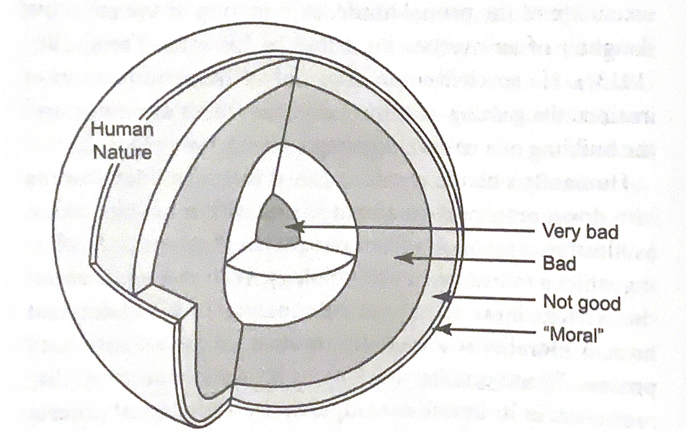
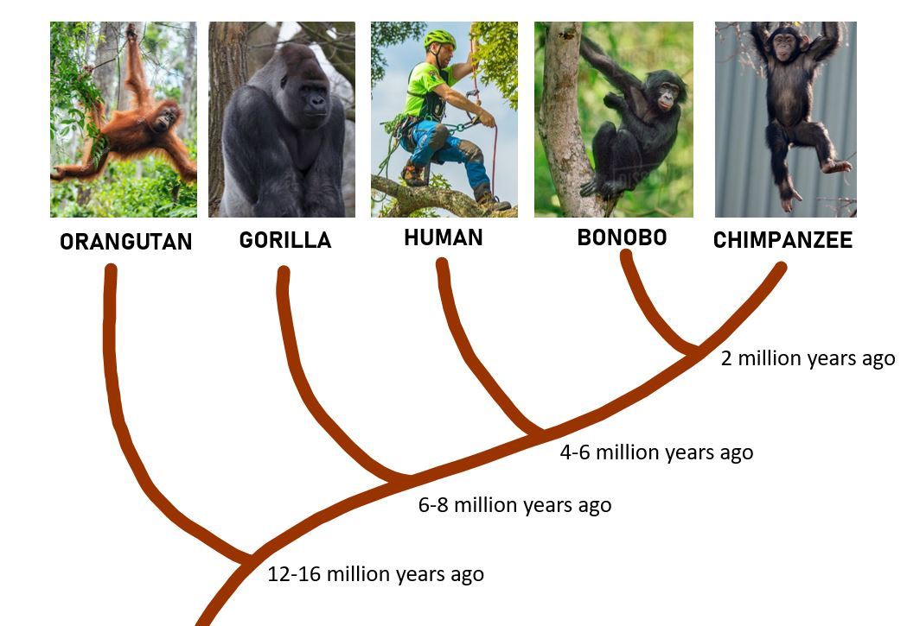
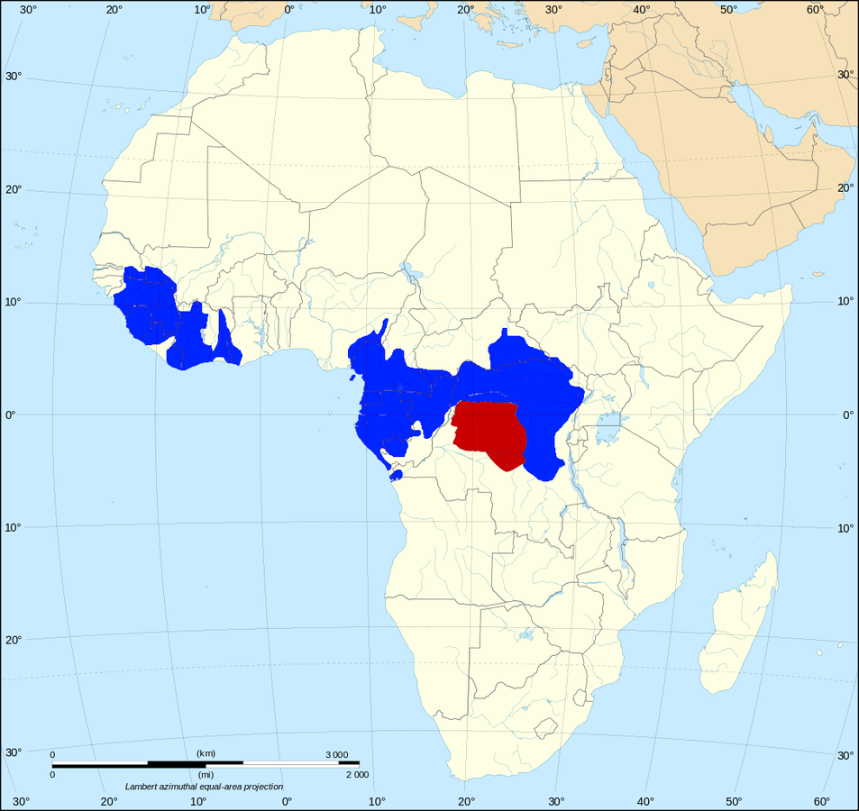
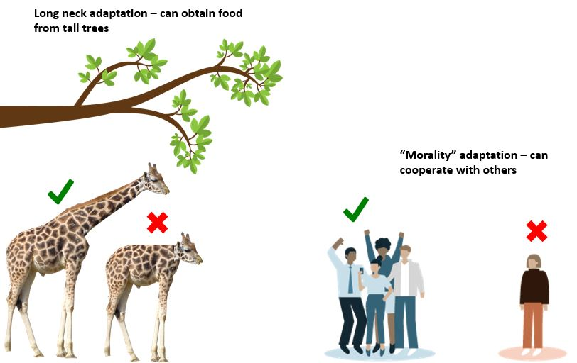

# Week 2

This week we will be discussing insights for human moral psychology from research on animals and human infants/ children.

.highlight[In week 2:]
- Are remnants of our moral intuitions present in animals?
- How can natural selection, which touts "survival of the fittest," account for the presence of moral organisms?
- Are children capable of moral reasoning and moral behavior?
- How do we develop our moral conscience across the lifespan?

---

# Darwin's theory of evolution 

.footnote[Darwin (1859)]

.left-column-med[- Darwin proposed that organisms evolve primarily through *natural selection*
  - Organisms in a given population naturally vary on heritable traits (e.g., height)
  - When a particular variant of a trait is adaptive (e.g., being tall), individuals with the adaptive form of the trait are more likely to survive and reproduce
  - Thus adaptive traits are more likely to be passed on to subsequent generations]

.right-column-med[]

---

# Morality

Altruistic behavior has puzzled evolutionary biologists and psychologists because it seemingly conflicts with the theory of natural selection

Individuals who steal, cheat, deceive, and hoard resources would have a better chance of surviving and reproducing

So why do some individuals sacrifice their lives to save another life, or sacrifice their time and earnings to help those who are suffering, when these actions can reduce their chances of surviving and reproducing? 

---

# A veneer theory of human morality

- Veneer theory was endorsed by many biologists in the 20th century
- It posits that humans are inherently selfish and amoral beings. Underneath a thin "veneer" of morality lies an amoral, selfish animal
- This theory implies that humans are the only moral animal because morality requires .highlight[self-regulation and self-control] that other animals do not have
.right-column[]

.footnote[Frans de Waal (2006)]

---
# Moral behavior of primates

- In order to determine if other animals have moral capabilities, we should first observe the behavior of our closest evolutionary relatives: bonobos and chimpanzees

.smaller-picture[]

---

# Bonobos and chimpanzees

.left-column-med[
- Both bonobos and chimpanzees live in Sub-Saharan Africa, separated by the Congo river
- North of the Congo river, where chimpanzees live, there is less rainfall and more competition for food; south of the Congo river, where bonobos live, food is abundant and competition is limited
- These different environmental pressures led to large differences in behavior between the two species]

.right-column-med[
Chimps live in the blue areas and bonobos live in the red areas]

???
The congo river is very wide so they can't swim across
For example, some gorillas and chimps live in the same areas, where gorillas  eat what is on the ground, so chimps have to find food elsewhere 
---
# Bonobos and chimpanzees

.center[<iframe width="700" height="400" src="https://www.youtube.com/embed/Wrv-W-_mHnI" frameborder="0" allow="accelerometer; autoplay; clipboard-write; encrypted-media; gyroscope; picture-in-picture" allowfullscreen></iframe>]

.right[https://www.youtube.com/watch?v=Wrv-W-_mHnI]

---
# Is vaneer theory supported?

- While bonobos are relatively peaceful, chimps can be very violent
- Bonobo females ban together to form strong alliances, but chimpanzee males often hurt females and children for their own benefit
--

- .highlight[Discussion question:] can understanding the behavior of our closest relatives (chimps and bonobos) tell us anything about human morality? Are we chimps with self-control (as veneer theory would suggest), or is something else going on?

---
# The "Beethoven" error
- Beethoven was incredibly disorganized and messy; nonetheless, surrounded by chaos, he created beautiful works of art
- It would be an error to say that beauty cannot result from a disorderly, chaotic process
- In the same way, while natural selection can be cruel and ruthless, it would be an error to say that it can only result in cruel and ruthless creatures

.footnote[Frans de Waal (2006)]

---

# A naturalistic theory of human morality
- Natural selection favors organisms with adaptations that allow them to survive and reproduce and lying, cheating, and harming others is not the only way to survive and reproduce
- For social animals (animals that live in groups) like humans, moral intuitions about harm, fairness, loyalty, etc. allow us to peacefully cooperate with members of our group
- Thus all social animals should have, to some extent, evolved moral intuitions 

.footnote[Frans de Waal (2006)]

---

# A naturalistic theory of human morality

---

# A naturalistic theory of human morality

- If we evolved morality from living in social groups, then we should be able to observe other social animals acting in moral ways 
- For example, non-human social animals would be inclined to help others and would be sensitive to violations of fairness

---

# Do animals help other animals?

.footnote[Rice & Gainer (1962)]

- Researchers suspended one rat by a harness  