# Week 2

This week we will be discussing moral insights from research on animals and human infants and children

.highlight[In week 2:]
- How can natural selection, which touts "survival of the fittest," account for the evolution of moral organisms?
- Are pieces of our moral intuitions present in nonhumasn animals?
- Are children capable of moral reasoning and moral behavior?
- How do we develop our moral conscience across the lifespan?

---

# Darwin's theory of evolution 

.footnote[Darwin (1859)]

- Darwin proposed that organisms evolve primarily through *natural selection*
  - Organisms in a given population naturally vary on heritable traits (e.g., height)
  - When a particular variant of a trait is adaptive (e.g., being tall), individuals with the adaptive form of the trait are more likely to survive and reproduce
  - Thus adaptive traits are more likely to be passed on to subsequent generations
.smaller-picture[]
---

# The evolution of morality

Altruistic behavior has puzzled evolutionary biologists and psychologists because it seemingly conflicts with the theory of natural selection

Individuals who steal, cheat, deceive, and hoard resources would have a better chance of surviving and reproducing

So why do some individuals sacrifice their lives to save another life, or sacrifice their time and earnings to help those who are suffering, when these actions can reduce their chances of surviving and reproducing? 

---

# A veneer theory of human morality

- Veneer theory was endorsed by many biologists in the 20th century
- It posits that humans are inherently selfish and amoral beings and underneath a thin "veneer" of morality lies an amoral, selfish animal
- This theory implies that humans are the only moral animal because morality requires .highlight[self-regulation and self-control] that other animals do not have
.right-column-big[]

.footnote[Frans de Waal (2006)]

---
# A veneer theory of human morality
.footnote[Darwin (1871)]
.left-column-big["Of all the differences between man and the lower animals, the moral sense or conscience is by far the most important."
.right[-Charles Darwin,  *The Descent of Man*]]

.right-column-small[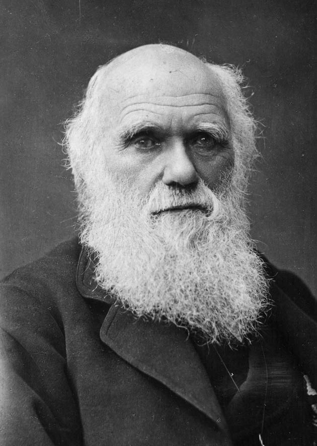]

---
# Moral behavior of primates

- In order to understand how humans evolved to have moral senses and to determine if other animals have moral capabilities, we should first observe the behavior of our closest evolutionary relatives: bonobos and chimpanzees
.smaller-picture[]

---

# Bonobos and chimpanzees

.left-column-med[
- Both bonobos and chimpanzees live in Sub-Saharan Africa, separated by the Congo river
- North of the Congo river, where chimpanzees live, there is less rainfall and more competition for food; south of the Congo river, where bonobos live, food is abundant and competition is limited
- These different environmental pressures led to large differences in behavior between the two species]

.right-column-med[]

???
The congo river is very wide so they can't swim across
For example, some gorillas and chimps live in the same areas, where gorillas  eat what is on the ground, so chimps have to find food elsewhere 
---
# Bonobos and chimpanzees

.center[<iframe width="700" height="400" src="https://www.youtube.com/embed/Wrv-W-_mHnI" frameborder="0" allow="accelerometer; autoplay; clipboard-write; encrypted-media; gyroscope; picture-in-picture" allowfullscreen></iframe>]

.right[https://www.youtube.com/watch?v=Wrv-W-_mHnI]

---
# Is vaneer theory supported?

- While bonobos are relatively peaceful, chimps can be very violent
- Bonobo females ban together to form strong alliances, but chimpanzee males often hurt females and children for their own benefit
--

- .highlight[Discussion question:] can understanding the behavior of our closest relatives (chimps and bonobos) tell us anything about human morality? Are we chimps with self-control (as veneer theory would suggest), or is something else going on?

---
# The "Beethoven" error
- Beethoven was incredibly disorganized and messy; nonetheless, surrounded by chaos, he created beautiful works of art
- Therefore, it would be an error to say that beauty cannot result from a disorderly, chaotic process
- In the same way, while natural selection can be cruel and ruthless, it would be an error to say that it can only result in cruel and ruthless creatures

.footnote[Frans de Waal (2006)]

---

# A naturalistic theory of human morality
- Natural selection favors organisms with adaptations that allow them to survive and reproduce and lying, cheating, and harming others is not the only way to survive and reproduce
- For social animals (animals that live in groups) like humans, moral intuitions about harm, fairness, loyalty, etc. allow us to peacefully cooperate with members of our group
- Thus all social animals should have, to some extent, evolved moral intuitions 

If we evolved morality from living in social groups, then we should be able to detect at least rudimentary forms of moral intuitions in nonhuman social animals

.footnote[Frans de Waal (2006)]

---

# Altruistic worker ants
.smallest-picture[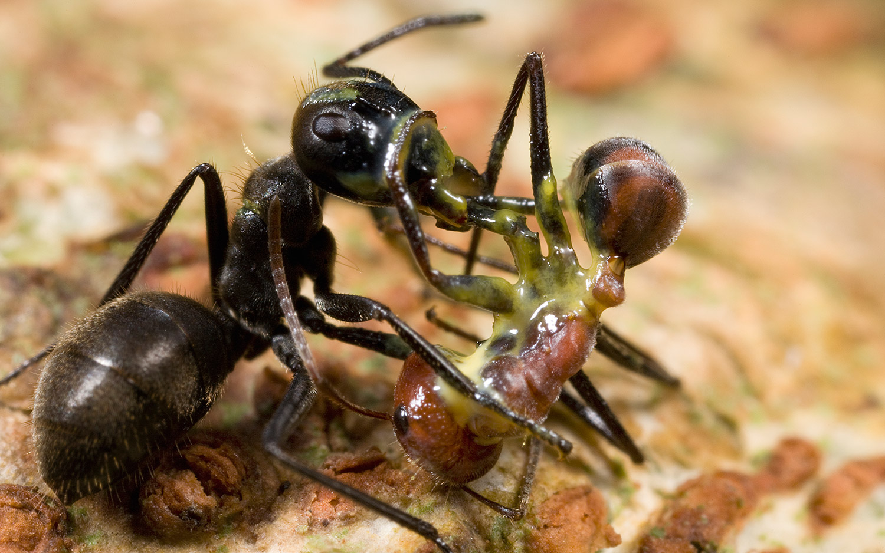]
Some species of worker ants have cavities full of poisonous glue in their body that they will explode to protect the rest of their colony

The explosion will likely save the colony but will kill the altruistic ant

--

Do nonhuman animals care about protecting and providing for group members that they are not genetically related to? 
---
# Protecting behavior in rats
.footnote[Rice & Gainer (1962)]

.left-column-med[
- Rice and Gainer (1962) tested if rats would expend effort to help another rat who was suffering
- **Training session:** first, experimenters trained the rats to learn that pressing a lever would lower a styrofoam block that was suspended by a harness]

.right-column-med[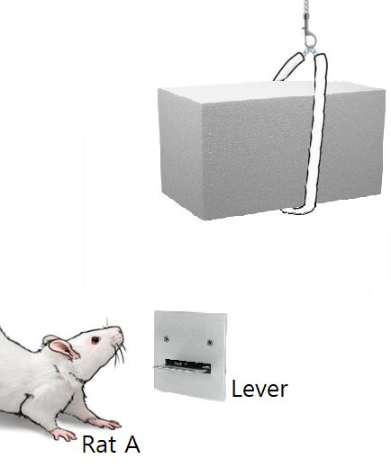]

???
They were trained to lower the foam via shocks, i.e., they would be shocked if they did not press the lever 
---

# Protecting behavior in rats
.right-column-bigger[
- **Experiment**: Rice and Gainer (1962)  suspended rat B by a harness in full view of rat A; rat B showed signs of distress, squealing and wriggling to try to get free
  - Researchers measured whether Rat A would press the lever and relieve rat B of distress
- **Results:** Rats pushed the lever on average 14.6 times (compared to .8 times for rats in the control group who were presented with the styrofoam block)]
.footnote[Rice & Gainer (1962)] 
.left-column-smaller[   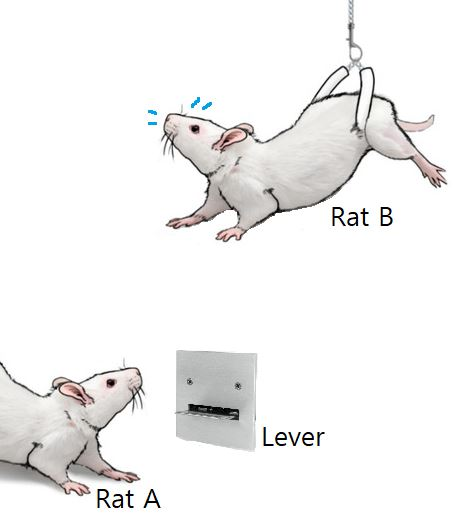]

???

The control condition had a styrofoam block raised up by a harness instead of a rat. If pressed, the bar would lower the rat 
This experiment happened over 5 10-minute trials. when the rats realized that pressing the level would lower the other rat, they pressed it at increasing frequency, but when they realized the lever would lower the foam, they did not press it at increasing frequency suggesting that the rats were motivated to relieve the distress of the suspended rat
---

# Protecting behavior in primates

.footnote[Masserman et al. (1964)]

.left-column-med[- Masserman et al. (1964) tested if monkeys were willing to forgo food in order to save another monkey from harm
- **Training session:** first, experimenters trained rhesus monkeys to pull one chain in response to a blue light and another chain in response to a red light in order to obtain a pellet of food
- Two days into training, another monkey was placed in the compartment to the right of the first monkey]
.right-column-med[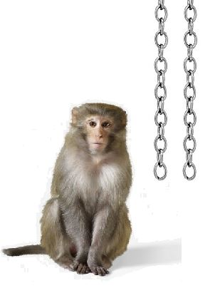]

---
# Protecting behavior in primates 
.footnote[Masserman et al. (1964)]

- Four days into training, when the monkey pulled on one of the chains to get food, Masserman et al. (1964) administered a shock to the monkey in the adjacent compartment 
- **Results**: 10/15 monkeys preferred to pull the chain that did not shock the other monkey
  - One monkey did not pull either chain for 5 days and another did not pull either chain for 12 days after seeing it shock the other monkey
  - These monkeys were willing to starve to not harm the neighboring monkey

--

.highlight[Discussion question:] Are these rats and monkeys helping because they feel empathy? How may their motivations and responses differ from human motivations and responses?

???
Monkeys may be more likely to help monkeys they know but may not have moral concerns for those who are strangers
---

# Providing behavior in primates 
.footnote[Horner et al. (2011)] 
.right-column-med[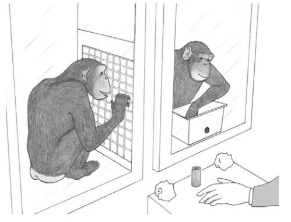]
- Horner et al. (2011) tested whether chimpanzees were concerned with helping other chimps (not just preventing harm)
- For the experiment, two chimps were held in adjacent compartments
-  The researcher offered one of the chimps a bucket of 30 evenly distributed red and green tokens
- The chimps learned that if they choose the red token (the selfish token), then only they will get food, but if they choose a green token (the prosocial token), both chimps would get food

---

# Providing behavior in primates
.footnote[Horner et al. (2011)] 
.right-column-med[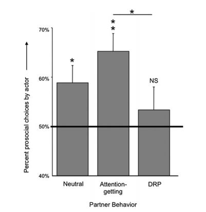]
- Horner et al. (2011) found that chimps were willing to help; they choose the prosocial token more than chance (50%)
- The monkey's willingness to choose the prosocial token increased when the other chimp was making noise indicating that they were hungry (coded as attention-giving) but decreased when the other chimp was trying to intimidate (coded as DRP)

???

attention-giving (self-scratching, noise, food-grunts, or hitting the caging)
directed requests and pressure = DRP (throwing paper toward other monkey, spitting water, begging, hooting)

---
# Providing behavior in primates
.footnote[de waal et al. (2008)] 
.right-column-med[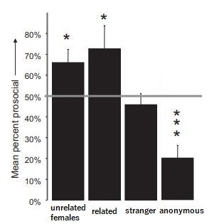]
- In a similar paradigm, Capuchin monkeys were offered a selfish token or a pro-social token
- This time, the researchers varied whether or not the other monkey was an unrelated group member, related, a stranger, or anonymous 
- de Waal et al. (2008) found that monkeys were less concerned with helping strangers or helping anonymously 

???
In the anonymous condition, the researchers put up an opaque partition so that the monkeys could see each other through a small peephole, but they could not see each other accept or consume the rewards

---

# Summary: providing and protecting 

- Non-human animals have been found to expend effort to reduce the suffering of others
  + Some monkeys are willing to even forgo food to prevent other monkeys from being shocked
- Non-human animals have also been found to provide for others
  + They prefer to help groupmates and kin than to help strangers
  + They are much less likely to help when the donation is anonymous 

---
# Fairness in nonhuman animals

.right-column-big[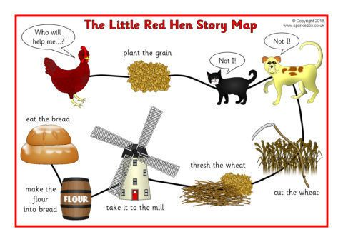]

The Little Red Hen is a children's story about a hen who wants to make bread

She asked her friends if they would help her, but no one wanted to. At the end of the story, her friends wanted to eat the bread, but she concluded that that was unfair because they didn't help her make it

--

Do nonhuman animals distribute resources fairly?
Do they react negatively to violations of fairness?
---
# Reciprocity in vampire bats

.right-column-med[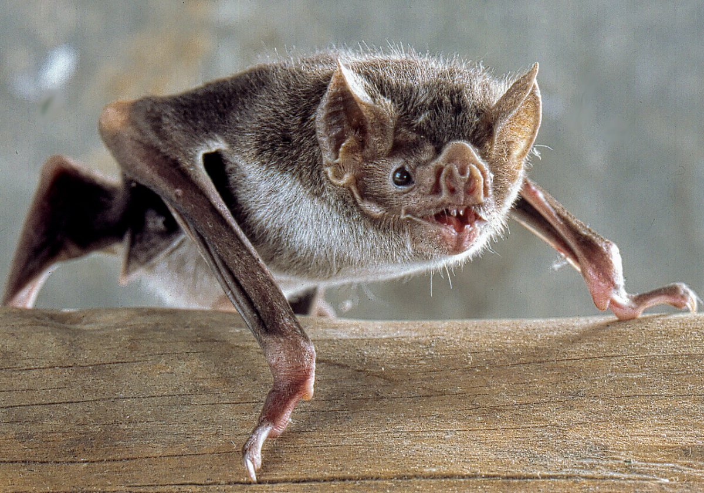]
- Vampire bats exclusively feed on blood; they can only survive about two days without it
- If they cannot find any from an animal, they need to beg another vampire bat to regurgitate some of their meal
- Thus they form cooperative, reciprocal relationships with nonrelated members of their group

Helping so that you will be helped in the future is called **reciprocal altruism** 
---
# Fairness in primates
.footnote[de Waal & Berger (2000)]
- de Waal and Berger (2000) tested whether monkeys were more willing to share their food with another monkey when the other monkey helped obtain it
- The researchers first trained capuchin monkeys to pull food toward themselves using a metal bar
.right-column-med[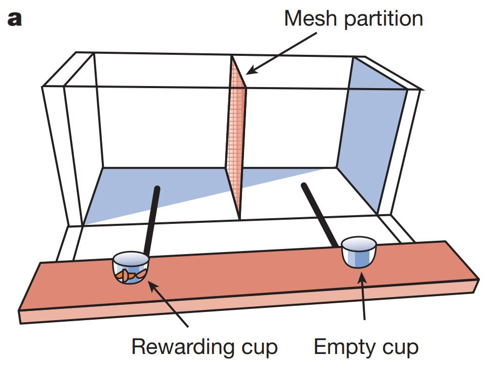]
- In one condition, the monkey was able to pull the food in alone (the solo condition), but in the other condition, the monkey needed help to pull the food in (the cooperation condition)
---
# Fairness in primates

.footnote[de Waal & Berger (2000)]
.right-column-med[]
- de Waal and Berger (2000) found that the monkeys generally were very willing to spontaneously share food, even if they did all of the work to obtain it
- They also found that they share about 1-2 more pieces on average when the other monkey helped obtain the food

---
# Fairness in primates

.footnote[Brosnan & de Waal (2003)]
.right-column-med[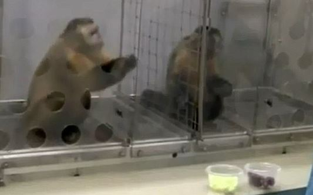]
- Brosnan & de Waal (2003) tested whether monkeys were bothered by violations of fairness
- First, they trained capuchin monkeys to trade rocks for food rewards
- The rewards were cucumbers or grapes; the monkeys liked the cucumbers but strongly preferred the grapes
- The researcher would have both monkeys trade the rocks for food, but would give one monkey a cucumber and the other monkey a grape
---
# Fairness in primates
.footnote[Brosnan & de Waal (2003)]
.right-column-med[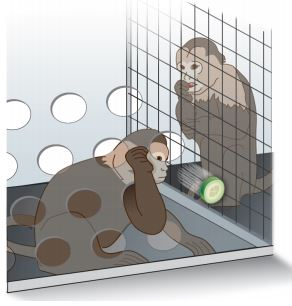]
- Brosnan & de Waal (2003) found that the monkey with the cucumber reward (the inferior reward) would refuse to except the reward and refuse to exchange the rocks for cucumbers

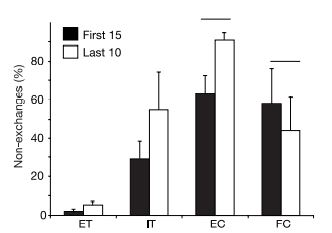

???
ET = equality test (both monkeys receive cucumbers)
IT = inequality test (one monkey cucumber, other monkey grape)
EC = effort control (food was handed to the monkeys with no exchange at all)
FC = food control  (the monkey exchanged for the cucumber; the other monkey was absent but the grape was place it the spot where the other monkey was)
---
# Inequity aversion
There are two types of inequity aversion:
  1. **Disadvantageous inequity aversion:** being averse to inequity that disadvantages you (e.g., being adverse to receiving a cucumber while the other monkey receives a grape)
  2. **Advantageous inequity aversion:** being averse to inequity that advantages you (e.g., being averse to receiving a grape while the other monkey receives a cucumber)
  
Monkeys exhibit behavior consistent with the first but not the second
---
# Advantageous inequity aversion

Advantageous IA might be unique to humans; very few monkeys refuse advantageous rewards

.smallish-picture[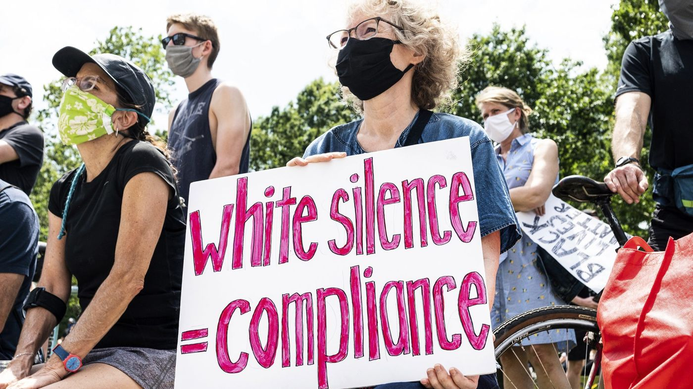]

---

# Summary: fairness/ justice

- Many nonhuman animals engage in reciprocal exchanges of resources, especially for kin
- Primates are willing to share resources with non-kin group members and especially with those that help them obtain it
- Primates sometimes refuse rewards that are unfair

These findings suggest that primates distribute resources and expect resources to be distributed (at least reasonably) fairly

???
A cucumber reward is simply not reasonable

