# Week 2

This week we will be discussing insights about morality gleaned from research on animals and human infants and children.

.highlight-blue[In week 2:]
- **How can natural selection, which touts "survival of the fittest," account for the evolution of moral organisms?**
- **To what extent do nonhuman animals behave morally?**
- Are children capable of moral reasoning and moral behavior?
- How do we develop moral judgments across the lifespan?

---

# Darwin's theory of evolution 

.footnote[Darwin (1859)]

- Darwin proposed that organisms evolve primarily through *natural selection*
  - Organisms in a given population naturally vary on heritable traits (e.g., height)
  - When a particular variant of a trait is adaptive (e.g., being tall), individuals with the adaptive form of the trait are more likely to survive and reproduce
  - Thus adaptive traits are more likely to be passed on to subsequent generations

.pull-right[]
---

# The evolution of morality

- Altruistic behavior has puzzled evolutionary biologists and psychologists because it seemingly conflicts with the theory of natural selection

- Individuals who steal, cheat, deceive, and hoard resources would have a better chance of surviving and reproducing

--

- So, why do some individuals sacrifice their lives to save another life, or sacrifice their time and earnings to help those who are suffering, when these actions can reduce their chances of surviving and reproducing? 

---

# Veneer theory

- Veneer theory was endorsed by many biologists in the 20th century
- It posits that humans are inherently selfish and amoral beings and underneath a thin "veneer" of morality lies an amoral, selfish animal
- This theory implies that humans are the only moral animal because morality requires .highlight-blue[self-regulation and self-control] that other animals do not have
.right-column-big[]

.footnote[Frans de Waal (2006)]

---
# Veneer theory
.footnote[Darwin (1871)]
.left-column-big[
>"Of all the differences between man and the lower animals, the moral sense or conscience is by far the most important."
.right[-Charles Darwin,  *The Descent of Man*]]

.right-column-small[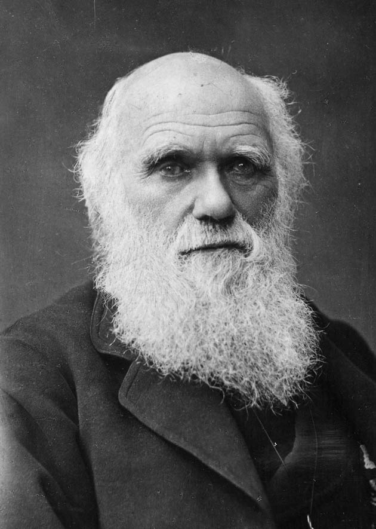]

---
# Moral behavior of primates

.pull-right[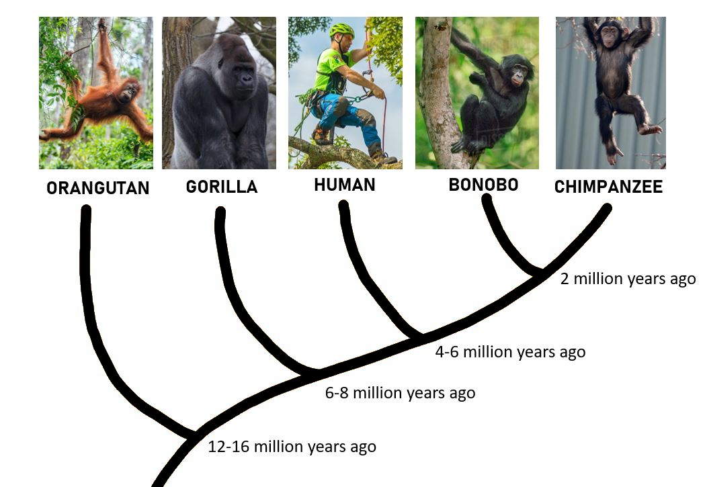]
- How did humans evolve to have moral consciences? Do other animals have moral capabilities?

- The first place we might look to answer these questions is our closest relatives (bonobos and chimpanzees)

---

# Bonobos and chimpanzees

.pull-left[
- Both bonobos and chimpanzees live in Sub-Saharan Africa, separated by the Congo river

- The Congo river is very wide (they cannot swim across it); this led to a single species turning into two]

.pull-right[]

---
# Bonobos and chimpanzees

.pull-left[
- North of the Congo river, where chimpanzees live, there is less rainfall and more competition for food; south of the Congo river, where bonobos live, food is abundant and competition is limited
- These different environmental pressures led to large differences in behavior between the two species]

.pull-right[]

???
For example, some gorillas and chimps live in the same areas, where gorillas  eat what is on the ground, so chimps have to find food elsewhere 
---
# Bonobos and chimpanzees

.center[<iframe width="500" height="350" src="https://www.youtube.com/embed/Wrv-W-_mHnI" frameborder="0" allow="accelerometer; autoplay; clipboard-write; encrypted-media; gyroscope; picture-in-picture" allowfullscreen></iframe>]

.right[https://www.youtube.com/watch?v=Wrv-W-_mHnI]

---
# Bonobos and chimpanzees

- While bonobos are relatively peaceful, chimps can be very violent

- Bonobo females ban together to form strong alliances, but chimpanzee males often hurt females and children for their own benefit

--

.dq[ Are we just chimps with self-control (as veneer theory would suggest)?]

---
# The "Beethoven" error
.footnote[Frans de Waal (2006)]

- Beethoven was incredibly disorganized and messy; nonetheless, surrounded by chaos, he created beautiful works of art

- Therefore, it would be an error to say that beauty cannot result from a disorderly, chaotic process

- In the same way, while natural selection can be cruel and ruthless, it would be an error to say that it can only result in cruel and ruthless creatures

---

# A naturalistic theory
.footnote[Frans de Waal (2006)]

- Natural selection favors organisms with adaptations that allow them to survive and reproduce 

- However, lying, cheating, and harming others is not the only way to survive and reproduce

- For social animals (animals that live in groups) like humans, moral intuitions about harm, fairness, loyalty, etc. allow us to peacefully cooperate with members of our group

---

# A naturalistic theory 
.footnote[Frans de Waal (2006)]

- All social animals should have, to some extent, evolved moral intuitions 

- If we evolved morality from living in social groups, then we should be able to detect at least rudimentary forms of moral intuitions in nonhuman social animals

---

# Altriusm in animals

.highlight-blue[Altruistic behaviors] are selfless actions that benefit other(s) without regard to how it will affect oneself.

- Altruism is theorized to have evolved in animals because it is adaptive under the following conditions

  - **Kin selection**

  - Reciprocal altruism

---

# Kin selection

.pull-right[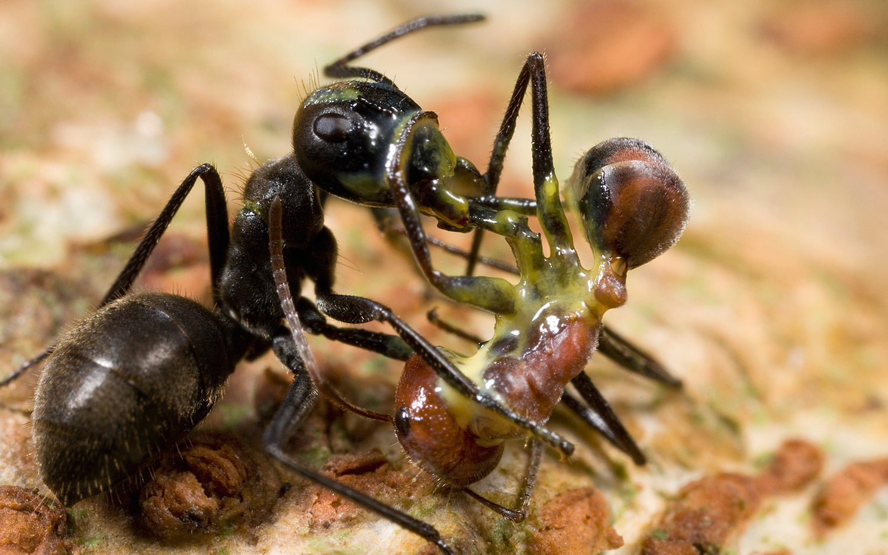]

.pull-left[
**Kin selection**: Altruism that favors the chance of survival of genetic relatives]

---

# Kin selection

.pull-right[]

.pull-left[
**Kin selection**: Altruism that favors the chance of survival of genetic relatives

Some species of worker ants have cavities full of poisonous glue in their body that they will explode to protect the rest of their colony

- The explosion will likely save the colony but will kill the altruistic ant]

---
# Altruism in rats
.footnote[Rice & Gainer (1962)]

.pull-left[#### Research question
- Do nonhuman animals care about protecting and providing for group members .highlight-blue[that they are not genetically related to]?

- Will a rat save another rat from suffering?]

.pull-right[]

---
# Altruism in rats
.footnote[Rice & Gainer (1962)]

.pull-left[####Training session
-  Experimenters trained the rats to learn that pressing a lever would lower a styrofoam block that was suspended by a harness

- They would be shocked if they did not press the lever]

.pull-right[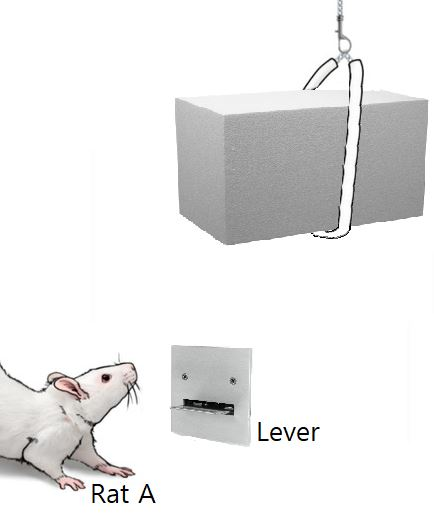]

---

# Altruism in rats
.footnote[Rice & Gainer (1962)] 
.pull-left[]

.pull-right[####Method
- The experimenters suspended rat B by a harness in full view of rat A; rat B showed signs of distress, squealing and wriggling to try to get free

- They measured whether Rat A would press the lever and relieve rat B of distress]
  

---
# Altruism in rats
.footnote[Rice & Gainer (1962)] 

.pull-left[#### Results
- The rats pushed the lever on average 14.6 times when there was another rat in distress (compared to .8 times for a styrofoam block)]

.pull-right[
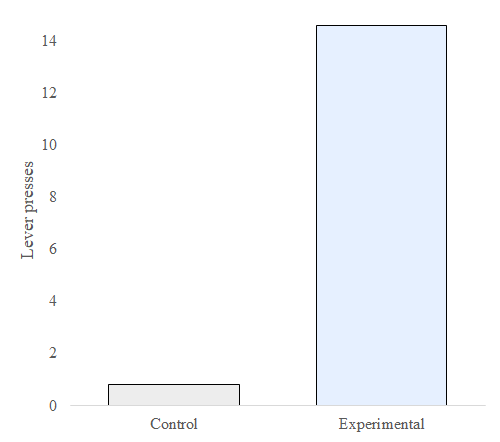]

???

The control condition had a styrofoam block raised up by a harness instead of a rat. If pressed, the bar would lower the rat 
This experiment happened over 5 10-minute trials. when the rats realized that pressing the level would lower the other rat, they pressed it at increasing frequency, but when they realized the lever would lower the foam, they did not press it at increasing frequency suggesting that the rats were motivated to relieve the distress of the suspended rat

---

# Altruism in primates

.footnote[Masserman et al. (1964)]

.pull-right[]

.pull-left[#### Research question 
- Masserman et al. (1964) tested if monkeys were willing to forgo food in order to save another monkey from harm]

---
# Altruism in primates

.footnote[Masserman et al. (1964)]

.pull-left[#### Training session

- Experimenters trained rhesus monkeys to pull one chain in response to a blue light and another chain in response to a red light to obtain food
]
.pull-right[]

---
# Altruism in primates
.footnote[Masserman et al. (1964)]

#### Method
- Two days into training, another monkey was placed in the compartment to the right of the first monkey

- Four days into training, when the monkey pulled on one of the chains to get food, Masserman et al. (1964) administered a shock to the monkey in the adjacent compartment 

---

# Altruism in primates
.footnote[Masserman et al. (1964)]

#### Results

- 10/15 monkeys preferred to pull the chain that did not shock the other monkey
- One monkey did not pull either chain for 5 days and another did not pull either chain for 12 days after seeing it shock the other monkey
- These monkeys were willing to starve to not harm the neighboring monkey

--

.dq[Are these rats and monkeys helping because they feel empathy? ]

???

How may their motivations and responses differ from human motivations and responses?

Monkeys may be more likely to help monkeys they know but may not have moral concerns for those who are strangers
---

# Altruism in primates
.footnote[Horner et al. (2011)] 
.pull-left[#### Research question
- Horner et al. (2011) tested whether chimpanzees were concerned with helping other chimps (not just preventing harm)]

.pull-right[
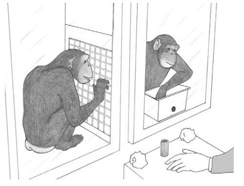]

---

# Altruism in primates
.footnote[Horner et al. (2011)] 

.pull-left[#### Method
- Two chimps were held in adjacent compartments

-  The researcher offered one of the chimps a bucket of 30 evenly distributed red and green tokens]

.pull-right[
]

---
# Altruism in primates
.footnote[Horner et al. (2011)] 

.pull-left[#### Method

- The chimps learned that if they choose the red token (the selfish token), then only they will get food, but if they choose a green token (the prosocial token), both chimps would get food]

.pull-right[
]

---

# Altruism in primates
.footnote[Horner et al. (2011)] 
.pull-right[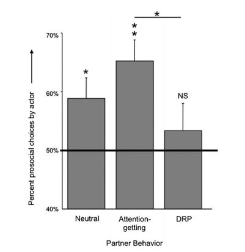]
.pull-left[#### Results
.smaller[- Chimps were willing to help; they choose the prosocial token more than chance (50%)

- Willingness to choose the prosocial token increased when the neighbor was making noises (attention giving) but decreased when the other chimp was trying to intimidate (DRP)]]

???

attention-giving (self-scratching, noise, food-grunts, or hitting the caging)
directed requests and pressure = DRP (throwing paper toward other monkey, spitting water, begging, hooting)

---
# Altruism in primates
.footnote[de Waal et al. (2008)] 
#### Method
- In a similar paradigm, Capuchin monkeys were offered a selfish token or a pro-social token

- This time, the researchers varied whether or not the other monkey was an unrelated group member, related, a stranger, or anonymous 

- In the anonymous condition, the researchers put up an opaque partition so that the monkeys could see each other through a small peephole, but they could not see each other accept or consume the rewards

---

# Altruism in primates
.footnote[de Waal et al. (2008)] 

.pull-left[#### Results
- Monkeys were less concerned with helping strangers or helping anonymously than they were in helping their relatives or group members] 

.pull-right[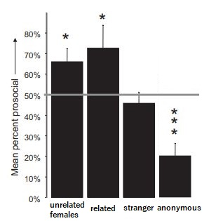]

---

# Altriusm in animals

.highlight-blue[Altruistic behaviors] are selfless actions that benefit other(s) without regard to how it will affect oneself.

- Altruism is theorized to have evolved in animals because it is adaptive under the following conditions

  - Kin selection

  - **Reciprocal altruism**

---

# Reciprocity in vampire bats

.right-column-med[
]
.pull-left[
**Reciprocal altruism**: Helping others so that they help you in the future.]

---

# Reciprocity in vampire bats

.right-column-med[
]
.pull-left[**Reciprocal altruism**: Helping others so that they help you in the future.

Vampire bats exclusively feed on blood; they can only survive about two days without it

- If they cannot find any from an animal, they need to beg another vampire bat to regurgitate some of their meal.]

---
# Reciprocity in vampire bats

.right-column-med[
]
.pull-left[**Reciprocal altruism**: Helping others so that they help you in the future.

Vampire bats exclusively feed on blood; they can only survive about two days without it

- If they cannot find any from an animal, they need to beg another vampire bat to regurgitate some of their meal.]

.pull-right[
*Vampire bats form cooperative, reciprocal relationships with nonrelated members of their group*]

---
# Fairness in primates
.footnote[de Waal & Berger (2000)]

#### Research question

- Do nonhuman animals who form reciprocal relationships care about fairness? Do they really remember and help those who helped them?

- de Waal and Berger (2000) tested whether monkeys were more willing to share their food with another monkey when the other monkey helped obtain it

---
# Fairness in primates
.footnote[de Waal & Berger (2000)]

.left-column-med[####Method
- The researchers first trained capuchin monkeys to pull food toward themselves using a metal bar
- **The solo condition:** the monkey was able to pull the food in alone
- **The cooperation condition:** the monkey needed help to pull the food in
]
.right-column-med[
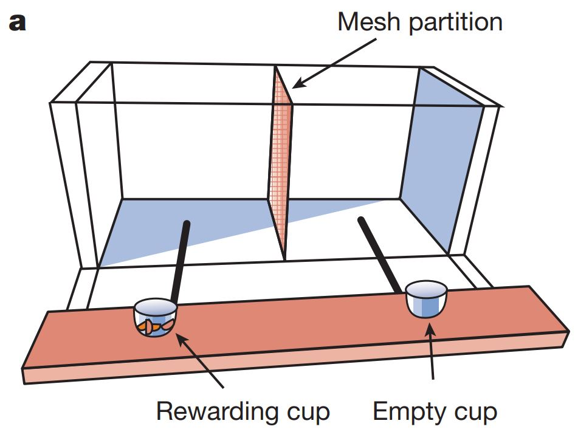]

---
# Fairness in primates

.footnote[de Waal & Berger (2000)]
.right-column-med[
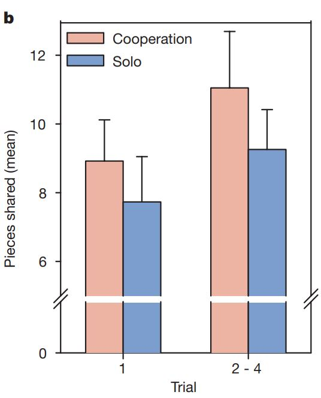]
.left-column-med[#### Results
- Monkeys generally were very willing to spontaneously share food, even if they did all of the work to obtain it

- They also found that they share about 1-2 more pieces on average when the other monkey helped obtain the food]

---
# Fairness in primates
.footnote[Brosnan & de Waal (2003)]

#### Research question

- When nonhuman animals form reciprocal relationships, do they react negatively to violations of fairness?

- Brosnan & de Waal (2003) tested whether monkeys were bothered by violations of fairness

---
# Fairness in primates
.footnote[Brosnan & de Waal (2003)]

.right-column-med[
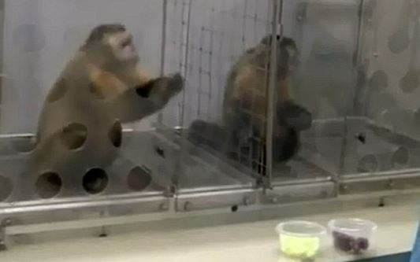
]
.left-column-med[#### Method
- Researchers trained capuchin monkeys to trade rocks for food rewards (cucumbers or grapes)

- The researcher would have both monkeys trade the rocks for food, but would give one monkey a cucumber and the other monkey a grape]

???

- The rewards were cucumbers or grapes; the monkeys liked the cucumbers but strongly preferred the grapes

---
# Fairness in primates
.footnote[Brosnan & de Waal (2003)]
.right-column-med[
.small[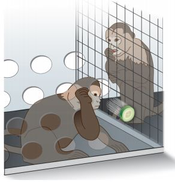]

]

.left-column-med[#### Results 
- Brosnan & de Waal (2003) found that the monkey with the cucumber reward (the inferior reward) would refuse to except the reward and refuse to exchange the rocks for cucumbers]

---
# Fairness in primates
.footnote[Brosnan & de Waal (2003)]

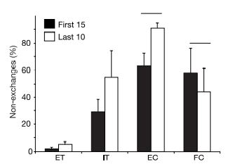

ET = Both monkeys received cucumbers 
IT = One monkey cucumber, one monkey grape

???
ET = equality test (both monkeys receive cucumbers)
IT = inequality test (one monkey cucumber, other monkey grape)
EC = effort control (food was handed to the monkeys with no exchange at all)
FC = food control  (the monkey exchanged for the cucumber; the other monkey was absent but the grape was place it the spot where the other monkey was)
---
# Inequity aversion
There are two types of inequity aversion:
  1. **Disadvantageous inequity aversion:** being averse to inequity that disadvantages you (e.g., being adverse to receiving a cucumber while the other monkey receives a grape)
  
  2. **Advantageous inequity aversion:** being averse to inequity that advantages you (e.g., being averse to receiving a grape while the other monkey receives a cucumber)
  
Monkeys exhibit behavior consistent with the first but not the second
---
# Inequity aversion

**Advantageous inequity aversion **might be unique to humans; very few monkeys refuse advantageous rewards

.smaller-centered-picture[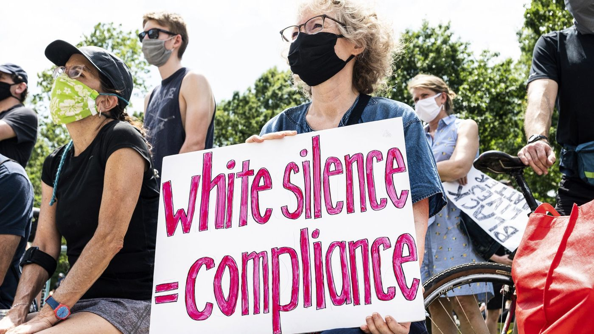]

---

# Summary 

- As social animals, we evolved moral intuitions because it was *adaptive* to cooperate with others 
- Non-human animals naturally provide for others and try to reduce their suffering
  - Unlike humans, they rarely help strangers and help anonymously
- Primates are willing to share resources with non-kin group members and especially with those that help them obtain it
  - Unlike humans, they only get upset about fairness violations that affect them

.highlight-blue[Next class:] babies!
