# Week 2

This week we will be discussing moral insights from research on animals and human infants and children

.highlight-blue[In week 2:]
- How can natural selection, which touts "survival of the fittest," account for the evolution of moral organisms?
- Are pieces of our moral intuitions present in nonhuman animals?
- **Are infants capable of moral reasoning and moral behavior?**
- **How do we develop moral judgments across the lifespan?**

---
# Infant research
.footnote[Warneken & Tomasello (2006)]

.sm-br[]
<iframe width="560" height="315" src="https://www.youtube.com/embed/Z-eU5xZW7cU" frameborder="0" allow="accelerometer; autoplay; clipboard-write; encrypted-media; gyroscope; picture-in-picture" allowfullscreen></iframe>

https://www.youtube.com/watch?v=Z-eU5xZW7cU

---

#Infant research
.footnote[Warneken & Tomasello (2006)]

#### Research question

Do infants spontaneously help strangers?

---

#Infant research
.footnote[Warneken & Tomasello (2006)]
#### Method

Researchers put 18-month-old infants in different situations where the experimenter was having trouble reaching a goal 

- **The experimental condition**: the experimenter would alternate his gaze between the child and the object and then verbalize his problem (e.g., "my marker!")

- **The control condition**: the experimenter would look at the object with a neutral face for 20 seconds

---
#Infant research
.footnote[Warneken & Tomasello (2006)]
#### Method

- **Out of reach:** the experimenter needs help with something out of their reach

--

  - .highlight-blue[The marker task:] The experimenter accidentally drops a marker on the floor and unsuccessfully reaches for it (experimental) or intentionally throws a marker on the floor (control)

---

#Infant research
.footnote[Warneken & Tomasello (2006)]
#### Method

- **Physical obstacle**: the experimenter needs help because there is a physical obstacle blocking their way

--

  - .highlight-blue[The cabinet task:] The experimenter wants to put magazines into a cabinet, but the doors are closed so that he bumps into it (experimental) versus bumping into the doors as he tries to lift the magazines onto the cabinet (control)

---
#Infant research
.footnote[Warneken & Tomasello (2006)]
#### Method

- **Wrong means**: the experimenter needs help because they tried to do a task but got an undesirable result

--

  - .highlight-blue[The book task:] A book slips from a stack as the experimenter attempts to place it on top of the stack (experimental) or he places it next to the stack (control)

---
#Infant research
.footnote[Warneken & Tomasello (2006)]
#### Method

- **Wrong result**: the experimenter needs help because he is trying to complete a task but is using the wrong means to do it

--

  - .highlight-blue[The flap task:] A spoon drops through a hole and the experimenter unsuccessfully tries to grasp it through the small hole, ignorant of a flap on the side of the box (experimental). Alternatively, he throws the spoon in the box on purpose (control)

---

#Infant research
.footnote[Warneken & Tomasello (2006)]

For most tasks, the infants were more likely to help in the experimental conditions than in the control conditions

---
#Infant research
.footnote[Warneken & Tomasello (2006)]

This research finding implies that these pre-verbal infants were able to distinguish between when a stranger needed help vs. didn't need help AND that they were motivated to help them 

--

.dq[.smaller[How (if at all) does this finding differ from what we discussed about the altruistic behavior in chimpanzees and other primates?]]
---
# Infant research
.footnote[Hamlin et al. (2007)]

#### Research question

Do infants prefer "good" people to "bad" people?

---

# Infant research
.footnote[Hamlin et al. (2007)]

#### Method

- Researchers showed infants (5 to 10 months old) live shows with animated, wooden shapes

- In the show, a red circle would be attempting to climb a hill

- In some shows, another character would enter the scene and interact with the climber

???

https://www.youtube.com/watch?v=HBW5vdhr_PA
(start at :46)

---

# Infant research
.footnote[Hamlin et al. (2007)]

####Method

**A nice triangle**

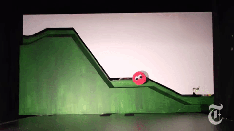

???

https://www.youtube.com/watch?v=j4n_Qh4Gg9Q
---
# Infant research
.footnote[Hamlin et al. (2007)]

#### Method

**A mean square**

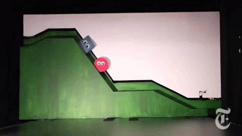

???

https://www.youtube.com/watch?v=ExcxDMEHlHY

---
# Infant research
.footnote[Hamlin et al. (2007)]

#### Method (study 1)

- Infants watched the helping show and hindering show back to back until they became disinterested (no longer looking at the show, suggesting that they had fully processed it)

- Infants were then asked to choose which toy they would like to play with - the yellow triangle (the helper) or the blue square (the hinderer)

- Researchers recorded which toy the infant reached for first

---
# Infant research
.footnote[Hamlin et al. (2007)]

#### Results (study 1)

100% of 6-month-olds and 88% of 10-month-olds reached for the helper (yellow triangle)

---
# Infant research
.footnote[Hamlin et al. (2007)]

#### Method (study 2)
- Researchers wanted to know if infants choose the yellow triangle because it was helpful, or because of other intrinsic properties (e.g., because they preferred objects moving uphill, are yellow, or are triangles)

---
# Infant research
.footnote[Hamlin et al. (2007)]

#### Method (study 2)

- They designed a second experiment where the only change was that the triangle was pushing a red ball (no eyes) up a hill and the blue square was pushing a red ball down the hill

---

# Infant research
.footnote[Hamlin et al. (2007)]
.right-column-med[]

.left-column-med[#### Results (study 2) 
- The researchers found that when the object being pushed up or down the hill was a ball, then the infants did not prefer the yellow triangle over the blue square

- Infants have already (at 6 months) developed a preference for good over bad characters
]

---

# Infant research
.footnote[Schmidt & Sommerville (2011)]

#### Research question

Do infants expect situations to be fair?

---

# Infant research
.footnote[Schmidt & Sommerville (2011)]

.left-column-big[#### Method 
-  15-month-old infants watched two movies in which an actor allocates continuous (milk) or discrete (crackers) resources to two people

  -  The actor lifts up the cookies/milk and says "yummy!"
  -  The recipients lift up their plates and say "please?"]
  

.right-column-small[
 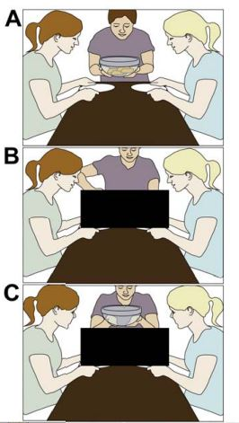]
---

# Infant research
.footnote[Schmidt & Sommerville (2011)]

.left-column-small[#### Method 

  - The actor distributes the cookies/milk either fairly (equal) or unfairly
  - In the post-test, they show the infants the videos devoid of social context (pictures F and G)]
  

.right-column-big[  
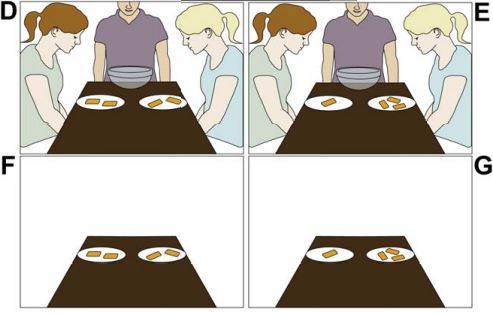]

---
# Infant research
.footnote[Schmidt & Sommerville (2011)]

.pull-left[#### Results
- Infants looked significantly longer at the violation of fairness than they did at the fair outcome 

- Infants expect resources to be allocated fairly]

.pull-right[
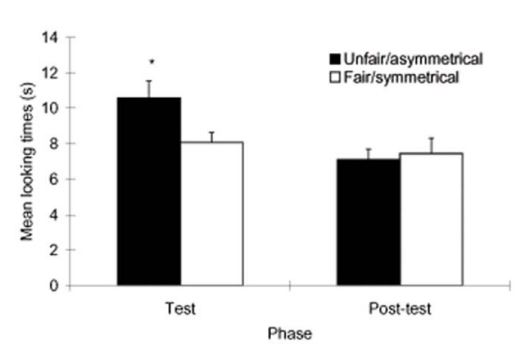]

---
# Infant research
.footnote[Sloane, Baillargeon, & Premack (2012)]

#### Research question

Under what conditions do infants expect fairness?

---

# Infant research
.footnote[Sloane, Baillargeon, & Premack (2012)]

#### Method (study 1)

- 19-month-old infants watched a live puppet show where puppet giraffes were distributed either toys, cookies, or cars

- The event was either equal or unequal
  - **Equal event**: both giraffes got a toy/ cookie/ car
  
  - **Unequal event**: one giraffe got two toys/cookies/cars, while the other giraffe got nothing
  
---
# Infant research 
.footnote[Sloane, Baillargeon, & Premack (2012)]

#### Method (study 1)

.highlight-blue[The experimental condition]

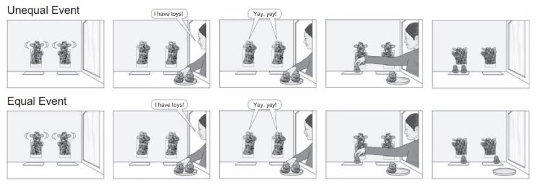
---

# Infant research 
.footnote[Sloane, Baillargeon, & Premack (2012)]

#### Method (study 1)

.highlight-blue[The cover-control condition]

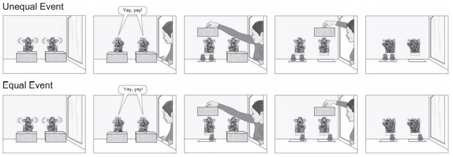
---
# Infant research 
.footnote[Sloane, Baillargeon, & Premack (2012)]

.pull-left[#### Results (study 1)
- Infants looked longer at the unfair event, suggesting that the infant expects the resources be allocated fairly

- However, the infant did *not* look longer in the cover control condition]
.pull-right[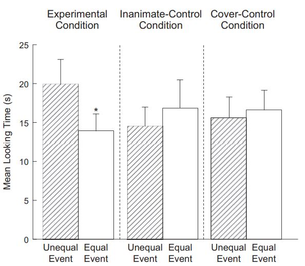]

???

In the inanimate control condition, the giraffes were inanimate (they just rested on the post instead of talking)

---
# Infant research 
.footnote[Sloane, Baillargeon, & Premack (2012)]

.pull-left[#### Results (study 1)

]

   
.dq[What can we conclude from these results about how infants percieve violations of fairness?]

???

Infants only care about violations of fairness for animate people
Infants only care about violations of fairness when the unfairness is being caused by an agent (not just when some people have more resources than others)

---
# Infant research 
.footnote[Sloane, Baillargeon, & Premack (2012)]

#### Method (study 2)

- 21 month old infants watched a live show where an experimenter asked two children to put away the toys

  - .highlight-blue[Explicit condition]: the experimenter told the children they would receive a reward for putting away their toys
  
  - .highlight-blue[Implicit condition]: the experimenter did not tell the children they would receive a reward for putting away their toys
  
  - .highlight-blue[Control condition]: the boxes were opaque so the experimenter could not see how many toys each child put away 

---
# Infant research 
.footnote[Sloane, Baillargeon, & Premack (2012)]

#### Method (study 2)
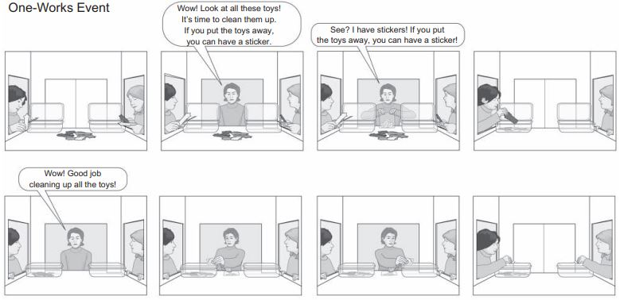

---
# Infant research 
.footnote[Sloane, Baillargeon, & Premack (2012)]

#### Method (study 2)
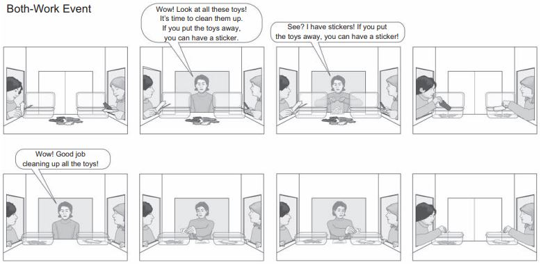

---

# Infant research 
.footnote[Sloane, Baillargeon, & Premack (2012)]

.pull-left[#### Results (study 2)
- Infants looked longer when the child who did not work also got a sticker

- This was true even when the experimenter did not explicitly tell the children they would get stickers for putting their toys away
]

.pull-right[
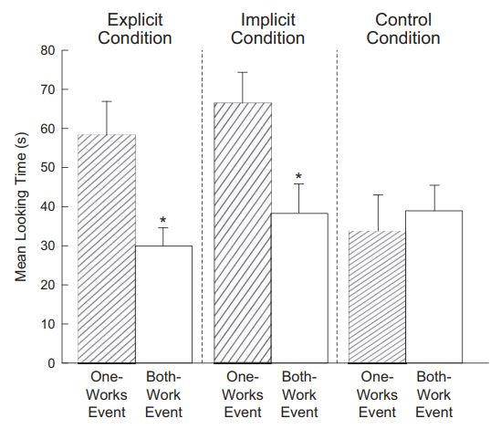]

---

# Summary 

- Infants spontaneously help and prefer good characters to bad

- Infants expect situations to be fair
  - They expect resources to be allocated fairly (present) but not be allocated fairly (past)
  
  - They expect children to receive prizes only when they earn them 

--

.dq[.smaller[Do these studies prove that intuitions about harm and fairness are innate?]]

---

#  Kohlberg's stage theory
.footnote[Kohlberg (1968)]
Kohlberg conducted a 12 year longitudinal study, presenting the same moral dilemmas to boys at different time points in their lives, from childhood to early adulthood 

For example, he asked his participants:

>"Should the doctor mercy kill a fatally ill woman requesting death because of her pain?"
---

#  Kohlberg's stage theory
.br-sm[]

<i>Should the doctor mercy kill a fatally ill woman requesting death because of her pain?</i> 

.smaller[.highlight-blue[Age 13]: "If she requests it, it's really up to her. She is in such terrible pain, just the same as people are always putting animals out of their pain."

.highlight-blue[Age 16]: "I don't know. In one way, it's murder, it's not a right or privilege of man to decide who shall live and who should die. God put life into everybody on earth and you're taking away something from that person that came directly from God, and you're destroying something that is very sacred..."

.highlight-blue[Age 24]: "A human life takes precedence over any other moral or legal value, whoever it is. A human life has inherent value whether or not it is valued by a particular individual. The worth of the individual human being is central where the principles of justice and love are normative for all human relationships."]

---

#  Kohlberg's stage theory
.footnote[Kohlberg (1968)]

Kohlberg (1968) theorizes that there are three stages to moral development

- **Pre-conventional level**: right and wrong is determined through rewards and punishments

- **Conventional level**: right and wrong is determined by expectations and rules from family, group, and/or nation

- **Post-conventional level**: right and wrong is determined by autonomous, abstract moral principles

???
Pre-conventional (children): the individual is concerned with themself only; something is wrong when they get punished for it; something is right when they get rewarded for it. They are not considering others or society

Conventional (adolescents and most adults): the individual is concerned with what others think; they are concerned with laws but not just because they are avoiding punishment but because they are motivated to maintain social order

Post-conventional (some adults): Most adults never reason at this level; you reason like a philosopher 

---
# Kohlberg's stage theory
.footnote[Kohlberg (1968)]

.left-column-bigger[]
???
Stage 1: e.g., a child avoids a behavior because they were punished for it
Stage 2: e.g., a child helping clean because they were offered ice cream
Stage 3: e.g., they want to be "good" because they want others to like them 
Stage 4: laws should not be broken, e.g., you should not steal because it is against the law and the law is important or else there would not be chaos
Stage 5: focused on individual rights; e.g., you can steal if your family is starving because people should have the right to life, to not suffer
Stage 6: like a philosopher; e.g., the golden rule (treat others like you want to be treated); the categorical imperative; Kant's categorical imperative  (act only in a way in which you would want the act to become universal law)
--

.dq[.smaller[Which stage do you think primates reason at? Psychopaths?]]

 
---

# Kohlberg's stage theory

#### Criticisms 
Kohlberg's stage theory implies that adults who do not reason at the post-conventional level are morally deficient 

  - Some cultures do not have adults at level 3 (Gibbs et al., 2007) because level 3 reasoning relies on individual rights which are de-emphasized in some cultures (e.g., collectivistic cultures)
  
  - Kohlberg used this model to claim that women have inferior moral reasoning abilities; some (e.g., Kohlberg's student Carol Gilligan (1982)) have argued that women reason differently, focusing more on interpersonal relationships than individual rights

???
  - The theory was developed on a very WEIRD sample (western, white, upper-class boys)
  - This theory is surprisingly secular. It assumes that religion plays no role in moral development
  
---

# Social domain theory
.footnote[Turiel (1983)]

Elliot Turiel developed social domain theory in the late 70s/ early 80s

- **Social domain theory**: moral development is driven by a child's interactions with their social environment 

  + Children learn rules from their social interactions about how they should act in social situations
  
  + These rules can be categorized into three different social domains that develop in parallel and follow different developmental trajectories
  
???
That they develop in parallel is distinct from Kohleberg, who theorized that morality develops in stages
  
  
---
# Social domain theory
.footnote[Turiel (1983); Smetana (2014)]

####The three social domains

  -  **Moral domain**: prescriptive judgments about justice, welfare, and rights
  
  - **Societal domain**: normative rules about tradition, authority, and social norms and convention that coordinate social interactions

  - **Psychological domain**: private personal preferences that do not violate the rights or welfare of others

  
---
# Social domain theory
.footnote[Turiel (1983); Smetana (2014)]

Rules in **the moral domain** are .highlight-blue[obligatory, universally acceptable, and not determined through consensus/ institutional convention]

- A moral transgression is wrong because of intrinsic features of the act (e.g., it is harmful), not because an institution says so 

For example, a child learns that hitting is wrong. Hitting is wrong even if an authority figure or institution says its OK because hitting harms others 

---
# Social domain theory
.footnote[Turiel (1983); Smetana (2014)]

Rules in the **societal domain**  are shared across a group of people and they determine which behaviors are appropriate for a given context (e.g., etiquette)
- Social conventions are .highlight-blue[arbitrary]; another social convention could be substituted to fill the same role

E.g., a child learns that they need to wear their uniform to school (a blue shirt and black pants). This rule is arbitrary because a purple shirt could be substituted and the purpose of the uniform is fulfilled; there is no reason that the shirt needs to be blue   

---
# Social domain theory
.footnote[Turiel (1983); Smetana (2014)]

**Personal preferences** are distinct from social conventions because they .highlight-blue[occur in private or only concern an individual]; personal preferences are distinct from moral rules because they do not violate the rights or welfare of others

E.g., a child learns that they (and others) have different food preferences and that everyone has the freedom to choose what to eat based on those preferences

---
# Social domain theory
.footnote[Turiel (1983); Smetana (2014)]

Children construct the moral domain through empathy and through observing negative consequences when a rule is violated

  - In social interactions, a child observes (either because they are a victim or an observer) that immoral actions uniquely cause emotional distress to a victim 
  
  - These actions are then assigned moral status, whereas interactions that do not lead to emotional distress are not

---

# Social domain theory
.footnote[Turiel (1983); Smetana (2014)]

Simultaneously, children are also constructing the societal domain by witnessing the arbitrary rules and expectations in their given culture

  - When a convention is violated, there is rarely emotional distress/ a victim

???
Children learn that moral rules exist due to intrinsic features of the act, while social conventions exist to maintain social order. Conventions are arbitrary; another rule could fit the purpose just as well 
Example: Wearing red vs. wearing black to a funeral

---
#Social domain theory
.footnote[Smetana (1981)]

####Method
.smaller[Children aged 2-9 rated 10 moral and conventional social rules on how serious the rule is, how much a person should be punished for breaking the rule, and how permissible the rule would be in the absence of a rule ]

.small[1. One child hitting another child. (M)
2. A child not sharing a toy. (M)
3. A child shoving another child. (M)
4. A child throwing water at another child. (M)
5. A child taking another child's apple. (M)
6. A child not participating in show and tell. (C)
7. A child not sitting in the designated place (on the rug) during story time.(C) 
8. A child not saying grace before snack. (C)
9. A child putting a toy away in the incorrect place. (C)
10. A child not placing her belongings in the designated place. (C)]

???
This is just an example of a study that supports this theory
---
#Social domain theory
.footnote[Smetana (1981)]

####Results
- Moral transgressions were rated as more serious and deserving of stricter punishment than conventional transgressions

- Conventional transgressions were rated as more permissible in the absence of a rule than moral transgressions

This is evidence that children (even very young children) distinguish between and treat moral rules and social conventions differently
---

# Social domain theory

#### Criticisms 

- The moral/ conventional distinction is not always pronounced
  - Many non-Western cultures treat acts as moral that Westerners would call social conventions
  - An act may be considered moral in one context but a convention in another (e.g., an act was considered moral historically but now is not)

E.g., some people think that kneeling for a flag is a violation of a social convention, while others think that it is a moral violation. This theory is unable to answer exactly how this disagreement develops
---

# Summary

- Kohlberg theorized that morality developed in stages    
  - The final stage (that most adults never reach) is to make moral judgments through consistent abstract principles rather than because of rewards or punishment, obeying authority, and/or societal pressures
  
- Turiel theorized that children construct the moral domain through social interactions
  - Crucial to constructing the moral domain is learning to distinguish moral rules (which are invariable/ exist because of intrinsic properties of the act itself) and social conventions (which are arbitrary and fluid)

.highlight-blue[Due Sunday:] HW2