# Week 3
This week we will be discussing how adults judge actions as right or wrong

.highlight-blue[In week 3:]
- **How do we determine which course of action to take in a moral dilemma?**
- **How do we determine if an action is right or wrong?** 
- Do moral judgments arise from a deliberate, conscious process, or an automatic, unconscious one?

---
# The rationalist model of moral judgment
.footnote[Haidt (2001)]

- Conscious reasoning determines moral judgments  
- Emotions (e.g., sympathy, disgust, anger) are sometimes used as input to guide conscious reasoning

???
In this model, a person is completely rational. In order to make a judgment, individuals reflect and reason through the evidence carefully, thinking about whether the action is fair, whether it harmed anyone, etc. 

---
# Moral reasoning
Psychologists study moral reasoning primarily through moral dilemmas
- A **moral dilemma** is a moral situation where an individual has to choose between two conflicting moral principles

For example, the following scenario pits two moral principles against each other: do not kill and do not allow someone to suffer.

>A doctor must decide whether to kill a dying patient who is asking for an end to her suffering. 

The most studied dilemma in moral psychology is .highlight-blue[the trolley dilemma].

.footnote[Monin et al. (2007)]
---

# The trolley problem: the switch case
.footnote[Foot (1978)]

.left-column-big[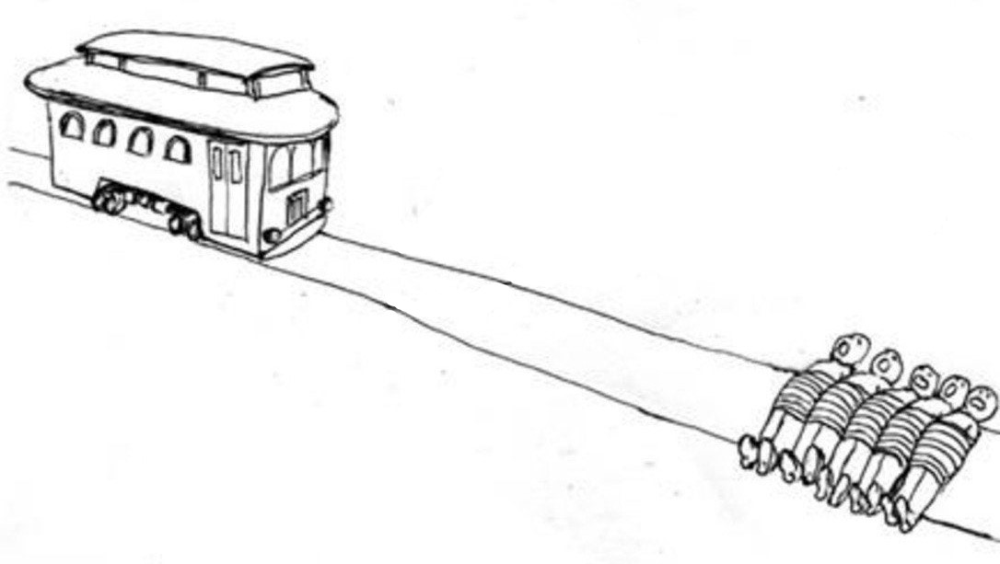]

          
A runaway trolley is barreling down a set of train tracks. There is unfortunately no conductor to stop the train, which is about to run over and kill five people...

---

# The trolley problem: the switch case
.footnote[Foot (1978)]

.left-column-big[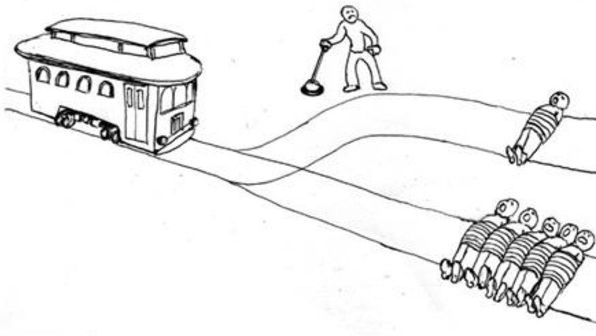]
          
You are standing to the side of the track. Next to you is a lever. If you pull the lever, you can divert the train onto an alternate track where it will kill one person instead of five. **Should you pull the lever?**

???
Moral dilemma: kill 5 people with inaction or kill 1 person with action?
---

# The trolley problem: the footbridge case
.footnote[Foot (1978)]

.left-column-biggest[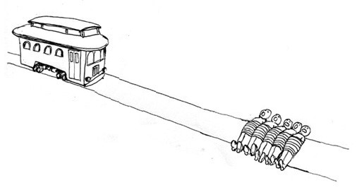]

          
Now consider this second case. A runaway trolley is barreling down a set of train tracks. There is unfortunately no conductor to stop the train, which is about to run over and kill five people...

---

# The trolley problem: the footbridge case
.footnote[Foot (1978)]

.left-column-biggest[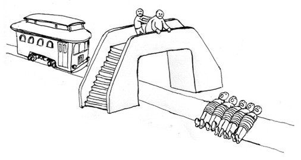]
          
You are standing on a footbridge overlooking the train. Next to you is a heavy gentleman. If you push the man off the bridge, you can stop the train, which will kill one person instead of five. Should you push the man?

---
# The trolley problem
- Studies have found that about 90% of people say they would pull the lever in the first scenario but only 10% say they would push the man in the second scenario
- If you recall from lecture 1, the normative philosophical theory *utilitarianism* says that what we ought to do is what will benefit the most people, and clearly, pushing the man off the bridge is what is best for the most number of people, so why don't we want to push?

.highlight-blue[Discussion question:] In both scenarios, you are choosing to either kill one person or five people, so why won't you push the man off the bridge?

.footnote[Hauser et al. (2008)]
---
# The trolley problem
- There are many differences between pulling a switch to save five people and throwing someone off a bridge to save five people
  - **Spacial proximity**: you are far away from the victim (switch) vs. you are close to the victim (bridge)
  - **Physical contact**: you do not need to touch the victim (switch) vs. you do need to touch the victim (bridge)
  - **Personal force**: you do not need to apply personal force to the victim (switch) vs. you do need to apply personal force to the victim (bridge)
  - **Intention**: harm is an foreseen but unintended side effect of achieving the greater good (switch) vs. harm is a means to a greater good (bridge)

.footnote[Greene et al. (2009)]

---
# The trolley problem: study 1
.footnote[Greene et al. (2009)]
**Research question**: Why do people say no to the bridge case? Personal force, spatial proximity, or physical contact?

- In a between subject design, Greene et al. (2009) gave participants four different variations of the trolley dilemma
.right-column-bigger[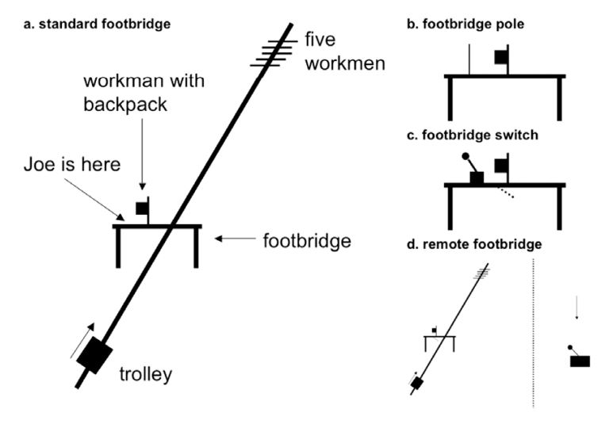]

(a) The standard footbridge 
(b) Footbridge pole 
(c) Footbridge switch 
(d) Remote footbridge
???

a. The standard footbridge: should Joe push a man off the bridge to save five?
b. Footbridge pole: Should Joe use a pole to push the man off the bridge to save five?
c. Footbridge switch: Should Joe pull the switch to open a trap door that will drop him off the bridge?
d. Remote footbridge: Footbridge switch case (but Joe is distanced from the man)
---
# The trolley problem: study 1
.footnote[Greene et al. (2009)]

|| |Personal force|Spatial Proximity|Physical contact|
|---||----|----|----|
|The standard footbridge |.tiny-picture[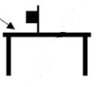]|
**.green[&check;]**|
**.green[&check;]**|
**.green[&check;]**|
|Footbridge pole|.tiny-picture[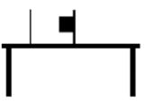]|
**.green[&check;]**|
**.green[&check;]**|
**.red[&cross;]**|
|Footbridge switch|.tiny-picture[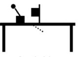]|
**.red[&cross;]**|
**.green[&check;]**|
**.red[&cross;]**
|Remote footbridge|.tiny-picture[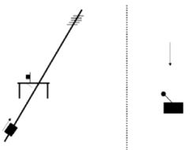]|
**.red[&cross;]**|
**.red[&cross;]**|
**.red[&cross;]**|

???

You can compare pairs of moral acceptability ratings to determine if personal force, spatial proximity, or physical contact are important factors
Personal force: compare footbridge poll and footbridge switch
Spatial proximity: compare footbridge switch and remote footbridge
Physical contact: compare standard footbridge and footbridge poll
---
#The trolley problem: study 1
.footnote[Greene et al. (2009)]
Results study 1
.right-column-med[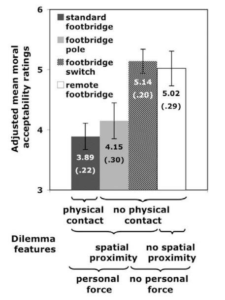]

- Participants rated the extent to which choosing to harm the one person to save the five was "morally acceptable"
- Personal force was rated as less morally acceptable than no personal force, regardless of physical contact/ spatial proximity

???

Individuals judged actions that required personal force (pushing off the bridge with hands or a pole) as less morally acceptable than actions that did not require personal force (the switch cases), regardless of if Joe touched the victim (physical contact) and regardless of if the individual was close or not (spatial proximity)

---
# The trolley problem: study 2
.footnote[Greene et al. (2009)]

Study 2
- In a between subject design, participants were given three more variations of the trolley dilemma

.right-column-bigger[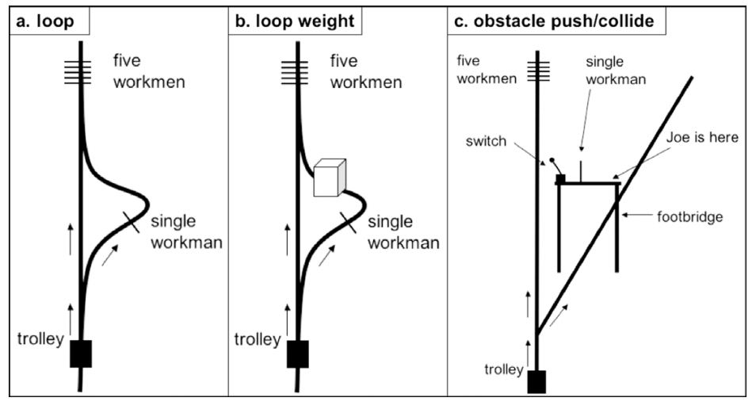]
(a) The loop  
(b) The loop weight  
(c) The obstacle collide  
(d) The obstacle  push

???
This study was to test the importance of personal force and intention 

(a) the loop - Joe may save the five by turning the trolley onto a looped side track that reconnects with the main track at a point before the five people
(b) the loop weight - identical to the loop but there is a heavy weight positioned behind the victim. The weight stops the trolley, not the victim
(c) the obstacle collide - the individual is on a bridge and needs to redirect the train from hitting five people. On his way to the switch, he unintentionally collides into a workman and he falls to his death
(d) the obstacle push - same as collide but now he needs to push the workman off of the bridge to get to the switch (instead of just colliding with him)
---
# The trolley problem: study 2
.footnote[Greene et al. (2009)]

|| |Intentional|Personal force|
|---||----|----|
|The loop |.less-tiny-picture[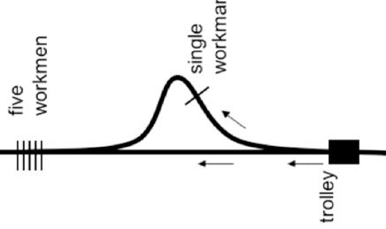]|
**.green[&check;]**|
**.red[&cross;]**|
|The loop weight|.less-tiny-picture[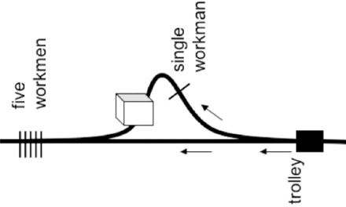]|
**.red[&cross;]**|
**.red[&cross;]**|
|The obstacle collide|.tiny-picture[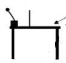]|
**.red[&cross;]**|
**.green[&check;]**
|The obstacle push|.tiny-picture[]|
**.green[&check;]**|
**.green[&check;]**|

---
# The trolley problem: study 2
Results study 2
.right-column-big[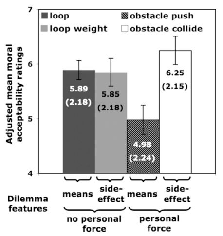]

- There was one main effect (intention) and an interaction
- Intentional and personal force combined made for especially low moral acceptability ratings

???
Main effect of intention (means were rated as morally worse than side effects)
- The main effect was qualified by the significant interaction between intention and personal force
---
# The trolley problem: discussion
- Greene et al. (2009) conclude that individuals find harmful actions much less morally acceptable when
  - A person uses personal force (e.g., harms them directly with their hands or an object) rather than a switch
  - A person uses someone as a means to an end (i.e., good consequences should never justify evil means)

???
  - **Intention**: harm is an foreseen but unintended side effect of achieving the greater good (switch) vs. harm is a means to a greater good (bridge)
  - **Personal force**: you do not need to apply personal force to the victim (switch) vs. you do need to apply personal force to the victim (bridge)

---
# Abstract moral principles 
.footnote[Cushman et al. (2006)]

The rationalist model predisposes that individuals are consciously aware of the reasoning behind their moral decisions, but are they really?

- Cushman et al. (2006) varied moral scenarios on three principles:
  - **The action principle**: It's morally worse if harm is caused by action rather than inaction.
  - **The intention principle**: It's morally worse if harming someone is a means to accomplish a goal than if harm occurs as a side effect of the goal.
  - **The contact principle**: It's morally worse to use physical contact to harm than it is to harm someone without using physical contact.

---

# Abstract moral principles 
.footnote[Cushman et al. (2006)]

Cushman et al. (2006) administered moral dilemmas that differed on just one principle (e.g., in one the harm was caused by action and in the other the harm was caused by inaction) and asked participants to justify any differences in moral judgments. The justifications were coded for:
- **Sufficiency**: the subject gave a difference between the two cases that accounted for their judgment
- **Failure**: the subject gave a difference between the two cases that could not account for their judgment
- **Uncertainty**: the subject was unsure about how to justify their responses
- **Denial**: the subject denied that they gave different responses
- **Alternative explanation**: the subject gave an alternative explanation (e.g., they clicked the wrong button)

---
# Abstract moral principles 
.footnote[Cushman et al. (2006)]

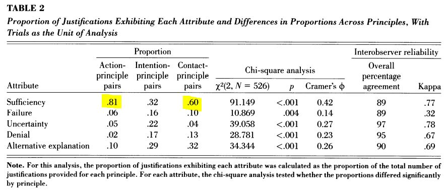
Individuals were able to give justifications for the action principle (it is worse to act than not act) and contact principle (it is worse to harm someone with physical contact than without) but not the intention principle (it's worse to harm someone as a means to an end than as a side effect)
---
# Philosophy guiding moral reasoning
.footnote[Aktas et al. (2017)]

Aktas et al. (2017) gave participants four moral dilemmas and had them choose whether the action to save the five people was "right" or "wrong"

Scenarios
1. The switch trolley dilemma (impersonal)
2. The footbridge trolley dilemma (personal)
3. Organ transplant (impersonal)
4. Organ transplant (personal)

???
Organ transplant personal -- a surgeon kills one patient and harvests their organs to save 5
Organ transplant impersonal -- a surgeon allows a nurse to kill a patient and then harvests their organs to save 5 

---
# Philosophy guiding moral reasoning
.footnote[Aktas et al. (2017)]

Additionally, participants were given five choices to justify their right or wrong judgment

- **Amoral**: Moral reasons did not play an important role in my judgment 
- **Virtue-ethical**: Someone who intentionally harms an innocent person cannot be moral
- **Deontology**: Intentionally harming an innocent person is against fundamental moral rules and is thus unacceptable regardless of its intended consequences  
- **Utilitarianism**: Moral action is what ensures the well-being of the maximum number of people  
- **Fatalistic**: It is wrong to interfere with consequences that arise as a result of the natural course of events no matter what the ensuing harm is 
---
# Philosophy guiding moral reasoning
.footnote[Aktas et al. (2017)]
.right-column-big[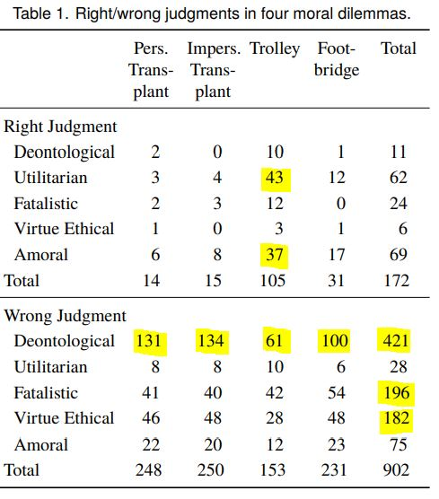]

The majority of participants chose the deontological explanation ("intentionally harming an innocent person is against fundamental moral rules and is thus unacceptable regardless of its intended consequences")

Fatalistic and virtue ethical explanations were also common

???

This study was done on predominately muslim participants (the study was done in Turkey)
- Many gave utilitarian/ amoral explanations for the trolley dilemma 

---
# Summary
- Individuals find harmful actions much less morally acceptable when personal force (i.e., violence) is involved and when a person is using someone as a means to an end
- Some moral reasoning is conscious; people justify that it is worse to harm someone with action than to harm someone with inaction, and that it is worse to harm someone with physical contact than without it
- When asked to justify decisions in moral dilemmas, individuals prefer to endorse deontology over other moral philosophies, that there are fundamental moral rules that cannot be violated

---

# The rationalist model of moral judgment
.footnote[Haidt (2001)]

Let's revisit the rationalist model of moral judgment

Many philosophers and psychologists have argued that affect has a more direct role in determining a moral judgment than this model suggests

---
# The role of affect in moral judgments
.footnote[Greene et al. (2001)]
Greene et al. (2001) gave participants moral-personal dilemmas (like the footbridge trolley dilemma), moral-impersonal dilemmas (like the switch trolley dilemma), and non-moral dilemmas

.right-column-big[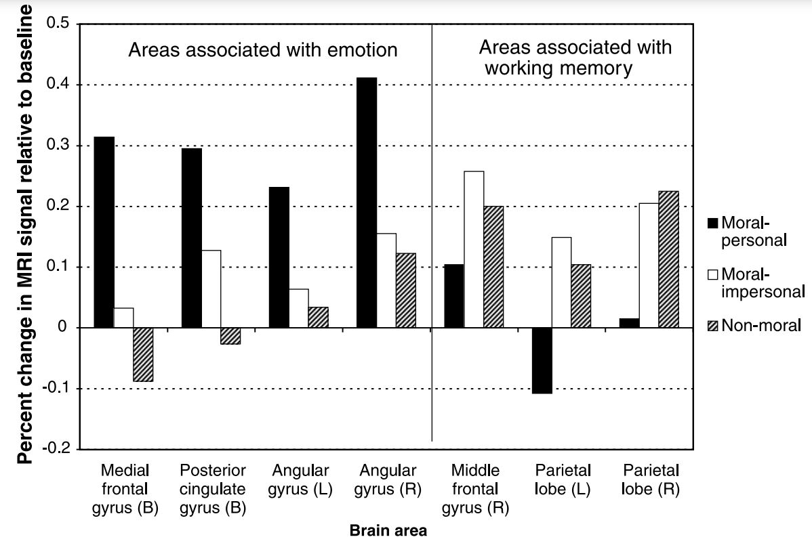]

They found that moral-personal dilemmas involved areas of the brain associated with emotion and moral-impersonal dilemmas involve areas of the brain associated with working memory
???
They also found that solving moral dilemmas involved the same brain areas that are used in a stroop task, whether automatic process are being influenced/override by conscious processing
---
#The role of affect in moral judgments
.footnote[Koenigs et al. (2007); Cima et al. (2010); Bartels & Pizzaro (2011)]
Other studies have looked at special populations who endorse pulling the switch **and** pushing the man off of the bridge
- Individuals who have damage to the ventromedial prefrontal cortex (VMPC), an area involved
in generating emotions 
- Psychopaths (individuals who have deficits in emotional processing and inhibitory control)
- Utilitarians/ consequentialists (individuals who philosophize that the morality of an action should be judged on the consequences of the action, i.e., their moral philosophy requires them to suppress emotional responses)

Based on these findings, **emotion may play a more direct role** in moral reasoning than the rationalist model suggests

---
#The role of affect in moral judgments

Thinking about pushing a man off of a bridge elicits more negative affect than thinking about pulling a lever; our decision to not push does not seem to be controlled at all by conscious reasoning

.highlight-blue[Next class]: Are our moral decisions really guided by conscious reasoning or are they guided by our emotions?  