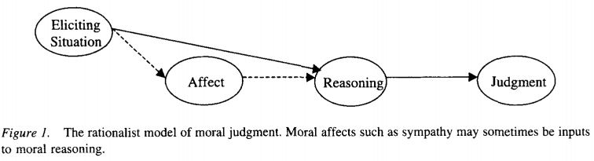
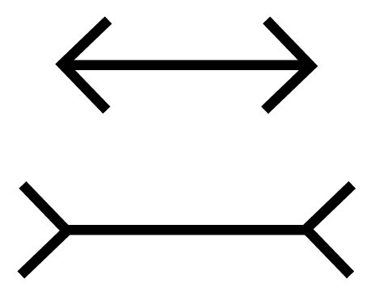
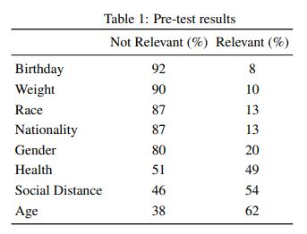
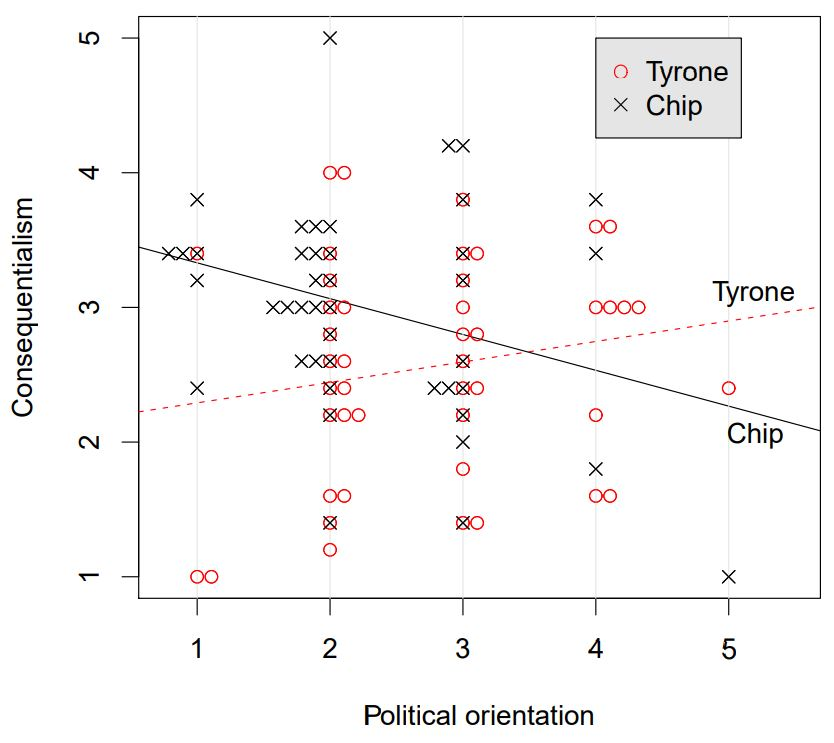
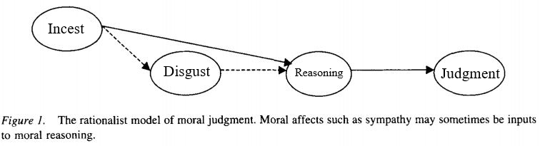
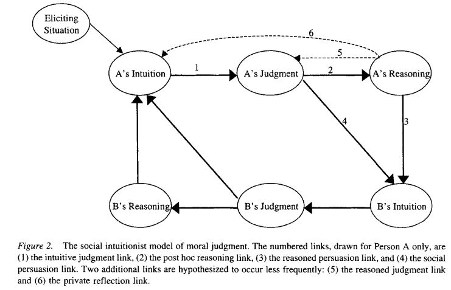
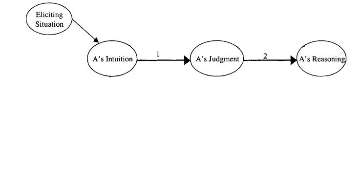
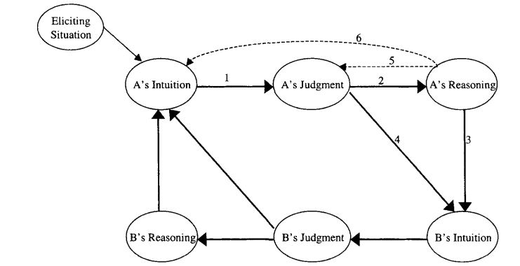
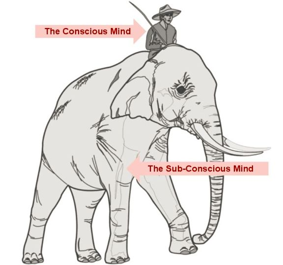

# Week 3
This week we will be discussing how adults judge actions as right or wrong

.highlight-blue[In week 3:]
- How do we determine which course of action to take in a moral dilemma?
- **How do we determine if an action is right or wrong?**
- **Do moral judgments arise from a deliberate, conscious process, or an automatic, unconscious one?**
---

# The rationalist model of moral judgment
Last class..

.footnote[Haidt (2001)]

- Conscious reasoning determines moral judgments  
- Emotions (e.g., sympathy, disgust, anger) are sometimes used as input to guide conscious reasoning

???
In this model, a person is completely rational. In order to make a judgment, individuals reflect and reason through the evidence carefully, thinking about whether the action is fair, whether it harmed anyone, etc. 
---

# But... we are not rational

.highlight-gray[**Moral dumbfounding**] 

- We cannot always defend our moral judgments with reason

.highlight-gray[**Motivated reasoning**]
- We prefer evidence that helps us get to a desired conclusion

---

# Consider the following...
.footnote[Haidt (2012)]
Julie and Mark, who are sister and brother, are traveling together in France. They are both on summer vacation from college. One night they are staying alone in a cabin near the beach. They decide that it would be interesting and fun if they tried making love. At the very least it would be a new experience for each of them. Julie is already taking birth control pills, but Mark uses a condom too, just to be safe. They both enjoy it, but they decide not to do it again. They keep that night as a special secret between them, which makes them feel even closer to each other. So what do you think about this? .highlight-blue[Was it wrong for them to have sex?]

If you think it was wrong, list a few reasons *why* you think it was wrong.
???
Ask class what were the reasons, pointing out that they used protection, that they were not harmed, that it did not ruin their relationship
---
# Moral dumbfounding
.footnote[Haidt, Koller, & Dias (1993); Haidt (2012)]
.highlight-blue[**Moral dumbfounding**]: An individual makes a moral judgment but cannot defend it with reason; it just *feels* wrong

.right-column-med[]

Haidt demonstrates other instances of "harmless" offenses being moralized

> A family's dog was killed by a car in front of their house. They had heard that dog meat was delicious, so they cut up the dog's body and cooked it and ate it for dinner.

---
#Moral dumbfounding
.footnote[Haidt, Koller, & Dias (1993); Haidt (2012)]
.highlight-blue[**Moral dumbfounding**]: An individual makes a moral judgment but cannot defend it with reason; it just *feels* wrong

Haidt demonstrates other instances of "harmless" offenses being moralized

> A man goes to the supermarket once a week and buys a dead chicken. But before cooking the chicken, he has sexual intercourse with it. Then he cooks it and eats it.

---

# Moral dumbfounding

This is the Müller-Lyer illusion
.smaller-picture[]

???
I know that these lines are the same length. But looking at these lines, I cannot help but think the second one is longer
In the same way, moral dumbfounding is like an illusion; the individual sees the action is wrong, even though they cannot explain why

---

# Evidence for motivated reasoning 
.footnote[Uhlmann et al. (2009)]

**Pretest**

Researchers gave participants the following set of instructions:

> There are certain factors that come into play that may make it OK to harm others in certain situations. For example, some people believe that harming other people is usually wrong, but if someone is guilty of a serious crime (such as murder) then this should be taken into account when deciding to harm (such as giving
the death penalty). We are interested in finding out if the following facts should reasonably influence a person’s moral judgment in deciding whether to harm others in order to promote greater consequences.

---
# Evidence for motivated reasoning 
.footnote[Uhlmann et al. (2009)]

**Pretest**

.right-column-med[]

Most people said that they wouldn't take demographic variables [e.g., gender (80%), race (87%), weight (90%)] into account when deciding if it is right or wrong to harm someone.

---

# Evidence for motivated reasoning 
.footnote[Uhlmann et al. (2009)]

**Study 1b: Lifeboat dilemma**

Participants read the following moral dilemma: 
>Should an individual throw a severely injured person (so injured that he would not survive) off of a crowded lifeboat in order to prevent the lifeboat from sinking, thereby drowning all of the individuals aboard?

Participants were randomly assigned to one of two conditions
- The injured person's name was Chip Ellsworth III
- The injured person's name was Tyrone Payton

---

# Evidence for motivated reasoning 
.footnote[Uhlmann et al. (2009)]
**Study 1b: Lifeboat dilemma**

After reading the scenario, participants were asked questions like:
> It is sometimes neccesary to allow the death of innocent lives in order to promote the greater good.

.right-column-med[]

- High scores on consequentialism = the participant was willing to sacrifice the injured person for the greater good
- High scores on political orientation = the participant is conservative (vs. liberal)

---

# Evidence for motivated reasoning 
.footnote[Uhlmann et al. (2009)]

**Study 1b: Lifeboat dilemma**

.right-column-med[]

The researchers found a significant interaction effect between conservatism and person being sacrificed
- Liberals more likely to more likely to sacrifice Chip but not Tyrone 
- Conservatives were equally likely to sacrifice Chip as they were to sacrifice Tyrone
---
# Evidence for motivated reasoning 
.footnote[Uhlmann et al. (2009)]

**Study 1b: Lifeboat dilemma**

This is evidence for *motivated reasoning*
> "Rather than being moral rationalists who reason from general principle to specific judgment, it appears as if people have a "moral toolboox" avaliable to them where they selectively draw upon arguments that help them build support for their moral intuitions"

* Intuition comes first, and then we try to explain that intuition

---

# The rationalist model of moral judgment
.footnote[Haidt (2001)]

---

# The rationalist model of moral judgment
.footnote[Haidt (2001)]
.right-column-big[]

- The rationalist model says that affect does not have a direct causal role in moral judgments
- If the rationalist model is correct, then... 
  - If someone cannot think of a reason that something is wrong, then it can't be wrong 
  - Reasoning would be objective not motivated
- But, people become genuinely dumbfounded at moral scenarios, and people do use reasoning to come to desired conclusions

Haidt (2001) proposed an alternative model of moral judgment called the *social intuitionist model*
???
Affect is merely input for reasoning 
---
# The mind has two systems
.footnote[Kahneman (2011); Haidt (2001)]
.pull-left[**The Intuitive System (system 1)**
- Fast, effortless
- Automatic, unintentional
- Process in inaccessible
- Parallel processing
- Common in all mammals]
.pull-right[**The Reasoning System (system 2)**
- Slow, effortful
- Controllable, intentional
- Process is consciously accessible
- Serial processing
- Unique to humans (> 2 years old), possible some trained apes]

---
# The social intuitionist model
.footnote[Haidt (2001)]

- Moral judgments are caused primarily by quick *intuitions*
- Reasoning has a causal role in moral judgment, but only the reasoning of another person
- Less frequently, individuals can change their intuitions or initial judgment through reasoning

.right-column-big[]

---

# The social intuitionist model

.footnote[Haidt (2001)]

(1) .highlight-blue[The intuitive-judgment link:] Without any conscious processing, moral judgments occur.  
(2) .highlight-gray[The post-hoc-reasoning link:] Once a judgment has occurred, the individual searches for reasons to explain the judgment.

.smaller-picture[]

---

# The social intuitionist model
.footnote[Haidt (2001)]

(3) .highlight-blue[The reasoned-persuasion link:] Moral reasoning can affect the intuitions of others.  
(4) .highlight-gray[The social persuasion link:] Judgments can affect the intuitions of others (e.g., conformity).

.smaller-picture[]

???
Note that you are not affecting the judgment or reasoning of another person directly, only their intuitions (e.g., emotions)
Core of the model: moral reasoning has a causal role in moral judgment, but only the reasoning of another person. reasoning rarely is used to question or change ones own moral beliefs
---

# The social intuitionist model
.footnote[Haidt (2001)]

(5) .highlight-blue[The reasoned-judgment link:] The individual overrides their intuition with reasoning.  
(6) .highlight-gray[The private reflection link:] An individual, through reasoning, develops a new intuition.

.smaller-picture[]

???
*5 occurs rarely, hypothesized only to happen when initial intuition is weak & reasoning skills is high
*6 also occurs rarely, e.g., person perspective takes, feeling sympathy/ other emotional responses

---
# The social intuitionist model
.footnote[Haidt (2001); Haidt (2012)]
- Moral reasoning is a lawyer not a judge
  - If moral reasoning was like a judge, then we would weigh all of the evidence before the moral judgment
  - Moral reasoning is instead like a lawyer; it's purpose is to justify the judgment, searching after the judgment for reasons to support it and convince others to support it
  .right-column-med[]

- The mind is like a rider on an elephant 
  - The rider is our conscious processing 
  - The elephant is our automatic, unconscious processing  
  
???
The rider can: develop goals and think about and weigh future consequences... it also speaks for the elephant, even when it doesn't know why the elephant does what the elephant does 

---
# Five intuitions (MFT)

- Haidt later proposed **moral foundations theory**, which posits that there are (at least) five moral intuitions
  - **Harm/care** - We should care for and not harm vulnerable others.
  - **Fairness/cheating** - We should get back what we put forward; we should not cheat.
  - **Ingroup/ betrayal** - We should be loyal to our groups (e.g., family, nation).
  - **Authority/ subversion** - We should respect authority and tradition.
  - **Purity/ Degradation** - We should not violate norms of decency and purity by doing certain things with our bodies.

.footnote[Haidt & Joseph (2007); Koleva et al. (2012)]

A candidate for a 6th intuition:

  - **Liberty/ Oppression** - People should not restrict the freedom of others.
  
---
# Criticisms of the social intuitionist model
.footnote[Pizzaro & Bloom (2001)]
Pizzaro & Bloom (2001) argue that deliberate reasoning is not as irrelevant to moral reasoning as the social intuitionist model suggests

Deliberate reasoning can....

1) Shift our initial cognitive appraisal
- For example, learning that a student's parent died can change a negative appraisal for missing homework

2) Control situations to avoid having intuitions
- For example, looking away to not feel sympathy 

---

# Criticisms of the social intuitionist model
.footnote[Monin et al. (2007)]

Monin et al. (2007) argue that the social intuitionist model does not fit for all moral situations

-  The intuitionist and rationalist models represent two different situations
  - Shocking moral violations (intuitionist model)
  - Complex moral dilemmas (rationalist model)

---
# Criticisms of the social intuitionist model
.footnote[Monin et al. (2007)]

Reacting
> Should you kill a man for money, eat your dog, or have sex with a sibling?

Deciding
> A doctor must decide whether to kill a dying patient who is asking for an end to her suffering.

Intuition plays a much more important role when an individual is *reacting* to a moral violation than when an individual is debating between conflicting actions

???
Another role of moral reasoning may be to choose what you should do in a moral dilemma

---

# Criticisms of the social intuitionist model
.footnote[Uhlmann et al. (2015)]
Uhlmann et al. (2015) argue that acts in moral dumbfounding studies like masturbating with a dead chicken, or eating one's family dog are difficult to defend with "rational" metrics like harm, or money

But they do have very high informational value .highlight-blue[in real-life contexts] for the moral character of the person doing the act

A person who does extremely taboo, highly unusual, and disgusting acts in a society may be also likely to do other immoral acts (e.g., a person who can eat their family dog may not be able to form normal emotional attachments)

It may be rational then to avoid such acts, to avoid negative character judgments and protect your reputation

---
# Criticisms of the social intuitionist model
.footnote[Helzer & Critcher (2018)]

Actions are wrong, not because anyone is harmed, but because they signal that the person doing the action has a flawed moral-cognitive machinery that may result in harm to others in the future 

Would you hire someone to babysit your children who urinates on bibles and eats their pets?
---
# Summary

- The social intuitionist model posits that moral judgments are often intuitive; the process is automatic and inaccessible
  - Reasoning more often than not is a lawyer, defending the judgment, rather than a judge, carefully weighing the evidence 
  - We can be persuaded by the reasoning of others, but we rarely use reasoning to persuade ourselves of a different judgment

.highlight-blue[Next week:]

- How do we form character judgments of others? 
- When do we attribute blame to a person for their actions and when do we attribute it to their circumstances?