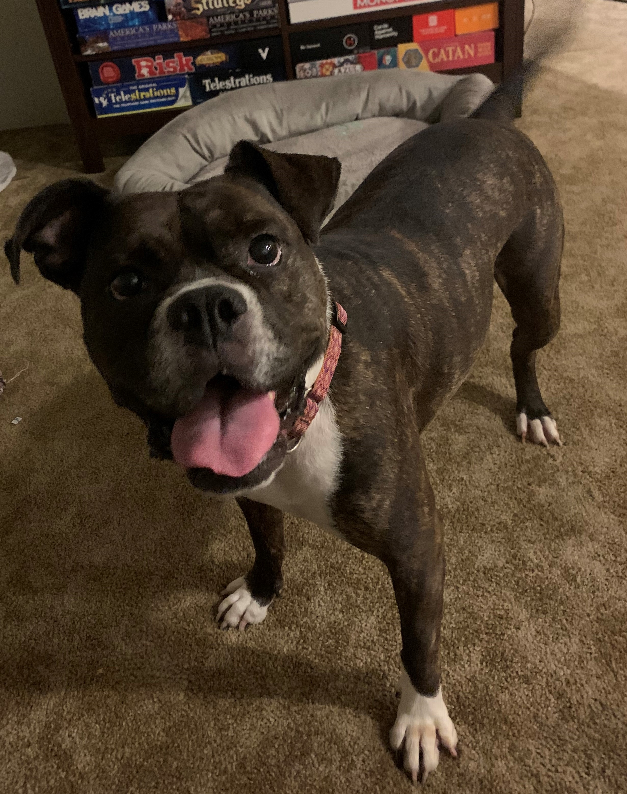
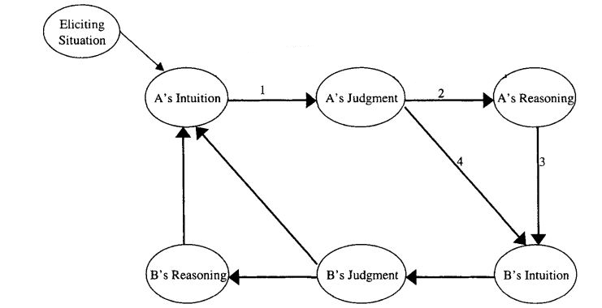
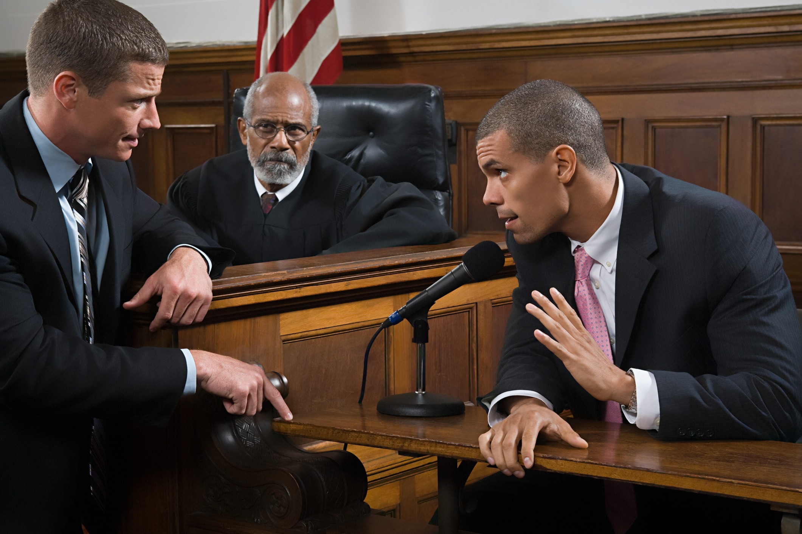

# Week 3
This week we will be discussing we reason through moral dilemmas and judge behaviors as right or wrong

.highlight-blue[In week 3:]
- How do we determine which course of action is right in a moral dilemma?
- What moral principles do we typically use to justify our moral judgments?
- **Do moral judgments arise from a deliberate, conscious process, or an automatic, unconscious one?**

---
# The rationalist model
Last class..

.footnote[Haidt (2001)]

- People use conscious reasoning to make moral judgments 
- Emotions (e.g., sympathy, disgust, anger) are sometimes used as input to guide conscious reasoning

???
In this model, a person is completely rational. In order to make a judgment, individuals reflect and reason through the evidence carefully, thinking about whether the action is fair, whether it harmed anyone, etc. 

---

# We are not rational

- Our moral judgments are often *automatic* and we cannot explain them (moral dumbfounding)

- We prefer evidence that helps us get to a desired conclusion and reject evidence that doesn't (motivated reasoning)

---

# Activity
.footnote[Haidt (2012)]
> Julie and Mark, who are sister and brother, are traveling together in France. They are both on summer vacation from college. One night they are staying alone in a cabin near the beach. They decide that it would be interesting and fun if they tried making love. At the very least it would be a new experience for each of them. Julie is already taking birth control pills, but Mark uses a condom too, just to be safe. They both enjoy it, but they decide not to do it again. They keep that night as a special secret between them, which makes them feel even closer to each other. 

.dq[.smaller[Was it wrong for them to have sex? Why?]]

???
Ask class what were the reasons, pointing out that they used protection, that they were not harmed, that it did not ruin their relationship

---

# Activity
.footnote[Haidt, Koller, & Dias (1993); Haidt (2012)]

.right-column-small[ 
]

.left-column-big[
> A family's dog was killed by a car in front of their house. They had heard that dog meat was delicious, so they cut up the dog's body and cooked it and ate it for dinner.

.dq[.smaller[Was it wrong for them to eat their dog? Why?]]
]

---

# Activity
.footnote[Haidt, Koller, & Dias (1993); Haidt (2012)]

.left-column-big[
> A man goes to the supermarket once a week and buys a chicken. But before cooking the chicken, he has sexual intercourse with it. Then he cooks it and eats it.

.dq[.smaller[Was it wrong for him to masturbate with the chicken carcass? Why?]]
]

.right-column-small[  

]

---
# Moral dumbfounding
.footnote[Haidt, Koller, & Dias (1993); Haidt (2012)]
.highlight-blue[**Moral dumbfounding**]: An individual makes a moral judgment but cannot defend it with reason; it just *feels* wrong

---

# Moral dumbfounding
.sm-br[]

<b>The Müller-Lyer illusion</b>

.pull-left[
- Even with the knowledge that the lines are the same length, the bottom one still *feels* longer

- Even with the assurance that my moral principles aren't being violated, harmless taboos still *feel* wrong
]
.pull-right[
]

---

# Motivated reasoning
.footnote[Uhlmann et al. (2009)]

#### Method (pretest) 

The researchers asked participants whether certain factors affect their judgment about whether it is OK to harm someone

> For example, some people believe that harming other people is usually wrong, but not wrong if someone is guilty of a serious crime (such as murder)

---
# Motivated reasoning 
.footnote[Uhlmann et al. (2009)]

.pull-left[#### Results (pretest)
Most people said that they wouldn't take demographic variables [e.g., gender (80%), race (87%), weight (90%)] into account when deciding if it is right or wrong to harm someone.
]
.pull-right[
]

---

# Motivated reasoning 
.footnote[Uhlmann et al. (2009)]

####Method (study 1)
Participants read the following moral dilemma: 
>Should an individual throw a severely injured person (so injured that he would not survive) off of a crowded lifeboat in order to prevent the lifeboat from sinking, thereby drowning all of the individuals aboard?

---

# Motivated reasoning 
.footnote[Uhlmann et al. (2009)]

####Method 

Participants were randomly assigned to one of two conditions
- The injured person's name was Chip Ellsworth III
- The injured person's name was Tyrone Payton

After reading the scenario, participants were asked questions like:
- It is sometimes neccesary to allow the death of innocent lives in order to promote the greater good.

---

# Motivated reasoning 
.footnote[Uhlmann et al. (2009)]

.left-column-med[#### Results 
- High scores on consequentialism: the participant was willing to sacrifice the injured person for the greater good

- High scores on political orientation: the participant is conservative (vs. liberal)]

.right-column-med[
]

---

# Motivated reasoning 
.footnote[Uhlmann et al. (2009)]

.left-column-med[#### Results 
The researchers found a significant interaction effect between conservatism and person being sacrificed
- Liberals more likely to sacrifice Chip than Tyrone 
- Conservatives were equally likely to sacrifice Chip as they were to sacrifice Tyrone]

.right-column-med[
]

---
# Motivated reasoning 
.footnote[Uhlmann et al. (2009)]

#### Discussion 

This is evidence for *motivated reasoning*
> "Rather than being moral rationalists who reason from general principle to specific judgment, it appears as if people have a "moral toolboox" avaliable to them where they selectively draw upon arguments that help them build support for their moral intuitions"

---

# The rationalist model
.footnote[Haidt (2001)]

---

# The rationalist model
.footnote[Haidt (2001)]

- The rationalist model says that affect **does not have a direct causal role** in moral judgments

  - If someone cannot think of a reason that something is wrong, then it can't be wrong 
  
  - Reasoning would be objective not motivated
  
--

- Haidt (2001) proposed an alternative model of moral judgment called the *social intuitionist model*
???
Affect is merely input for reasoning 

---
# Two systems
.footnote[Kahneman (2011); Haidt (2001)]
.pull-left[**The Intuitive System (system 1)**
- Fast, effortless
- Automatic, unintentional
- Process in inaccessible
- Parallel processing
- Common in all mammals]

--

.pull-right[**The Reasoning System (system 2)**
- Slow, effortful
- Controllable, intentional
- Process is consciously accessible
- Serial processing
- Unique to humans (> 2 years old), possible some trained apes]

---
# .smaller[The social intuitionist model]
.footnote[Haidt (2001)]

.left-column-small[- Moral judgments are caused primarily by quick and effortless *intuitions*

- Reasoning has a causal role in one's moral judgments, but only *the reasoning of another person*
]

.right-column-big[]

---

# .smaller[The social intuitionist model]
.footnote[Haidt (2001)]

.left-column-small[
- Very infrequently, individuals try to change their own intuitions or initial judgment through reasoning

- More often, reasoning's role is to persuade others of your judgment]

.right-column-big[]

---

# .smaller[The social intuitionist model]

.footnote[Haidt (2001)]

.pull-left[
.highlight-blue[(1) The intuitive-judgment link:] Without any conscious processing, moral judgments occur.

.highlight-gray[(2) The post-hoc-reasoning link:] Once a judgment has occurred, the individual searches for reasons to explain the judgment.]

.pull-right[]

---

# .smaller[The social intuitionist model]
.footnote[Haidt (2001)]

.pull-left[
.highlight-blue[(3) The reasoned-persuasion link:] Moral reasoning can affect the intuitions of others.

.highlight-gray[(4) The social persuasion link:] Judgments can affect the intuitions of others (e.g., conformity).]

.pull-right[]

???
Note that you are not affecting the judgment or reasoning of another person directly, only their intuitions (e.g., emotions)
Core of the model: moral reasoning has a causal role in moral judgment, but only the reasoning of another person. reasoning rarely is used to question or change ones own moral beliefs
---

# .smaller[The social intuitionist model]
.footnote[Haidt (2001)]

.pull-left[
.highlight-blue[(5) The reasoned-judgment link:] The individual overrides their intuition with reasoning.

.highlight-gray[(6) The private reflection link:] An individual, through reasoning, develops a new intuition.]

.pull-right[]

???
*5 occurs rarely, hypothesized only to happen when initial intuition is weak & reasoning skills is high
*6 also occurs rarely, e.g., person perspective takes, feeling sympathy/ other emotional responses

---
# .smaller[The social intuitionist model]
.footnote[Haidt (2001); Haidt (2012)]

.pull-left[- Moral reasoning is a lawyer not a judge

  - **Judge**: weighs all of the evidence before the moral judgment
  
  - **Lawyer**: argues a case to convince others to support it]
  
.pull-right[
]
---

# .smaller[The social intuitionist model]
.footnote[Haidt (2012)]

.right-column-med[]

.left-column-med[- The mind is like a rider on an elephant 
  - The rider is our conscious processing 
  
  - The elephant is our automatic, unconscious processing  ]

---

# .smaller[The social intuitionist model]
.footnote[Haidt (2012)]

.right-column-med[]

.left-column-med[- The mind is like a rider on an elephant 
  - The rider develops goals and thinks about the future, but it's the elephant who is really in charge
  
  - The rider speaks for the elephant, even when it doesn't know how or why the elephant makes the decisions it does]

---

# .smaller[The social intuitionist model]

.left-column-big[
> "Reason is, and ought only to be the slave of the passions, and can never pretend to any other office than to serve and obey them." .right[-David Hume, 1739   *A Treatise of Human Nature*
]]

.right-column-small[]
---

# Six moral intuitions

.footnote[Haidt & Joseph (2007); Koleva et al. (2012)]

  - **Care/harm** - We should care for and not harm vulnerable others.
  - **Fairness/cheating** - We should get back what we put forward; we should not cheat.
  - **Ingroup/ betrayal** - We should be loyal to our groups (e.g., family, nation).
  - **Authority/ subversion** - We should respect authority and tradition.
  - **Purity/ Degradation** - We should not violate norms of decency and purity by doing certain things with our bodies.
  - **Liberty/ Oppression** - People should not restrict the freedom of others.

---
# Criticisms 
.footnote[Pizzaro & Bloom (2001)]

#### Reasoning does have an important role

- Pizzaro & Bloom (2001) argue that deliberate reasoning is not as irrelevant to moral reasoning as the social intuitionist model suggests

--

Deliberate reasoning can....

1) Shift our initial cognitive appraisal
- For example, learning that a student's parent died can change a negative appraisal for missing homework

---

# Criticisms 
.footnote[Pizzaro & Bloom (2001)]
#### Reasoning does have an important role

- Pizzaro & Bloom (2001) argue that deliberate reasoning is not as irrelevant to moral reasoning as the social intuitionist model suggests

Deliberate reasoning can....

2) Control situations to avoid having intuitions
- For example, looking away to not feel sympathy 

---

# Criticisms
.footnote[Monin et al. (2007)]

#### Reacting vs. deciding
Monin et al. (2007) argue that the social intuitionist model does not fit for all moral situations

-  The intuitionist and rationalist models represent two different situations
  - Shocking moral violations (intuitionist model)
  
  - Complex moral dilemmas (rationalist model)

---
# Criticisms 
.footnote[Monin et al. (2007)]

#### Reacting vs. deciding

.pull-left[Reacting
> Should you kill a man for money, eat your dog, or have sex with a sibling?]

.pull-right[
Deciding
> Should a doctor kill a dying patient who is asking for an end to her suffering?]

--

Intuition plays a much more important role when an individual is *reacting* to a moral violation than when an individual is *deciding*

???
Another role of moral reasoning may be to choose what you should do in a moral dilemma

---

# Criticisms 
.footnote[Uhlmann et al. (2015)]

#### Character judgments

Uhlmann et al. (2015) argue that acts in moral dumbfounding studies like masturbating with a dead chicken, or eating one's family dog are difficult to defend with "rational" metrics like harm, or money

- But, they do have very high informational value .highlight-blue[in real-life contexts] for the moral character of the person doing the act

---
# Criticisms 
.footnote[Uhlmann et al. (2015)]

#### Character judgments

A person who does extremely taboo, highly unusual, and disgusting acts in a society may be also likely to do other immoral acts (e.g., a person who can eat their family dog may not be able to form normal emotional attachments)

- It may be rational then to avoid such acts in order to avoid negative character judgments and protect your reputation

---
# Criticisms 
.footnote[Helzer & Critcher (2018)]

#### Character judgments

Actions are wrong, then, not because anyone is harmed, *but because they signal that the person doing the action has a flawed moral-cognitive machinery* that may result in harm to others in the future 

- Would you hire someone to babysit your children who urinates on bibles and eats their pets?

---
# Criticisms 

.footnote[Gray, Waytz, & Young (2012)]

#### Perceiving harm in "harmless" taboos
- People don't believe these acts (e.g., consensual incest, eating the family dog, chicken masturbation) are really harmless

- For example, they might believe that permitting incest in a specific scenario *weakens* the overall condemnation of it

  > *Those who rally against ostensibly harmless violations such as homosexuality suggest that they represent the beginning of a slippery
slope in which all norms and standards are abandoned,
thereby plunging people into deadly anarchy*
---

# Criticisms 

.footnote[Gray, Waytz, & Young (2012)]

#### Perceiving harm in "harmless" taboos

- Thus, people may not believe that these "harmless" taboos aren't harmful (e.g., they cannot believe that incest would not harm a brother-sister relationship) 

- So, when the researcher says they are harmless, you are "dumbfounded" because they are not accepting your reason as valid
---
# Summary

- The social intuitionist model posits that moral judgments are more often than not intuitive; moral judgment is automatic and inaccessible

  - Reasoning is like a lawyer, defending the judgment, rather than a judge, carefully weighing the evidence 
  
- There are many criticisms to the social intuitionist model
  - Mainly, deliberate reasoning does appear to be more important than theorized, and "harmless" taboos may be informative of character and perceived to be harmful

.highlight-blue[Due sunday:] HW2