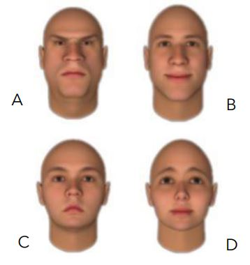
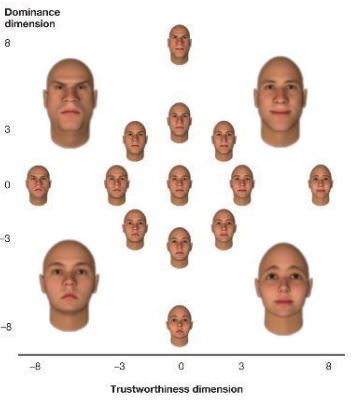
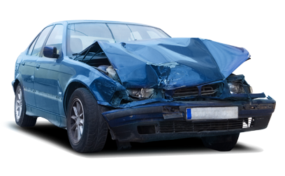
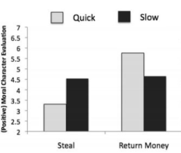
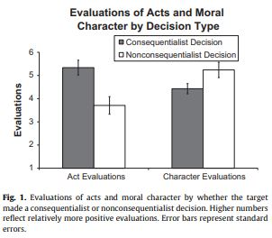

# Week 4
This week we will be discussing how we think about others in moral situations

.highlight-blue[In week 4:]
- **Which moral traits do we automatically evaluate in strangers?**
- **How do evaluate if someone is a good person?**
- Under what conditions is someone absolved from blame for their actions?
- When is someone deserving of praise for their actions?
---

# Inferring traits from appearance 

.left-column-med[]
Answer the following questions:

Rely on your "gut feeling" - there are no right or wrong answers.

- Which one of these people would you hire to work as your assistant?
- Which one of these people would you hire to babysit your kids?
- Which one of these people would you vote for as president? 
- Who looks the most trustworthy? 

 
---

# Inferring traits from appearance 
.footnote[Todorev et al. (2008)]

.right-column-small[]

In a repeated measures design, participants were shown computer generated faces and asked to rate them on different traits

The researchers found that people's impressions could be categorized into two dimensions 
-  .highlight-blue[First dimension:]  trustworthy/ non-aggressive - untrustworthy/aggressive

- .highlight-blue[Second dimension:]   Dominant/ confident - submissive/bashful

???
PCA - the judgments in each component were highly correlated with each other . The first two components explained about 80% of the variance in judgment scores

---

# Inferring traits from appearance 
.footnote[Todorev et al. (2008)]
.left-column-med[]

The top left faces were rated as **untrustworthy and dominant**
- These faces had hypermasculine features, like a pronounced jaw, small eyes, small forehead, and low eyebrows
  

---

# Inferring traits from appearance 
.footnote[Todorev et al. (2008)]
.left-column-med[]

  
The bottom right faces were rated as **trustworthy and submissive**
- These faces had child-like features, like large round eyes, large foreheads, high eyebrows, and round, small chins

---

# Inferring traits from appearance 
.footnote[Todorev et al. (2008)]
.right-column-small[]
  
These personality inferences are automatic and they occur **even though there is little evidence that they are accurate**

- These quick inferences may even lead us to misjudge the threat of others, such as Ted Bundy, who famously lured women by looking non-threatening

--

This study also illuminates how *important* moral character judgments are to first impressions; the goal of the first impression seems to be to determine if the other individual will be capable and motivated to harm you 

---
# Inferring moral character from actions

.right-column-small[]

Perhaps you do not want to be fooled by appearance. How would you know if Ted Bundy is a good person or not?

You can observe him. What does Ted Bundy *do*? 

--

"On Saturday mornings, Molly and Ted would watch cartoons together and let me sleep in. Their favorite was Dudley Doright and the Mounties. Dudley had a girlfriend named Nell whom he saved from villains who routinely tied her to railroad tracks. Ted could mimic Dudley perfectly, and he would call Molly “Nell.” Together, “Dudley and Nell” would fix breakfast and bring it to me in bed." 
.right[-Elizabeth Kendall, ex-girlfriend  
*The Phantom Prince, My Life with Ted Bundy*]

???

“A few of the horrendous facts include: He abducted and killed two women in one day and then took me out to dinner that evening. He raped and murdered women and then slept with me. He took my visiting family out for a fun evening of pizza. He then excused himself, went to a bar in South Seattle, found a young woman, and murdered her. The next day he was his charming self at a family event. One day when he was driving to Utah to go to law school, he called from Nampa, Idaho, to tell me he loved me. I learned later that he abducted a young woman that day and murdered her.”

---

# Inferring moral character from actions

.right-column-small[]

Perhaps you do not want to be fooled by appearance. How would you know if Ted Bundy is a good person or not?

You can observe him. What does Ted Bundy *do*? 

- Bad people can do good things
(And good people can do bad things)

---
# Inferring moral character from actions

.footnote[Helzer & Critcher (2018)]

**Observed behavior**: an individual walks past a homeless man and gives him $10.

.pull-left[<u>Person 1</u>   Yes - the individual feels sympathy for the man and is compelled to act

<u> Person 3 </u>  No - the individual was not carrying any cash]

.pull-right[<u>Person 2</u>  Yes - the individual is walking with his boss who he is trying to impress  

<u> Person 4 </u>   No - the individual felt giddy that there was a man suffering, calls him a loser, and walks away]

.highlight-blue[Discussion question:] Which of these people would you consider *moral*? Which of these people would you consider most *immoral*?

---

# Inferring moral character from actions

Behavior may not be very informative of whether or not someone is a good person

- We need to consider intentions, circumstances, and most importantly, their <u>**moral-cognitive machinery**</u>
---

#  Moral-cognitive machinery
.footnote[Helzer & Critcher (2018)]

We can determine if a car's *machinery* works by testing it to see if inputs cause appropriate outputs, i.e., when we do something to the car, it should react in the way that we would expect a functioning car to act 

- When you turn the key, you should hear the engine start.
- When you press on the gas pedal, the car should move forward.
- When you press on the volume button, music should play.

.right-column-med[]
---
#  Moral-cognitive machinery
.footnote[Helzer & Critcher (2018)]

Similarly, we can determine if someone's *moral-cognitive* machinery works by testing it to see if inputs cause appropriate outputs

- When a person is suffering, you should feel compassion and a desire to help. 
- When you cheat on your partner, you should feel guilty and compelled to stop or be honest about your actions.

---
# Moral-cognitive machinery
.footnote[Helzer & Critcher (2018)]

Someone with properly functioning *moral-cognitive machinery* will...

- Attend to relevant cues
- Appropriately process the cues
- Arrive at a good moral decision 

---
# Moral-cognitive machinery

For example, someone with functioning moral-cognitive machinery who walks by and sees someone suffering will..
- Properly notice and identify that the person is suffering
- Feel sympathy for the person
- Do what they can to help

--

<u>Person 1:</u> the individual feels sympathy for the man and is compelled to act (functioning moral-cognitive machinery)

<u>Person 4:</u> the individual felt giddy that there was a man suffering, calls him a loser, and walks away (broken moral-cognitive machinery)

???
If they are compelled to act, even if they cannot act, then they are probably a good person
If they are not compelled to act, but does so anyway for other benefits, then they are probably not a good person

---
# Moral-cognitive machinery
.footnote[Helzer & Critcher (2018)]

Someone with functioning moral-cognitive machinery will, over time, make good moral decisions (i.e., outputs), given the context (i.e., inputs)

- Good people have a **functioning** *moral-cognitive machinery* and bad people do not

- Since bad people have broken machinery, they will consistently do bad things

- Thus, we should care more about evaluating a person's machinery than about evaluating their specific behaviors 

---

# Moral-cognitive machinery

.highlight-gray[Example:]

A runaway trolley is barreling down a set of train tracks. There is unfortunately no conductor to stop the train, which is about to run over and kill five people...

Robert is standing to the side of the track. Next to him is a lever. If he pulls the lever, it will divert the train onto an alternate track where it will kill his infant son instead of the five. Without hesitation, Robert pulls the lever because 5 > 1.

.highlight-gray[What do you think about Robert? Is his moral-cognitive machinery working as it should?]

---
# Determining machinery functioning
.footnote[Critcher et al. (2012)]

Critcher et al. (2012) tested whether how quick people came to a moral decision affected how others perceived their character

Participants were randomly assigned to read either a story about quick deciding Justin and slow deciding Nate doing either moral or immoral actions

---
# Determining machinery functioning

<u>Immoral condition: </u>

Justin came across a cash-filled wallet in the parking lot of a local grocery store. He decided quickly what to do. He pocketed the money and drove off.

Nate came across a cash-filled wallet in the parking lot of a local grocery store. After a long and careful deliberation, he decided what to do. He pocketed the money and drove off.

Rate the moral character of Justin and Nate on a scale of 1 = "has entirely bad moral principles" to 7 = "has entirely good moral principles."

---

# Determining machinery functioning
.footnote[Critcher et al. (2012)]

<u>Moral condition: </u>

Justin came across a cash-filled wallet in the parking lot of a local grocery store. He decided quickly what to do. He returned the wallet to customer service.

Nate came across a cash-filled wallet in the parking lot of a local grocery store. After a long and careful deliberation, he decided what to do. He returned the wallet to customer service.

Rate the moral character of Justin and Nate on a scale of 1 = "has entirely bad moral principles" to 7 = "has entirely good moral principles."

---
# Determining machinery functioning
.footnote[Critcher et al. (2012)]

.right-column-med[]

- Main effect of condition - overall, people who returned the money were evaluated more positively than those who stole the money
- There was a significant interaction; quick immoral decisions were seen as more negative than slow immoral decisions, and quick moral decisions were seen as more moral than slow moral decisions

---

# Determining machinery functioning
.footnote[Critcher et al. (2012)]

- The decision speed is assumed to reflect how confident the individual is in the decision
- When people make a moral decision quickly and confidently, we tend to think that we are getting information about one's moral-cognitive machinery, rather than the circumstances
- This person *automatically* steals (non-functioning machinery) vs. this person *automatically* does not steal (functioning machinery)
- When the decision is slow, we can understand less about the underlying machinery because we do not know why the person is conflicted 

---
# Moral-cognitive machinery

Let's return to the trolley problem where Robert quickly decided to be a utilitarian (decide on what is moral by the consequences of the action) and kill his infant son to save the five people on the train 

Instead of killing his son quickly and nonchalantly, you probably expected him to:

- Attend to his infant son and the people, realizing that he has a profoundly difficult decision to make
- Feel immense distress and compassion for his son and the people on the tracks
- Regretfully not be able to pull the lever (or if he does, he would show immense remorse, running towards his son to hold him while he dies)

---
# Person-act dissociations

**Person-act dissociation:** like the man willing to sacrifice his son for the greater good, moral praiseworthy actions *can* signal negative information about the character of an actor 

--

Uhlmann et al. (2013) presented participants with a variation of the lifeboat dilemma (shipwrecked passengers deciding if they should throw an injured man overboard to keep their lifeboat from sinking)

--

Participants were randomly assigned to:
- The consequentialist (they threw the man overboard) or non-consequentialist condition (they did not throw the man overboard)
- Evaluate the act itself or the character of the decision makers

---
# Person-act dissociations

.right-column-med[]
A person-act dissociation did occur
- Individuals evaluated the consequentialist decision (pushing the person off of the boat) as more moral than the nonconsequentialist action
- However, people evaluated the people who make the consequentialist decision (push the person off of the boat) as having worse moral character than the people who don't push the person off of the boat 

---

# Person-act dissociations

.footnote[Uhlmann, Zhu, & Tannenbaum (2013)]
Reasons for person-act dissociations 

- **Empathetic suppression.** Consequentialist actions means that you were able to suppress your empathy (and therefore shows a non-functioning cognitive-moral machinery)

???
Psychopaths make utilitarian decisions because they wish to cause harm

--

- **Moral-motives problem.** Consequentialist actions could be due to wanting to do the right thing, but also, they may wish to cause harm, may be acting selfishly, etc.

--

- **Moral pragmatism**. Acts are held to a different standard than character judgments- unwillingness to sacrifice a life for the greater good is unpractical. Thus acts are judged pragmatically while character is not

---
# Summary

- We infer moral traits about others automatically, from as little as their appearance 
- Behavior can be uninformative if we are trying to understand someone's moral character
  - Good people do bad things and bad people do good things
- Instead, we evaluate one's moral machinery - if they react as they should to moral situations
- Sometimes we evaluate people negatively for doing actions that we consider admirable, and positively for doing actions that we consider immoral (called a person-act dissociation)

.highlight-gray[Next class:] When do we blame others for immoral actions?