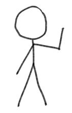

# Week 4
This week we will be discussing how we judge the moral character of others and how they attribute or fail to attribute blame to others for their actions 

.highlight-blue[In week 3:]
- **How do we determine if someone is a good person?**
- How do we attribute or fail to attribute blame to others for their actions?

---

# Assessing a car

.footnote[Helzer & Critcher (2018)]

How do we access if a car works?

**Option 1.** Assess its behavior. Can the car make it from point A to point B?

.pull-left[<u>Car 1</u>   ]
.pull-right-small[<u>Car 2 </u>   ]

???
Car B can if we push it... behavior might not be enough to determine if 
---

# Assessing a car

.footnote[Helzer & Critcher (2018)]

How do we access if a car works as it should?

**Option 1.** Assess its behavior. Can the car make it from point A to point B?

.pull-left[<u>Car 1</u>      Yes (you can drive it there)]
.pull-right-small[<u>Car 2 </u>      Yes (if you push it)]

---

# Assessing a person's "morality"

.footnote[Helzer & Critcher (2018)]

How do we access if a person's "morality" works as it should?

**Option 1.** Assess their behavior. Do they help the injured man?

.pull-left[<u>Person 1</u>      Yes (they feel sympathy for the man and are compelled to act)]
.pull-right-small[<u>Person 2 </u>      Yes (they want to be promoted and their boss is watching)]

---

# Assessing a person's "morality"
.footnote[Helzer & Critcher (2018)]

**Option 2.** Inputs should cause appropriate outputs.

For a car,
- When you turn the key, you should hear the engine start.
- When you press on the gas pedal, the car should move forward.

For a person,
- When a person is suffering, you should feel compassion and a desire to help. 
- When you cheat on your partner, you should feel guilty and compelled to stop or be honest about your actions.

???
Behavior is not sufficient in determining whether a car is working, and its not sufficient in determining whether a person's "morality" is working.

---

# Functioning moral-cognitive machinery

Someone with properly functioning *moral-cognitive machinery* will...

- Attend to relevant cues
- Appropriately process the cues
- Arrive at a good moral decision 

Someone with functioning moral-cognitive machinery will, over time, make good moral decisions (i.e., outputs), given the context (i.e., inputs) of the problem  

---

# Functioning moral-cognitive machinery

.highlight-gray[Example:]

A runaway trolley is barreling down a set of train tracks. There is unfortunately no conductor to stop the train, which is about to run over and kill five people...

Robert is standing to the side of the track. Next to him is a lever. If he pulls the lever, it will divert the train onto an alternate track where it will kill his infant son instead of the five. Without hesitation, Robert pulls the lever because 5 > 1.

.highlight-gray[What do you think about Robert? Is his moral-cognitive machinery working as it should?]

---
# Functioning moral-cognitive machinery

In this scenario, if Robert had a working moral-cognitive machinery, he would likely...

- Attend to his infant son and the people, realizing that he has a profoundly difficult decision to make
- Feel immense distress and compassion for his son and the people on the tracks
- Regretfully not be able to pull the lever (or if he does, he would show immense remorse, running towards his son and hold him as he dies, rocking him and apologizing profusely)

---
# Person-act dissocations

---
.footnote[Uhlmann, Zhu, & Tannenbaum (2013)]
Reason for person-act dissociations 

1. Moral-motives problem. Consequentialist actions could be due to wanting to do the right thing, but also, they may wish to cause harm, may be acting selfishly, etc (multiple-motives hypothesis)

2. Empathetic suppression. Consequentialist actions means that you were able to suppress your empathy (empathic
suppression hypothesis )

3. Acts are held to a different standard than character judgments- unwillingness to sacrifice a life for the greater good is unpractical. thus acts are judged pragmatically while character is not (moral pragmatism hypothesis )
---

# Qualities of a good moral character

Trustworthiness 
