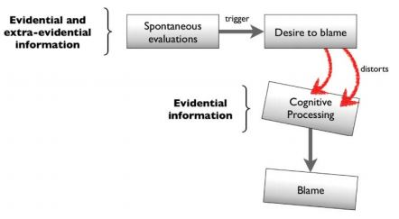

# Week 4
This week we will be discussing how we think about others in moral situations

.highlight-blue[In week 4:]
- Which moral traits do we automatically evaluate in strangers?
- How do evaluate if someone is a good person?
- **Under what conditions is someone absolved from blame for their actions?**
- **When is someone deserving of praise for their actions?**

---
# Blame

When someone behaves badly, we typically blame them and punish (or try to punish) them for it

.right-column-med[  ]

- However, occasionally someone does something and we do not blame them for it (legally or psychologically)
  - For example, if a 12 month old baby shoots and kills someone, we do not blame the baby; we do not consider the baby *morally responsible*

---
# Blame
.footnote[Alicke (1992)]
Consider the following story...
>John was driving over the speed limit (about 40mph in a 30-mph zone) to get home in time to hide an anniversary present for his parents that he had left out in the open before they could see it. As John came to an intersection, he applied his brakes but was unable to stop as quickly as usual because of some oil that had spilled on the road. As a result, John hit a car that was coming from the other direction, John hit the driver on the driver's side, causing him multiple lacerations, a broken collar bone, and a fractured arm. John was uninjured in the accident.

Is the accident John's fault?

---
# Blame
Consider the following story...

>Barbara wants to kill her husband, John. When they are eating at a restaurant, Barbara slips some poison into John's dish while he isn't looking. Unbeknownst to Barbara, the poison isn't strong enough to kill her husband. However, it makes the dish taste so bad that John changes his order. When he receives his new order, it contains a food that John is extremely allergic to, and which kills him within minutes.

Should Barbara be blamed for the death of her husband?

.footnote[Pizarro, Uhlmann, & Bloom (2003)]

---

# The culpable control model of blame
.footnote[Alicke (2000)]
The culpable control model of blame outlines when people think others should be blamed (and when they should not be blamed) for their actions

In a situation, the individual assigning blame focuses on three pieces of information and how they relate to each other: 

- The actor's mental state (their desires, plans, motives, knowledge)  
- The actor's behavior (their actions, omission of actions)  
- The consequences  of the behavior (immediate and extended) 
.center[.smaller-picture[]]

---

# The culpable control model of blame
.footnote[Alicke (2000)]

Let's revisit this scenario:

>John was driving over the speed limit (about 40mph in a 30-mph zone) to get home in time to hide an anniversary present for his parents that he had left out in the open before they could see it. As John came to an intersection, he applied his brakes but was unable to stop as quickly as usual because of some oil that had spilled on the road. As a result, John hit a car that was coming from the other direction, John hit the driver on the driver's side, causing him multiple lacerations, a broken collar bone, and a fractured arm. John was uninjured in the accident. What is M, B, and C?
.center[.smallest-picture[]]

???
John's mental state: He wants to get home fast to do a nice thing for his parents
John's behavior: he is speeding
Consequence: he crashes his car, injuring a man
---
# Personal control
.footnote[Alicke (2000)]

When we analyze the links between mental state, behavior, and consequences, we are estimating how much *personal control* that the actor had in the situation

In order for a person to have complete personal control over an action, they need to have:
- Intention
- Causation
- Foresight

---
# Intention
.footnote[Alicke (2000)]

.center[]

**High volitional behavior control:** the act's behavior was caused by one's mental state, i.e., the act was done *intentionally*; it required planning 

**Low volitional behavior control**: The actor acted accidentally,  was forced to act against their will, could not understand the significance of their actions, or could not act out desires due to physical or psychological limitations

.highlight-blue[Discussion question:] Name a situation where the actor would be judged to have low volitional behavior control.
???

Low: a Nazi concentration camp worker
Low: a blind person runs into a child and knocks them down

---

# Causation
.footnote[Alicke (2000)]
.center[]

**High causal control:** the actor's behavior clearly caused the consequence

**Low causal control**: there were multiple causes of the consequence, the behavior occurred a significant amount of time before the consequence, or the consequence would have occurred regardless of the behavior

.highlight-blue[Discussion question:] Name a situation where the actor would be judged to have low causal control.

???
Low: the person is drowning in the water, but they were having a heart attack so they would have died whether or not you tried to save them
Low: you tried to kill someone but also 50 other people were also trying to kill him too 
---

# Foresight
.footnote[Alicke (2000)]

.center[]

**High volitional outcome control**: the event's consequences were desired and foreseen

**Low volitional outcome control**: there is no way the individual could have foreseen the consequences of their actions, or the consequences were not desired but the individual was constrained by physical or psychological limitations

.highlight-blue[Discussion question:] Name a situation where the actor would be judged to have low volitional outcome control.

???
Low: an individual gives their date peanut butter, unknowingly poisoning them  
Low: a person allows someone to drown because they cannot swim
---

# Combinations of personal control
.footnote[Alicke (2000)]

.right-column-med[]

Personal control is maximized when all three components (volitional behavior control, causal control, and volitional outcome control) are present and minimized when all are not

---

# Combinations of personal control
.footnote[Alicke (2000)]

.right-column-med[]

**Column 6:** high casual control but low behavior and outcome volitional control 

E.g., a prototypical accident where the driver caused it but the consequences were undesired and unforeseen (people tend not to blame for these)

---
# Combinations of personal control
.footnote[Alicke (2000)]

.right-column-med[]

**Column 3:** high behavior volitional control but low outcome volitional control and casual control

E.g., "Impossible crimes" like shooting a man who is already dead, or buying a drug that you think is illegal but is actually an over the counter vitamin, trying to annoy a neighbor by blasting music but the neighbor loves loud music (people tend not to blame for these)

---
# Combinations of personal control
.footnote[Alicke (2000)]

.right-column-med[]

**Column 5:** high outcome volitional control and casual control but low behavior volitional control  

E.g., A woman, while driving down the street, entertains the thought of running over her husband with her car. The thought so unnerves her that she loses control of the wheel and runs over a pedestrian. The pedestrian happens to be her husband.

---
# Combinations of personal control
.footnote[Alicke (2000)]

.right-column-med[]

**Column 5:** high outcome volitional control and casual control but low behavior volitional control  

E.g., A woman, while driving down the street, entertains the thought of running over her husband with her car. The thought so unnerves her that she loses control of the wheel and runs over a pedestrian. The pedestrian happens to be her husband.

She did not intend the behavior at this time, but she did foresee the consequences and she did cause them with her behavior (people do tend to blame her)

---
# The culpable control model of blame
.footnote[Alicke (2008); Alicke (2000); Malle et al. (2014)]

"Culpable control" refers to the fact that the desire for someone to hold another person culpable or blameworthy changes their assessments of personal control

.right-column-med[]

  - People experience automatic affective **spontaneous evaluations** towards the actions and the people involved in the situation
  - Negative affective spontaneous reactions can then cause individuals to exaggerate the personal control that the actor played in the situation
    - E.g., a grieving mother searching to blame someone for the accidental death of her child
  
---
# Culpable control
.footnote[Alicke (1992)]

Consider again the following scenario:
>John was driving over the speed limit (about 40mph in a 30-mph zone) to get home in time to hide an anniversary present for his parents that he had left out in the open before they could see it. As John came to an intersection, he applied his brakes but was unable to stop as quickly as usual because of some oil that had spilled on the road. As a result, John hit a car that was coming from the other direction, John hit the driver on the driver's side, causing him multiple lacerations, a broken collar bone, and a fractured arm. John was uninjured in the accident.

---

# Culpable control
.footnote[Alicke (1992)]

Now consider this small change:
>John was driving over the speed limit (about 40mph in a 30-mph zone) to get home in time to hide **a vial of cocaine he had left out in the open before his parents could see it.** As John came to an intersection, he applied his brakes but was unable to stop as quickly as usual because of some oil that had spilled on the road. As a result, John hit a car that was coming from the other direction, John hit the driver on the driver's side, causing him multiple lacerations, a broken collar bone, and a fractured arm. John was uninjured in the accident.

---

# Culpable control
.footnote[Alicke (1992)]
- In a between subjects design, participants were given different versions of the car accident scenario and asked for the cause of the accident

- John was blamed more frequently for the accident when he was speeding to hide the cocaine than when he was speeding to hide the present

.smallest-picture[]

---

# An alternate model of blame
.footnote[Malle, Guglielmo & Monroe (2014)]
.right-column-med[]
- Malle et al. (2014) argue that blame processing happens hierarchically rather than simultaneously (like the CCM suggests) and that blame evaluations are less distorted by effective spontaneous reactions than the CCM suggests

---
# The Path Model of Blame
.footnote[Malle, Guglielmo & Monroe (2014)]
.right-column-med[]
- **Step 1:** The individual detects that the event violated a norm
- **Step 2:** The individual determined that the event was caused by the actor
- **Step 3:** The individual determines that the event was intentional
  - **Intentional:** The individual considers reasons for the action
  - **Not intentional**: The individual considers whether the actor was obligated to stop the event from occurring and whether the actor was capable of stopping the event from occurring
  
---
# The Path Model of Blame
.footnote[Malle, Guglielmo & Monroe (2014)]
.right-column-med[]

- The model is hierarchical because these steps happen in order
- For example, if an event was not caused by the actor, then one would not consider intentionally, and reasons are not important to consider if the action was not intentional

---

# Evidence supporting the path model
.footnote[Guglielmo (2012)]
.right-column-med[]

"Information search" paradigm
- Participants were given different norm-violating events and were told to ask questions to find out who should be blamed for the event
  - Participants asked about information in the order that the path model predicts
  - E.g., for negative events, participants tended to ask questions about causality; for agent-caused events, they primarily asked questions about intentionally, and so on
  
---
# Evidence supporting the path model
.footnote[Guglielmo (2012)]
.right-column-med[]

"Information offer" paradigm
- Participants were given different norm-violating events and were offered pieces of information (e.g., about causality, intentionally, etc.) that they could choose from to find out who should be blamed for the event 
  - Participants were more likely to accept information that the path model predicts they would
  
---

# Blame and praise
.footnote[Alicke et al. (2018); Anderson et al. (2020)]
- **Moral blame**: a negative appraisal that one's actions violated a moral rule that threatens the well-being of the group

- **Moral praise**: a positive appraisal that one's positive behavior and character has exceeded typical duties and obligations 

---
# Blame and praise
.footnote[Anderson et al. (2020)]

- According to Anderson and collegues (2020), blame and praise both play an important role in shaping moral behavior and choosing social partners 

  - However, praise is uniquely aimed at building, establishing, and maintaining social relationships 

---
# The side effect effect
.footnote[Knobe (2003)]

Consider the following...
>  The vice-president of a company went to the chairman of the board
 and said, 'We are thinking of starting a new program. It will help us
 increase profits, but it will also harm the environment.'
 The chairman of the board answered, 'I don't care at all about
 harming the environment. I just want to make as much profit as I can.
 Let's start the new program.' They started the new program. Sure enough, the environment was
 harmed.

How much blame did the chairman deserve for what he did  (on a scale from 0 to 6)?

*M* = 4.80

---

# The side effect effect
.footnote[Knobe (2003)]

Consider the following...

>  The vice-president of a company went to the chairman of the board
 and said, 'We are thinking of starting a new program. It will help us
 increase profits, and it will also help the environment.'
 The chairman of the board answered, 'I don't care at all about helping
 the environment. I just want to make as much profit as I can. Let's start
 the new program.' They started the new program. Sure enough, the environment was
 helped.
 
How much praise did the chairman deserve for what he did  (on a scale from 0 to 6)?

*M* = 1.40
---

# The side effect effect

People ascribed harsher blame for the negative side effect than they ascribed praise for the positive side effect

- This may be due to the fact that 82% of participants said that the chairman intentionally caused the negative side effect to the environment, but only 23% said that the the chairman intentionally caused the positive side effect to the environment 

---
# Asymmetric judgments of blame and praise

- Pizzaro et al. (2003) gave participants scenarios that varied in valence (positive or negative) and mental state of the actor (deliberate or impulsive)

.center[]

---
# Asymmetric judgments of blame and praise

.center[.left-column-med[  ]]

- Overall, negative acts were rated as more deserving a blame than positive acts were deserving of praise 
- In the negative condition, being impulsive significantly decreased moral blame, but in the positive condition, praise was given equally regardless of if the action was planned or impulsive

---
# Asymmetric judgments of blame and praise

.center[.left-column-med[  ]]

- Overall, negative acts were rated as more deserving a blame than positive acts were deserving of praise 
- In the negative condition, being impulsive significantly decreased moral blame, but in the positive condition, praise was given equally regardless of if the action was planned or impulsive

Differences between blame and praise judgments (in these studies and others) suggest that blame and praise function differently

---
# Blame vs. praise
.footnote[Anderson et al. (2020)]

- According to Anderson and collegues (2020), blame and praise both play an important role in shaping moral behavior and choosing social partners 

  - However, praise is uniquely aimed at building, establishing, and maintaining social relationships 
  
---
# Blame vs. praise
.footnote[Anderson et al. (2020)]

- According to Anderson and collegues (2020), blame and praise both play an important role in shaping moral behavior and choosing social partners 

  - However, praise is uniquely aimed at building, establishing, and maintaining social relationships 
  
- Another way that praise and blame differ is that praise is relatively "costless" 
  - In contrast, by accidentally blaming someone, you may lose a friendship, or the accused may retaliate against you
  
  - Thus, blame requires justification (e.g., causality, control, intentionally) whereas praise does not

---

# A theory of moral praise
.footnote[Anderson et al. (2020)]

- Anderson and colleagues (2020) theorize that in order to attribute praise to an actor for their admirable actions, individuals must evaluate the actor's motivations for acting morally

  - This is because they are trying to evaluate their moral-cognitive machinery to determine if they will be a cooperative and trustworthy social partner
  
---
# A theory of moral praise
.footnote[Anderson et al. (2020)]

Individuals can gain information about motivation from:
- Reading facial expressions
- Using decision time as a proxy for automaticity  
- Evaluating the effort the action took
  - Costly actions are considered more morally heroic

???
Individuals praise people less for an altruistic act when they benefited for the act 

---

#Summary

- When evaluating blame, people evaluate the amount of *personal control* that the actor has in a situation
  - Blame is reduced when an actor acts with good intentions, when the actor was not the sole cause of the consequence, and when the actor did not foresee or desire the consequence

- In contrast, when evaluating praise, the individual is much less concerned with variables like outcome and cause and more concerned with if the actor is motivated to do good