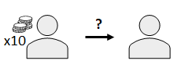

This week, we will be exploring moral behavior

.highlight-blue[In week 1:]
-
-
-
-

---

# The dictator game

???
The dictator tests altruism more so than cooperation
The dictator has $10. They can give some money to the other person but they don't have to.
  