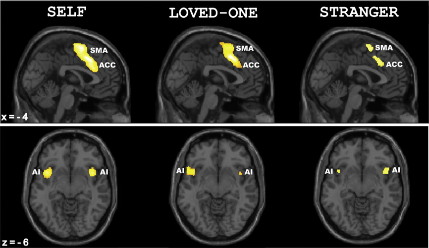

# Week 5
This week, we will be discussing moral behavior, particularly suppressing self-interest for the interests of others and the collective

.highlight-gray[In week 5:]

- What can economic games tell us about how we cooperate with each other?
- How trusting and generous are we towards strangers?
- **How concerned are we about being perceived as *moral* ?**
- **Does *true* altruism exist or are all pro-social acts inherently selfish?**

---

# The missing wallet study
.footnote[Cohn et al. (2019)]

#### Method

- Researchers performed a missing wallet experiment in 40 countries with more than 17,000 wallets

- For each wallet, a research assistant walked into a building (banks, theaters, museums, post offices, hotels, police stations, courts of law, or other public offices) and said:

>"Hi, I found this [pointing to the wallet] on the street around the corner. Somebody must have lost it. I’m in a hurry and have to go. Can you please take care of it?”

---
# The missing wallet study
.footnote[Cohn et al. (2019)]

 
.smaller-picture[]

---
# The missing wallet study
.footnote[Cohn et al. (2019)]

.pull-left[#### Method
- Some wallets had money in them while others had no money

- The researchers measured if the person did or did not contact the owner of the wallet]

.pull-right[
]
---
# The missing wallet study
.footnote[Cohn et al. (2019)]

.right-column-med[
]

.left-column-med[#### Results
- People were *more* likely to return wallets with money in them

- Across countries, about 40% of no money wallets were returned and about 51% of money wallets were returned]

---

# The missing wallet study
.footnote[Cohn et al. (2019)]

.right-column-med[
]

.left-column-med[#### Results
- Further, when a "big money" condition ($94.15) was added, people were even more likely to return the wallet

- And in another variation, people were about 9% more likely to return wallets with keys
]

---

# The missing wallet study
.footnote[Cohn et al. (2019)]

.pull-right[]

.pull-left[#### Results
- These findings were contrary to the expectations of expert economists, and contrary to the expectations of non-experts

]
---

# The missing wallet study
.footnote[Cohn et al. (2019)]

#### Discussion
- Extra monetary incentives *should* decrease wallet returns, but the opposite occurred

- A key, which is valuable to the wallet-owner but not the wallet-finder, should not increase wallet returns, but it does

--

.dq[Why do you think people return wallets that are *more* valuable?]

---

# The dictator game
 

 

- The dictator game is a simple variation of the ultimatum game 

- In this game, person A (called the "dictator") is given a sum of money, and they can choose to give a proportion to person B (or to give nothing at all)

- "Dictators" give on average 20% to 30% of the money to the other person

---
# Altruism

From these studies, we have learned that people will sometimes act against their self-interest in order to help a stranger

- They will return wallets, especially ones with a lot of money, or ones that hold important valuables like keys

- They will share their rewards with strangers in economic games, even when there is no obvious opportunity for reciprocation 

---
# Altruism

**Altruistic** behaviors are selfless actions that benefit other(s) without regard to how it will affect oneself

- Most "altruistic" behavior is done for those we love, like relatives or friends

  - **Kin selection**: helping those that share your genes   
  
  - **Reciprocal altruism**: helping others so that they will help you in the future 
  
- However, it is less obvious why people help strangers, especially ones they will never see again

---

# Activity

**Instructions**: Think about a recent behavior that you did that was *altruistic* (selfless and benefited others). Would you consider the act **purely** altruistic, or did you also benefit from it?

---

# Altruism 

.footnote[Batson and Shaw (1991)]
Batson and Shaw (1991) described three pathways to helping, two of which are selfish (i.e., egoist) and one of which they claim is altruistic

1. Arousal reducing (egoistic)

2. Reward seeking and punishment avoiding (egoistic)

3. Empathic concern (altruistic)

---
# Egoistic motivations
.footnote[Batson and Shaw (1991)]

One reason for helping is **to reduce your own negative arousal** 

- When we see someone suffering, we feel emotional distress

- Helping them will reduce our own suffering and make us feel *good*

---
# Egoistic motivations

.footnote[Cheng et al. (2010)]

#### Method

- Participants were shown animated hands or feet in painful (e.g., a finger getting stuck in a door) and non-painful situations in an fMRI scanner

- They were told to imagine it was their hand/foot, their love one's, or a stranger's

---

# Egoistic motivations

.footnote[Cheng et al. (2010)]

.pull-left[#### Results
- Similar pain regions of the brain are activated for the self and for others (especially close others)

- Helping others *reduces our own suffering*, especially when someone we love is suffering]

.pull-right[
]

---

# Egoistic motivations 
.footnote[Batson and Shaw (1991)]

A second reason for helping is **to seek rewards and to avoid punishments**

- Helping can be rewarding for an individual because having a cooperative and helpful *reputation* is important 

--

.dq[What is the benefit of appearing altrustic to others?]

---
# Egoistic motivations 
.footnote[Batson and Shaw (1991)]

A second reason for helping is **to seek rewards and to avoid punishments**

- Helping can be rewarding for an individual because having a cooperative and helpful *reputation* is important 

.dq[How do people signal to others that they are virtuous? ]

---

# Moral reputation
.footnote[Vonasch et al. (2018)]

<b>Would you rather?</b>

.pull-left[A doctor would amputate your dominant hand.

 OR]

.pull-right[You would get a swastika tattooed prominently on your face. Everyone you met would assume you were a Neo-Nazi when they saw you. You would not be allowed to explain to anyone, including family, friends, and strangers, why you have the tattoo on your face.]

---

# Moral reputation
.footnote[Vonasch et al. (2018)]

<b>Would you rather?</b>

.pull-left[A doctor would amputate your dominant hand.

 OR
 

.red[**70%**]

]

.pull-right[You would get a swastika tattooed prominently on your face. Everyone you met would assume you were a Neo-Nazi when they saw you. You would not be allowed to explain to anyone, including family, friends, and strangers, why you have the tattoo on your face.

.red[**30%**]

]
---
# Moral reputation
.footnote[Vonasch et al. (2018)]

<b>Would you rather?</b>

.pull-left[You will die right now.

OR]

.pull-right[You will live into your 90s, but everyone in your community will think you are a pedophile who sexually abuses children (you will not actually be a pedophile, but will have no way of proving you are not.)]

---
# Moral reputation
.footnote[Vonasch et al. (2018)]

<b>Would you rather?</b>

.pull-left[You will die right now.

OR

.red[**53%**]
 
]

.pull-right[You will live into your 90s, but everyone in your community will think you are a pedophile who sexually abuses children (you will not actually be a pedophile, but will have no way of proving you are not.)

.red[**47%**]
]

---

# Moral reputation
.footnote[Vonasch et al. (2018)]

<b>Would you rather?</b>

.pull-left[You will die right now and will be remembered fondly by your
community.

OR]

.pull-right[.smaller[You will live into your 90s, and everyone will hold you in high
esteem until your death. After you die, however, (false)
rumors will spread throughout your community that you
were a pedophile and had abused children. There will even
be articles about it in the newspaper. The rumors will never
be disproven and everyone in your community will think
you were a pedophile who abused children.]]

---
# Moral reputation
.footnote[Vonasch et al. (2018)]

<b>Would you rather?</b>

.pull-left[You will die right now and will be remembered fondly by your
community.

OR

.red[**30%**]
 
]

.pull-right[.smaller[You will live into your 90s, and everyone will hold you in high
esteem until your death. After you die, however, (false)
rumors will spread throughout your community that you
were a pedophile and had abused children. There will even
be articles about it in the newspaper. The rumors will never
be disproven and everyone in your community will think
you were a pedophile who abused children.

.red[**70%**]]
]

---

# Moral reputation
.footnote[Vonasch et al. (2018)]

#### Method

.right-column-small[
]

.left-column-big[
- Participants took an IAT test

- They were randomly assigned to a low (31/100) or high (97/100) implicit racism score 

- Then, they were told that their score would be ranked against others scores and broadcast to the entire school ]

  
---
# Moral reputation

.footnote[Vonasch et al. (2018)]

.right-column-small[
]

.left-column-big[#### Method

- Participants were then told that if they participated in another experiment, their score would not be included in the broadcast

  - The new task was disgusting or painful (worms or ice)]

---

# Moral reputation

.footnote[Vonasch et al. (2018)]

.right-column-small[
]

.left-column-big[#### Results

- 62.8% of participants with the (randomly assigned) high racism score were willing to endure a painful ice activity (30.4% put their hand in a bucket of worms)

- Only 8.9% of participants were willing to do the ice task in the low racism condition (3.9% in bucket of worms)]

---
# Dictator exit study
.footnote[Dana et al. (2005)]

#### Method (study 1)

- Two participants sat across from each other and worked on an unrelated study

- At the end of the study, the participants read instructions for a dictator game 

> You will be given $10, and you can give some to the other participant. The other participant will learn that you had $10 and decided to allocate X number of dollars to them. How much would you like to give?
  
  
---

# Dictator exit study
.footnote[Dana et al. (2005)]

#### Method (study 1)
- Participants indicated how much money they would like to give the other participant

- Then, dictators were given a second choice: to take $9 (instead of the $10) to *exit the game*

- If they choose this option, they will walk away with $9 and the other participant will never learn of the game's existence 

---

# Dictator exit study
.footnote[Dana et al. (2005)]

#### Results (study 1)

.pull-right[]

.pull-left[- 28% of "dictators" took the exit option

- People give because they want to *appear* selfless and fair, but they would actually rather keep the money]

---

# Dictator exit study
.footnote[Dana et al. (2005)]

#### Method (study 2)

- Participants were either in the *public* condition (same as study 1) or the *private* condition

---

# Dictator exit study
.footnote[Dana et al. (2005)]

#### Method (study 2)

.pull-left[

 **The public condition**

- The other participant will learn about the study (that you were given $10 and decided to give them $_____ of it).

- OR you can exit and take $9
]
.pull-right[

 **The private condition**

- The money will be given to the other participant with "*Thank you for your time today. An additional payment of $___ is attached to this note.*"

- OR you can exit and take $9]

---

# Dictator exit study
.footnote[Dana et al. (2005)]

#### Results (study 2)

.pull-left[- In the private condition, only one person chose to exit

- There was not a significant difference in gift size between the private and public condition]

.pull-right[]

---
# Dictator exit study
.footnote[Dana et al. (2005)]

#### Discussion (study 2)
People exit in the public condition because they are concerned about what the person will think about their gift (e.g., is it big enough?) but even when the gift is private, people feel compelled to give

--

.dq[Is the gift in the private condition *altruistic*?]

???

People want to be as altrustic as others expect them to be

---

# Moral credentials

.footnote[Monin & Miller (2001)]

#### Method

- Participants were randomly assigned to the credentials condition, the no credentials condition, or the base-rate condition

- In the credentials and no credentials condition, participants filled out a short survey about their perceptions of women 

- In the base-rate condition, they did not fill out any survey

---
# Moral credentials

.footnote[Monin & Miller (2001)]
#### The credentials condition

1. Most women are better off at home taking care of the children.
2. Men are more emotionally suited for politics than are most women.
3. The best job for most women is something like cook, nurse, or teacher.
4. Most women need a man to protect them.
5.  Most women are not really smart.

???
In this condition, participants have the opportunity to build up credibility that they are not sexist

---
# Moral credentials

.footnote[Monin & Miller (2001)]

#### The no credentials condition
1. Some women are better off at home taking care of the children.
2. Men are more emotionally suited for politics than are some women.
3. The best job for some women is something like cook, nurse, or teacher.
4. Some women need a man to protect them.
5. Some women are not really smart.

???

In this condition, participants do not have the opportunity to build up credibility that they are not sexist

---

# Moral credentials

.footnote[Monin & Miller (2001)]

Participants then read the following:

> .small[Imagine that you are the manager of a small (45-person) cement
manufacturing company based in New Jersey. Last year was a particularly good one, and after you invested in increasing the outputcapacity of your plant, you decide that it would be very fruitful if you
could find clients in other states to increase your business. Because
you cannot spend too much time away from the plant, you decide to
appoint someone to go around to prospective clients and negotiate
contracts. This is a highly specialized market, and the job will mostly
consist in going from one building site to another, establishing contacts with foremen and building contractors. It is also a highly competitive market, so bargaining may at some points be harsh. Finally,
it's a very technical market, and a representative that did not exude
confidence in their technical skills would not be taken seriously by
potential clients. Realizing how useful such a help would be for you,
you decide to give the person chosen one of the top-five salaries in
your company. Do you feel that this job is better suited for one gender
rather than the other?]

---

# Moral credentials

.footnote[Monin & Miller (2001)]

.pull-left[#### Results
- Women preferred a man for the job at the same rate, regardless of the condition they were in

- Men with "moral credentials" preferred a man for the job at a higher rate than men who did not have "moral credentials"]

.pull-right[
]

---

# Moral credentials

.footnote[Monin & Miller (2001)]

#### Discussion

People are more likely to express an attitude that could be considered prejudiced when they have a reputation of not being prejudiced 

--

.dq[What are the consequences of this effect in the "real world"?]
---

# An altruistic motivation
.footnote[Batson and Shaw (1991)]

- Batson and Shaw (1991) argue that **empathic concern** is a purely altruistic motivation for helping someone else

- Even when people know that there is no reward for helping (or are even facing a big consequence), people help strangers
  - e.g., people who hid Jews in Nazi Germany
  
  
---

# An altruistic motivation
.footnote[Batson and Shaw (1991)]

- Empathy is both cognitive and affective

  - **Cognitive empathy** is being able to think about a situation from another person's perspective
  
  - **Emotional empathy** is being able to feel what another person feels 

- Many people colloquially use empathy interchangeably with *compassion* 

  - We will talk more about empathy week 8 (moral emotions)

---

# An altruistic motivation

Batson and Shaw (1991) argue that empathic concern is the *only way* to reach purely unselfish altruism

.dq[Does it matter if something is *truly* altruistic? Or is a good act still good, even when the motivations are selfish? ]

---

# Summary

- People often go out of their way to help others,  even strangers 
- There are selfish reasons to help others, such as to feel good or to build a moral reputation
  - Many are willing to experience pain (or even die) to maintain their moral reputation
  - People want to be as altruistic as others expect them to be 
  - Some people care so much about their moral reputation that they censor their attitudes for audiences who are unaware of their "moral credentials"
- Some argue that *true* altruism can only arise through empathy

.highlight-blue[Due Sunday]: Quiz 2