# Week 6

This week, we will be discussing unethical behavior, particularly lying and cheating

.highlight-gray[In week 6:]

- **In what situations do people behave dishonestly?**

- ***Who* tends to behave dishonestly?**

- Next class is your midterm! Study guide is posted.


---

# Activity

>**Instructions:** In each matrix below, find two numbers that add up to 10. You have three minutes, so solve them as quickly as you can! Write down your answers on a piece of scratch paper.


```{r, echo = FALSE}
library(countdown)

countdown(minutes = 3, seconds = 0)
```

.smaller-picture[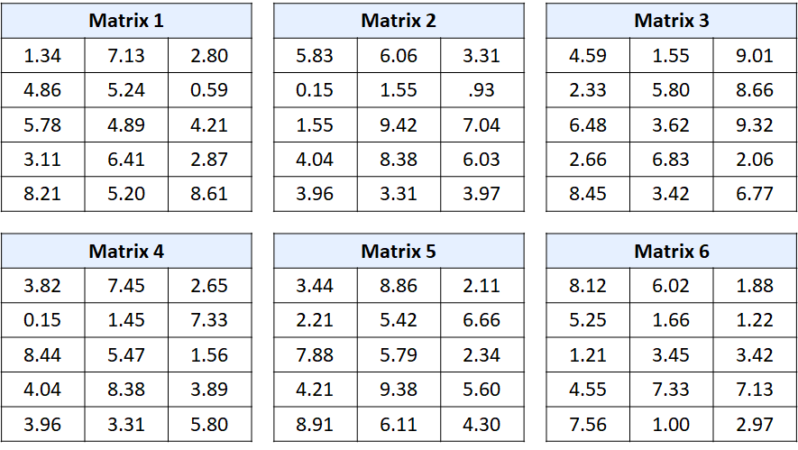]

---

# Answers


>**Instructions:** Let's calculate our group average so that we can compare it to some studies later. Compare your answers to the answer key and calculate how many you solved correctly.

.smaller-picture[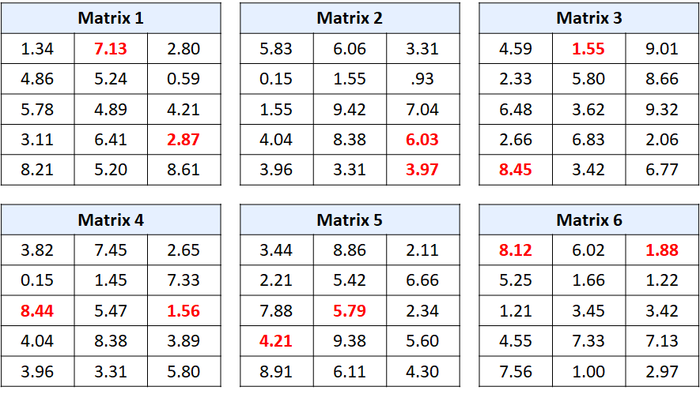]


---

# Dishonesty

.footnote[Markowitz & Levine (2021)]

.pull-left[
Two competing hypotheses about honesty
- **The dispositional honesty hypothesis**: certain people are intrinsically more honest than others

- **The situational honesty hypothesis**: people are honest when the situation is favorable for honesty and dishonest when the situation is not; people lie when the truth interferes with their goals or their reputation]

---
# Dishonesty

.footnote[Markowitz & Levine (2021)]

.pull-left[
Two competing hypotheses about honesty
- **The dispositional honesty hypothesis**: certain people are intrinsically more honest than others

- **The situational honesty hypothesis**: people are honest when the situation is favorable for honesty and dishonest when the situation is not; people lie when the truth interferes with their goals or their reputation]

.pull-right[
A third, hybrid hypothesis about honesty
- **A dispositional-situational interaction hypothesis**: disposition and situation interact to cause dishonesty

  - E.g., situations can constrain or allow a person to act differently from how they are dispositionally prone to 
]
???
e.g., a goal of making a friend, having a good time, etc.


---
# Situational and dispositional forces
.footnote[Markowitz & Levine (2021)]

####Method

- Participants were given 20 matrices to solve in 4 minutes (10 of the matrices had no solutions) and told that they would get 25 cents per problem solved 

- Unbeknownst to the participants, they were randomly assigned to one of two conditions
  - **The shredder condition**: participants shredded their matrix worksheet and then self-reported the number of matrices they solved
  
  - **The non-shredder condition**: participants gave their worksheet to the experimenter and self-reported the number of matrices they solved

- They also filled out the HEXACO-100 Honesty-Humility subscale

---

# Situational and dispositional forces
.footnote[Markowitz & Levine (2021)]

####Results

.pull-left[
- The researchers found evidence that both personality and the situation predicted dishonest behavior

- Specifically, they found evidence for a *dispositional-situational interaction hypothesis* (see Figure)
  - Dispositionally dishonest people cheated, regardless of the situation, while dispositionally honest people cheated only in the shredder situation
]
.pull-right[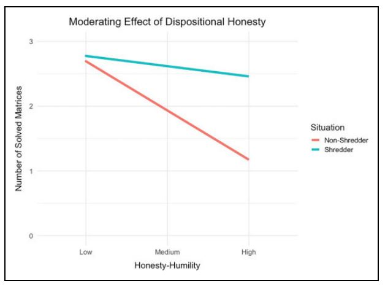]

---


# Situational and dispositional forces
.footnote[Lee & Gino (2018)]
<center>
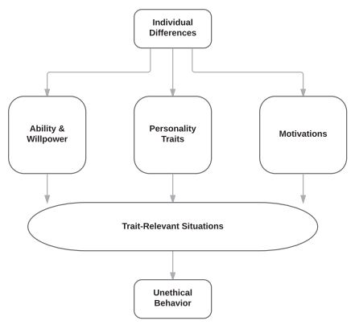

???

Here is a more complete model
---
# Situational and dispositional forces
.footnote[Lee & Gino (2018)]

#### Dispositional forces
.pull-left[
- **Ability and willpower**: the ability to put long term benefits (like a good moral reputation) over short term benefits

- **Personality traits**: stable personal characteristics like guilt proneness, trait empathy, psychopathy, and Machiavellianism

- **Motivations**: motivational factors, like performance anxiety or insecure attachments
]
.pull-right[]

---
# Situational and dispositional forces
.footnote[Lee & Gino (2018)]

#### Situational forces

.pull-left[
- A situation can increase/ decrease unethical behavior, given one's traits

- E.g., a person with performance anxiety may behave unethically in a situation where they are being pressured to perform

- E.g., willpower may be depleted when short term benefit is too tempting or the individual is overworked/ tired
]

.pull-right[]
---

# Situational determinants of dishonesty

Lab experiments have found that people are more or less dishonest under various situations

- **Peer influence**

- **Time of day**

- **Darkness/ anonymity**

- **"Victim" stolen from**

- **Object stolen**

---

# Peer influence

####Method

- Participants were given 20 matrices to solve in 5 minutes (an impossible task)

- They were also given $10 in an envelope and told that for every matrix that they solved, they would get 50 cents

---

# Peer influence

####Method

Unbeknownst to them, they were randomly assigned to one of the following conditions: 

  - **The control condition**: the participants handed their solved matrices to the experimenter, who counts the solved ones and gives the appropriate money amount

  - **The shredder condition**: the participants shredded their matrices on the other side of the room, and then took money according to how many matrices they claimed to have solved
  
  - **The in-group condition**: The shredder condition with the addition of a confederate saying (after one minute) shredded his paper and said "I solved everything. My envelpoe for the unearned money is empty. What should I do with it?"
  
  - **The out-group condition**: The in-group condition but the confederate was wearing a t-shirt from a different school (University of Pittsburgh)
  

---

# Peer influence

.pull-left[

####Results 
- Participants scored significantly higher in conditions where individuals shredded their papers, suggesting some level of cheating

- Participants cheated significantly more when they watched the confederate get away with cheating, but significantly less when that confederate was a member of the out-group 
]

.pull-right[
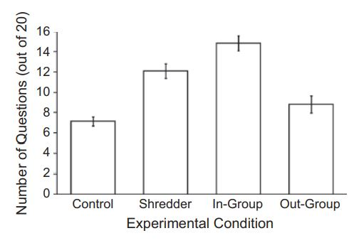]

---


# Peer influence


.pull-left[
####Conclusions 

- Observing an in-group member acting unethically changes the social norms associated with the act; cheating can become acceptable in a narrow situation

- Observing an out-group member acting unethically may decrease one's own unethical behaviors through mentally distancing (e.g., "my group is morally superior - we don't cheat")
]

.pull-right[
]
---


# Peer influence


.pull-left[
**Conclusions:** 

- Observing an in-group member acting unethically changes the social norms associated with the act; cheating can become acceptable in a narrow situation

- Observing an out-group member acting unethically may decrease one's own unethical behaviors through mentally distancing (e.g., "my group is morally superior - we don't cheat")
]

.pull-right[
]

.highlight-gray[**Discussion question**]: Is this a good experimental design for detecting cheating? Consider confounds, demand effects, and external and ecological validity.

???

Is it possible that scores increased so much from the control condition because people were grading themselves and made honest mistakes (confound)

It is possible there was a demand effect (i.e., was the experiment too transparent). Participants could have assumed that the experimenter wanted them to cheat since they were being asked to shred the paper 

This is pretty low stakes cheating, so it may not be generalizable to high stakes cheating contexts

---

# Time of day
.footnote[Kouchaki & Smith (2014)]
####Method

.left-column-big[
- Participants completed a visual perception task meant to test unethical behavior

- They were shown 100 trials of stimuli (see figure) and were instructed to indicate whether there were more dots on the left or right side

- They got 5 cents for each response on the right side and .5 cents for each left side response 

]

.right-column-small[
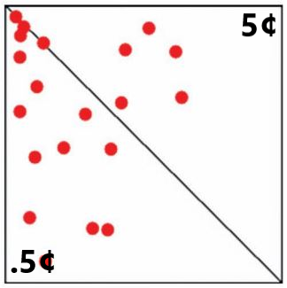
]

---


# Time of day
.footnote[Kouchaki & Smith (2014)]
####Method

.left-column-big[

- Out of 100 stimuli: 
  - 50 were ambiguous (the sides had roughly equal dots)

  - 34 contained clearly more on the left side

  - 16 contained clearly more on the right side

- Choosing the right side represented self-interest, cheating, or telling the truth 

]

.right-column-small[

]

---

# Time of day
.footnote[Kouchaki & Smith (2014)]
####Results

.pull-left[
- Participants favored the more profitable side in the afternoon, suggesting that people may become more dishonest throughout the day

- The researchers explain this effect through *dispositional factors*, i.e., people may have less willpower and/or may be more tired in the afternoon, leading them to more dishonest behavior


]
.pull-right[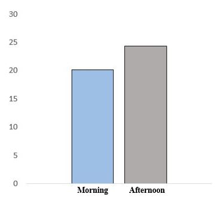]

---


# Time of day
.footnote[Kouchaki & Smith (2014)]
####Results

.pull-left[


.highlight-gray[**Discussion question**]: Is this a good experimental design for detecting cheating? Consider confounds, demand effects, and external and ecological validity.

]
.pull-right[]

???
One thing to consider is if there were selection effects (if people who choose to do the experiment in the afternoon are different from the morning). A follow up study ruled out this possibility

This conflates outright cheating behavior with very small self-serving dishonesty/ motivated reasoning

---

# Darkness

####Method

- Participants were given 20 matrices to solve in 5 minutes

- They were also given $10 in an envelope and told that for every matrix that they solved, they would get 50 cents from the their money supply

- Participants were randomly assigned to do the task under one of two conditions:

  - A well-lit room
  
  - A dim room, lit by only a few lights
  
- The participants put their matrix worksheet in a box in the back of the room and then turned in a collection slip self-reporting their earnings


???

Researchers were only able to match the matrix worksheet to the collection slip because of a discrete code on one of the matrices matching a code on the permission slip

---


# Darkness

####Results 

.pull-left[
- There were no differences between actual solved problems in the light and dark rooms

- However, participants in the dark room self-reported having solved *more* problems than participants in the well lit room

- The researchers theorize that this effect is due to the feeling of anonyminity that darkness brings
]

.pull-right[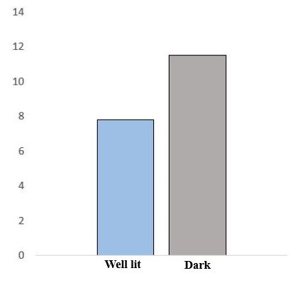]

---

# Victim: individual or group
.footnote[Amir, Kogut, & Bereby-Meyer (2016)]
####Method  (study 1)

- Participants completed a coin toss experiment where they had to predict the outcome of each toss (for 20 tosses)

- For each correct prediction, they would earn money that was taken from their opponent's account

- They did not need to preregister their predictions, so they could lie and say that they predicted it correctly when they did not

---

# Victim: individual or group
.footnote[Amir, Kogut, & Bereby-Meyer (2016)]
####Method (study 1)

.pull-left[
- Participants were randomly assigned to either:

  - The low (13 cents) or high (50 cents) cost condition
  
  - An individual opponent or a group of four opponent

- Each condition's opponent started out with a different amount of money so that deductions would be the same (see table)]

.pull-right[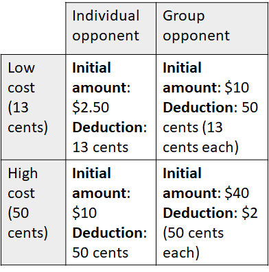]

---


# Victim: individual or group
.footnote[Amir, Kogut, & Bereby-Meyer (2016)]
####Results (study 1)

.pull-left[
- Participants were more likely to be dishonest when they were taking money from a group than when they were taking money from an individual 

- Participants were just as likely to be dishonest, regardless of if they were taking 13 cents or 50 cents

- The researchers theorize that this effect is driven by the identifiable victim effect (we feel more empathy for an individual than for a statistic)

]
.pull-right[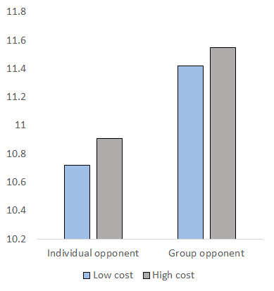]


---
# Victim: individual or group 
.footnote[Amir, Kogut, & Bereby-Meyer (2016)]
####Method (study 2)


- In a follow up study, the researchers ran the same experiment with one change in the group conditions
  
  - Participants were told both the global cost and the cost to each individual (e.g., we will deduct $2 from the group, which is 50 cents per person)
  
---
# Victim: individual or group
.footnote[Amir, Kogut, & Bereby-Meyer (2016)]
####Results (study 2)

.pull-left[
- When the harm to each individual is explicitly stated, participants no longer cheated groups more than individuals

- In this study, individuals did significantly cheat more when the cost was less
]

.pull-right[
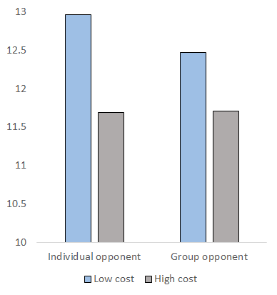
]


---
# Object stolen: money or tokens
.footnote[Mazar, Amir, & Ariely (2008)]
- Participants were given 20 matrices to solve in 5 minutes

- They were also given $10 in an envelope and told that for every matrix that they solved, they would get 50 cents from the their money supply

- Participants were randomly assigned to one of the following conditions:

  - **Control condition**
  
  - **Recycle condition**
  
  - **Recycle + token condition:** after the participant recycled their matrix worksheet, they told the experimenter their score and the participant gave them tokens, to later exchange for real money
  
  
---

# Object stolen: money or tokens
.footnote[Mazar, Amir, & Ariely (2008)]

#### Results
.pull-left[
- Participants solved more problems in the recycle conditions than they did in the control condition, suggesting cheating

]
.pull-right[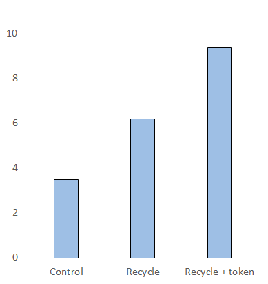]


---
# Object stolen: money or tokens
.footnote[Mazar, Amir, & Ariely (2008)]

#### Results
.pull-left[

- Participants solved more problems in the recycle + token condition than they did in the recycle condition, suggesting that token payments increased cheating over money payments

- .highlight-blue[Discussion question:] What are the implications of this finding in a digital world? 
]
.pull-right[]

---

# Summary

People are more likely to cheat in the following situations:
  - People like them are cheating (cheating is the norm in the group)
  
  - It is later in the day (they are tired and/or losing willpower)
  
  - They feel anonymous 
  
  - They are stealing from a group rather than an individual
  
  - They are stealing symbolic money (rather than real money) 

--

.highlight-gray[Discussion question]: Think about a situation where someone lied or cheated you. Were any of these factors present, or do you think that the action should be solely attributed to their disposition and not the situation?


---

# .smaller-font[Dispositional determinants of dishonesty]

Some people are more dishonest than others, regardless of the situation. Some dispositional predictors of dishonesty: 

- **Dark triad traits (psychopathy, machiavellianism, and narcissism) **

- **Creativity**

- **Anxiety**

---

# Dark triad traits
.footnote[Jones & Paulhus (2017)]

.left-column-med[
- **Narcissism**: belief that they are superior to others
  - Self-deceptive, tend to exaggerate their abilities

- **Psychopathy**: unemotional, impulsive (difficultly resisting immediate rewards)
  - Dishonesty may occur even in risky situations
  
- **Machiavellianism**: strategic manipulation and exploitation 
  - Dishonesty may only occur in strategic situations 

]
.right-column-med[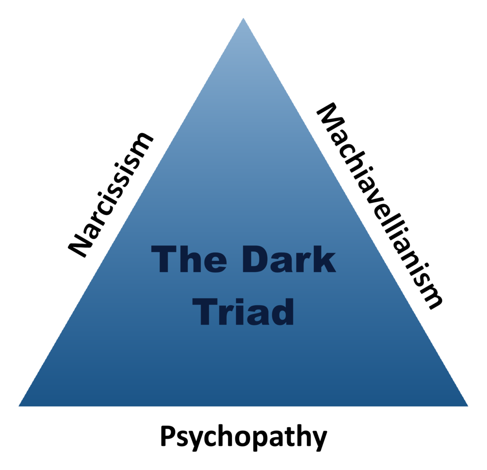]

---

# Dark triad traits
.footnote[Jones & Paulhus (2017)]

####Method (study 1)
- Participants filled out various surveys (including a survey measuring the dark triad personality traits)

- Participants played a coin flipping task. They read the following message:

> “On the next page is a coin flipping task – if you win, you get a bonus! Unfortunately, there’s a glitch in the software, so it’s possible to
flip the coin multiple times. So please only flip the coin once to be
fair."

- The researchers measured whether or not the participant clicked "flip" more than once

---

# Dark triad traits
.footnote[Jones & Paulhus (2017)]

####Results (study 1)


.pull-left[
- 13% of the sample cheated

- Narcissism, psychopathy, and machiavellianism were all significantly correlated with cheating behavior


]
.pull-right[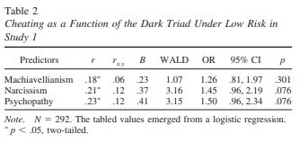]

---

# Dark triad traits
.footnote[Jones & Paulhus (2017)]

####Study 2

In the first study, there was a low risk of getting caught cheating

- Recall, a key difference between psychopaths and Machiavellians is that psychopaths are impulsive, while Machiavellians are strategic

- Thus Machiavellians would cheat less when there is a high risk of getting caught

---


# Dark triad traits
.footnote[Jones & Paulhus (2017)]

####Method (study 2)

- Participants played the same coin flipping task as in study 1. Half of the participants read the warning message from study 1:

> “On the next page is a coin flipping task – if you win, you get a bonus! Unfortunately, there’s a glitch in the software, so it’s possible to
flip the coin multiple times. So please only flip the coin once to be
fair."

- Half of the participants additionally read this high risk warning message: 

> "We will be conducting random checks to see if anyone flipped the coin more than once. Those who do will have
their work rejected.”

???

This study was taken on mTurk. Being rejected from a study could block you from participating in future studies 
---

# Dark triad traits
.footnote[Jones & Paulhus (2017)]

####Method (study 2)

.pull-left[
- Less people cheated in the low risk condition (10%) than the high risk condition (17%)

- Even under high risk, impulsive psychopaths risked their mTurk reputation for the extra money

- Individuals high in Machiavellianism cheated under low risk but not high risk (see figure)

]
.pull-right[
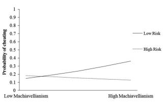]

---

#Creativity
.footnote[Gino & Wiltermuth (2014)]

#### Method

- Participants completed the Remote Association task (the RAT) to measure creativity. In the RAT task, participants need to think of a word that links three words together.

>What logically links these words? <br><br>Sore, shoulder, sweat

- Participants also completed the matrix task. They could earn $1 for each correct answer

- Participants self-reported results to the matrix task (their actual answers were unknowingly saved), allowing for a measurement of cheating

???

Answer: cold

---


#Creativity
.footnote[Gino & Wiltermuth (2014)]

#### Results

.pull-left[
- 59% of participants cheated on the matrix task (reported more matricies than they solved)

- Cheaters scored higher on the creativity task than none cheaters
 
]

.pull-right[
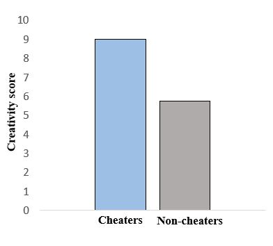
]


---

#Creativity
.footnote[Gino & Wiltermuth (2014)]

#### Results

.pull-left[

- .highlight-blue[Discussion question:] The researchers suggest that cheating causes one to become more creative (because it makes people feel like they are less constricted by rules). What is an alternate explanation of this finding?

]


.pull-right[

]

???

Creative people are good at getting away with cheating because they can  quickly come up with excuses. successfully cheating encourages them to do it again in the future 


---

# Anxiety
.footnote[]
Anxiety occurs as a response to novel situations, particularly when one is worried about an undesirable outcome

- When a person is anxious, they interpret ambiguous events as threatening and hyperfocus on those events

- People who are anxious may be hyperfocused on their own needs at the detriment to moral principles and community needs

---

# Anxiety
.footnote[]

####Method

- Participants were randomly assigned to one of two conditions:

  - **The anxiety condition**: participants listened to anxiety inducing music clip
  
  - **The neutral condition**: participants listened to a clip of air
  
- Participants read 13 scenarios (some of which depicted unethical behavior)

>  “You work as an office assistant for a department at a University. You’re alone in the office making copies and realize you’re out of copy paper at home. You therefore slip a ream of paper into your backpack.”

- Participants rated how likely they would engage in the behavior described (from 1 - not at all likely to 7 - highly likely)

---
# Anxiety
.footnote[]

####Results

.pull-left[
- Participants in the anxiety condition reported feeling more anxiety than those in the neutral condition

- Participants in the anxiety condition indicated that they were more likely to engage in unethical behavior than participants in the neutral condition 

]

.pull-right[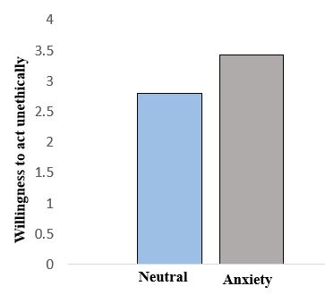]

---

# Anxiety
.footnote[]

####Results

.pull-left[

- In a follow up study, researchers measured unethical behavior experimentally (using the square visual perception task) and found consistent results
]

.pull-right[]

---

# Summary

- People who score high on dark traid traits behave more dishonestly than those who score low

  - In particular, psychopathy is associated with both risk taking and controlled unethical behavior, whereas machiavellianism is associated with controlled unethical behavior only

- People who are creative may be more dishonest
  - Both creativity and dishonesty involve breaking rules

- People who are in an anxious state may act dishonestly 

  - Especially when they are hyperfocused on their own needs (reducing their anxiety) and not on ethical principles

