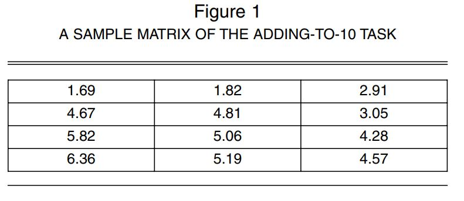

# Dishonesty

---

# Situational determinants of dishonesty

- Peer influence
- Time of day
- Darkness
- "Victim" - group vs. individual 

---

# Peer influence on unethical behavior

>**Instructions:** in the matrix below, find two numbers that add up to 10 as quickly as possible

.smaller-picture[]

???

4.81 and 5.19

---

# Peer influence on unethical behavior

####Method

- Participants were given 20 matrices to solve in 5 minutes (an impossible task)

- They were also given $10 in an envelope and told that for every matrix that they solved, they would get 50 cents

---

# Peer influence on unethical behavior

####Method

Unbeknownst to them, they were randomly assigned to one of the following conditions: 

  - **The control condition**: the participants handed their solved matrices to the experimenter, who counts the solved ones and gives the appropriate money amount

  - **The shredder condition**: the participants shredded their matrices on the other side of the room, and then took money according to how many matrices they claimed to have solved
  
  - **The in-group condition**: The shredder condition with the addition of a confederate saying (after one minute) shredded his paper and said "I solved everything. My envelpoe for the unearned money is empty. What should I do with it?"
  
  - **The out-group condition**: The in-group condition but the confederate was wearing a t-shirt from a different school (University of Pittsburgh)
  

---

# Peer influence on unethical behavior

.pull-left[

####Results 
- Participants scored significantly higher in conditions where individuals shredded their papers, suggesting some level of cheating

- Participants cheated significantly more when they watched the confederate get away with cheating, but significantly less when that confederate was a member of the out-group 
]

.pull-right[
]

---

# Peer influence on unethical behavior

.pull-left[
####Conclusions 

- Observing an in-group member acting unethically changes the social norms associated with the act; cheating can become acceptable in a narrow situation

- Observing an out-group member acting unethically may decrease one's own unethical behaviors through mentally distancing (e.g., "my group is morally superior - we don't cheat")
]

.pull-right[
]
---

# Peer influence on unethical behavior

.pull-left[
**Conclusions:** 

- Observing an in-group member acting unethically changes the social norms associated with the act; cheating can become acceptable in a narrow situation

- Observing an out-group member acting unethically may decrease one's own unethical behaviors through mentally distancing (e.g., "my group is morally superior - we don't cheat")
]

.pull-right[
]

.highlight-gray[**Discussion question**]: Is this a good experimental design for detecting cheating? Consider confounds, demand effects, and external and ecological validity.

???

Is it possible that scores increased so much from the control condition because people were grading themselves and made honest mistakes (confound)

It is possible there was a demand effect (i.e., was the experiment too transparent). Participants could have assumed that the experimenter wanted them to cheat since they were being asked to shred the paper 

This is pretty low stakes cheating, so it may not be generalizable to high stakes cheating contexts

---
