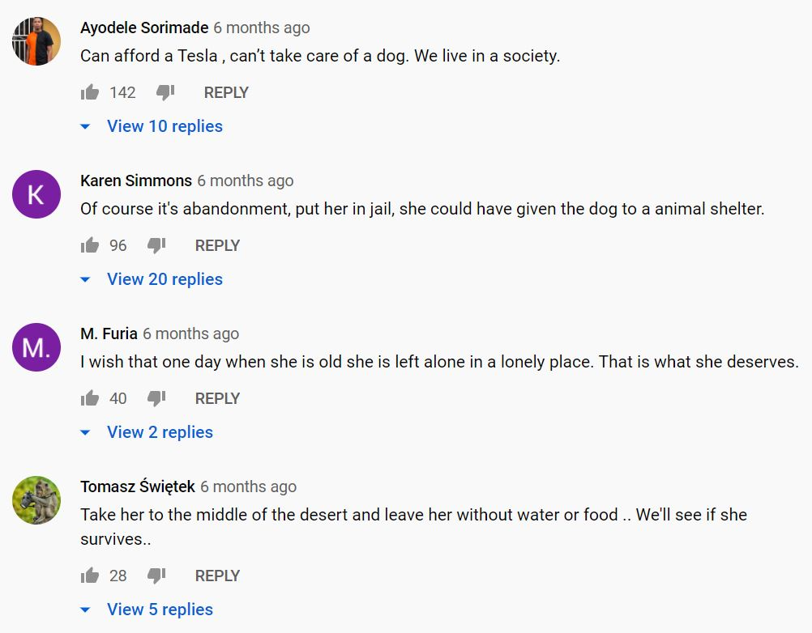
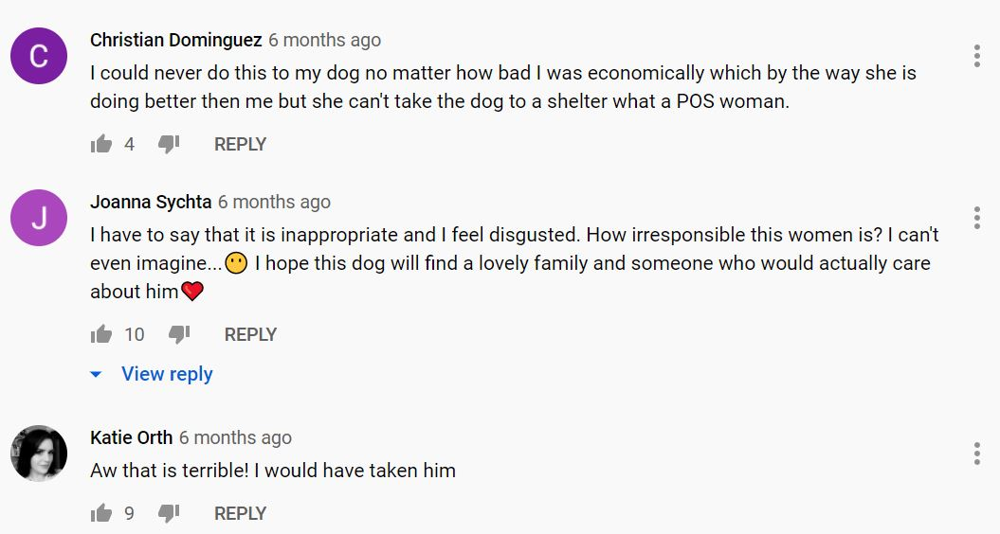
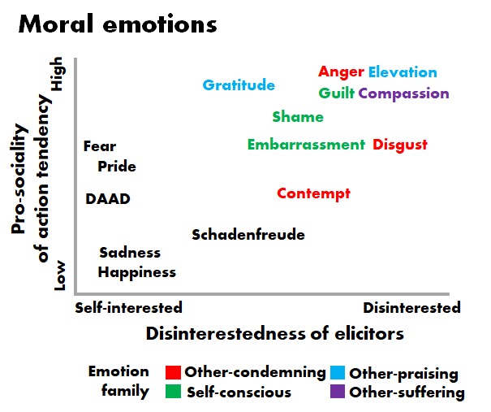
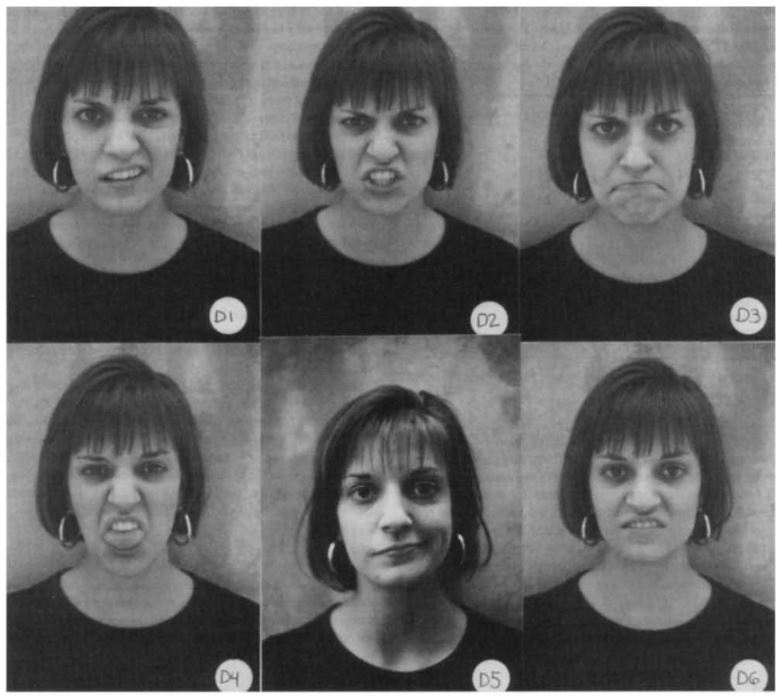
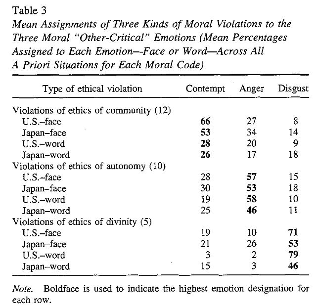
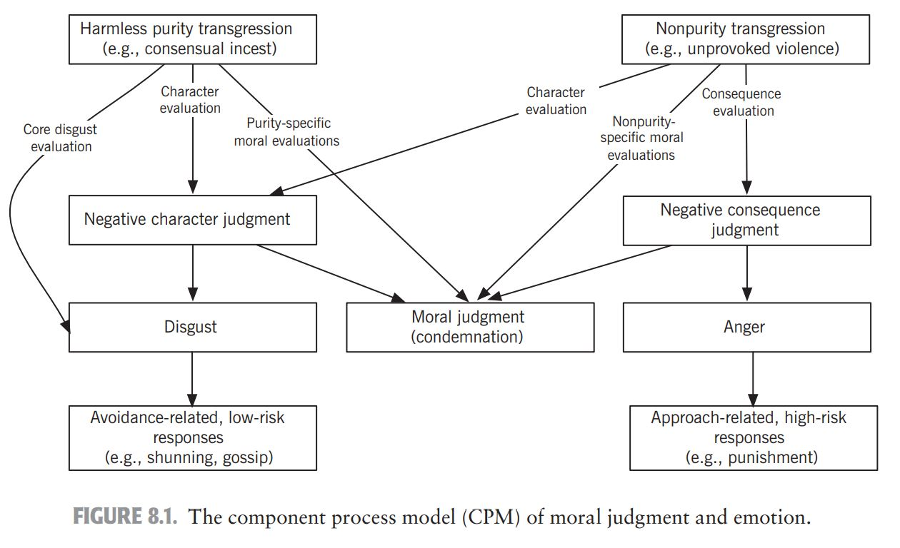
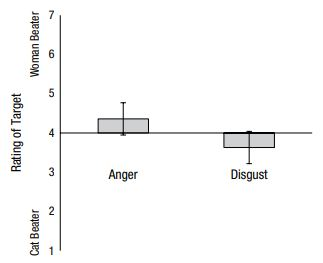
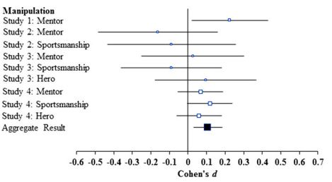
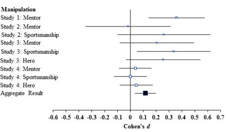
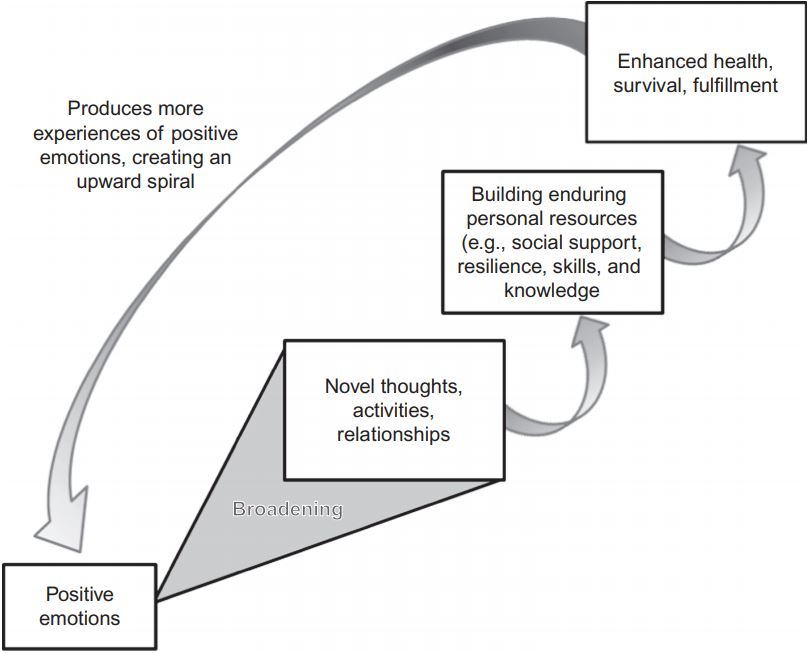

# Week 8

This week, we will be discussing four families of moral emotions: condemning-other, praising-other, suffering-other, and self-conscious emotions.

.highlight-gray[In week 8:]

- **What makes an emotion moral?**

- **What emotions are characteristic of witnessing a moral violation? A heroic moral action?**

- What emotions are characteristic of committing a moral violation? Of witnessing suffering?
---
# Dog abandoned by Tesla owner
 

<iframe width="560" height="315" src="https://www.youtube.com/embed/Jk2xDpcuxOY?start=38" frameborder="0" allow="accelerometer; autoplay; clipboard-write; encrypted-media; gyroscope; picture-in-picture" allowfullscreen></iframe>

https://www.youtube.com/watch?v=Jk2xDpcuxOY

???

This video was shot in Vancouver in August 2020
How does this action make you feel? 
What are you motivated to do?

---
# Dog abandoned by Tesla owner

.smaller-picture[]

---
# Dog abandoned by Tesla owner
 

.smaller-picture[]

---

# Social intuitionist model
.footnote[Haidt (2001)]
 
.smaller-picture[]

---
# Moral emotions

.footnote[Haidt (2003)]

**Moral emotions** are emotions that are commonly elicited when a person witnesses a moral act or a moral violation

  - Feeling angry at injustice
  - Feeling guilty for hurting your friend
  - Feeling grateful for an act of kindness 

Generally, emotions can be categorized by **the situations that typically elicit them** and **the actions that they inspire**. The most prototypical moral emotions have two prominent features: **disinterested elicitors** and **pro-social action tendencies**

---

# Disinterested elicitors

.footnote[Haidt (2003)]

.pull-left[
####General emotions
Typically, an emotion is elicited in a situation when something good or bad happens to the self

  - I am **happy** that I did well on the test
  
  - I am **afraid** that I will fall and hurt myself]

--

.pull-right[
####Moral emotions
Moral emotions are often triggered by events that are not happening to the self

  - I am **angry** that the Tesla driving woman left her dog
  
  - I am feeling **guilty** for hurting my friend]
---

# Pro-social action tendencies

.footnote[Haidt (2003)]

.pull-left[#### General emotions
Emotions motivate us to act 

  - E.g., I am **afraid**, so I am going to run away
  
  - E.g., I am **disgusted**, so I am going to throw the moldy food away]
  
--
  
.pull-right[####Moral emotions
Moral emotions motivate us to act *pro-socially*

  - I am feeling **compassion**, so I will donate
  
  - I am feeling **guilty**, so I will apologize for my actions]

---

# Families of moral emotions
.footnote[Haidt (2003)]
.smaller-picture[]

---

# Other-condemning family
.footnote[Haidt (2003)]
Other-condemning emotions are felt when others violate a moral or social norm. Other-condemning emotions motivate people to punish those who break moral rules

- Anger

- Contempt

- Disgust 

---

# Other-condemning family: anger
.footnote[Haidt (2003)]
.pull-left[
####Elicitors

- Anger is triggered when one is betrayed, insulted, or otherwise treated unfairly

- It is also triggered for third party acts (e.g., racism, oppression, exploitation)
]

--

.pull-right[
####Action tendencies

- Anger motivates one to attack the person or group that is responsible

- It can motivate one to seek *revenge*, to *punish* 

]

???

Anger is an interesting emotion because often it causes to act exactly the opposite of pro-socially. Can you think of an example of when it would be considered a moral emotion and an example of when it wouldn't be considered a moral emotion?
---

# Other-condemning family: disgust
.footnote[Haidt (2003)]
.pull-left[
####Elicitors
- Disgust is triggered by both physical objects (e.g., a moldy piece of bread) and by social/moral violations

- Disgust is particularly triggered when someone violates rules about what you can and cannot do to/with a human body (e.g., cannibalism, incest, necrophilia)
]

--

.pull-right[
####Action tendencies
- Disgust motivates one to avoid the transgression and to break off contact with the transgressor 

- It can also motivate one to physically or mentally cleanse themself  

]

???

E.g., hitler's sweater
---

# Other-condemning family: contempt
.footnote[Haidt (2003)]
.pull-left[
####Elicitors
- Contempt is elicited by acts that make one feel morally superior to the actor

- Some people may feel contempt for those who are lower than them in the social hierarchy; others may feel contempt for immoral/ corrupt elites 
]

--

.pull-right[
####Action tendencies
- Contempt motivates one to treat the person they have contempt for with little respect and warmth 

- Contempt weakens the ability to feel positive moral emotions, such as compassion, for the person

]

---

# Other-condemning family

.footnote[Schweder et al. (1997)]
#### The "big three" of morality 

The anthropologist Richard Schweder and his colleagues (1997) proposed a way to classify moral beliefs within a given culture. They proposed that every culture has three types of moral ethics (although these ethics can express themselves differently from culture to culture)

> **1. The ethics of autonomy**: some actions are wrong because they infringe upon the rights of others

???

Drew these principles from his cross cultural work in India 

Ask class for examples 

---

# Other-condemning family

.footnote[Schweder et al. (1997)]
#### The "big three" of morality 

The anthropologist Richard Schweder and his colleagues (1997) proposed a way to classify moral beliefs within a given culture. They proposed that every culture has three types of moral ethics (although these ethics can express themselves differently from culture to culture)

> **2. The ethics of community**: some actions are wrong because they infringe upon ones duties to their community  

---

# Other-condemning family

.footnote[Schweder et al. (1997)]
#### The "big three" of morality 

The anthropologist Richard Schweder and his colleagues (1997) proposed a way to classify moral beliefs within a given culture. They proposed that every culture has three types of moral ethics (although these ethics can express themselves differently from culture to culture)

> **3. The ethics of divinity**: some actions are wrong because they disrespect God, or otherwise degrade the body/soul 

---
# Other-condemning family

#### Schweder's ethics and MFT

.smaller-picture[]

---

# Other-condemning family
.footnote[Rozin et al. (1999)]

####Activity 

> Carefully read each situation and decide what FACE is most likely to be shown by the PERSON in the situation. If you feel that one of these faces clearly applies to the situation, enter its letter next to the situation. If you feel that none of these faces is at all appropriate, place an N next to the situation. If you feel that more than one of these faces is appropriate, list all of the appropriate faces, placing FIRST, the face that you consider most appropriate (e.g., Dl ,D5 or S2,S3). 

---

# Other-condemning family
.footnote[Rozin et al. (1999)]

.right-column-med[
]

.left-column-med[
Autonomy
> A PERSON is hearing about a man who comes home drunk
and beats his wife.

Community
> A PERSON is hearing about someone who doesn't go to 
his/her own mother's funeral.

Divinity
>  A PERSON is hearing about a 70-year-old male who has
sex with a 17-year-old female.

]

???

Choose which face the person who hears about the moral violation would make.

---

# Other-condemning family
.footnote[Rozin et al. (1999)]

#### The CAD-triad hypothesis

.right-column-med[]

- People were most likely to pick an angry face when the act violated the ethic of autonomy, contempt when the act violated the ethic of community, and disgust when the act violated the ethic of divinity

- They were also able to identity the correct emotion explicitly

---

# Other-condemning family

.footnote[Rozin et al. (1999)]
####The CAD-triad hypothesis

- **Anger** is linked to observing violations of the **autonomy ethic**, or the *harm* and *fairness* moral foundations

- **Contempt** is linked to observing violations of the **community ethic**, or violations of *loyalty* and *authority* moral foundations

- **Disgust** is linked to observing violations of the **divinity ethic**, or the *purity moral foundation*

???

Within a culture, actions that a culture considers violates the autonomy ethics will elicit anger, actions that a culture considers violates the community ethic elicits contempt, and actions that a culture considers violates the divinity ethic elicits disgust  
---

#Other-condemning family
.footnote[Chapman (2018)]
####The CPM (component process model) of moral judgment and emotion

- Unlike the CAD hypothesis, the CPM theorizes that disgust does not arise only from acts that violate purity/ the ethic of divinity 
- Instead, the CPM predicts that we are disgusted by acts that provide information about one's *moral character*

- Thus, an act that does *not* violate a divinity/ purity ethic *can* elicit disgust when it is informative of the individual's bad moral character

---
#Other-condemning family
.footnote[Chapman (2018)]

####The CPM (component process model) of moral judgment and emotion

.smaller-picture[]

---
#Other-condemning family
.footnote[Tannenbaum et al. (2011)]

#### Act-person dissociation

Giving participants two variations of the following scenario reveals an **act-person dissociation**, such that people think that beating up one's girlfriend is a worse moral transgression, but beating up one's girlfriend's cat is a stronger indicator of *poor moral character*

> John learns that his girlfriend of 8 years has been sleeping around
with another man. Upon hearing this, John becomes overwhelmed
with rage and beats up his girlfriend/ his girlfriend's cat.

---

#Other-condemning family

.footnote[Giner-Sorolla & Chapman (2017)]
#### Evidence for the CPM (component process model) of moral judgment and emotion

Method

Participants read each scenario and were asked to:

- Rate the character of the man in each scenario
- Rate the right/wrongness of the action in each scenario
- Look at facial expressions of anger and disgust and choose which emotion they were feeling witnessing the act 

---

#Other-condemning family
.footnote[Giner-Sorolla & Chapman (2017)]
#### Evidence for the CPM (component process model) of moral judgment and emotion

Results

.pull-right[]

- The cat-beater scenario more commonly elicited disgust and the girlfriend-beater scenario more commonly elicited anger 

- Higher disgust (but not anger) was associated with low character ratings
---

# Other-praising family
.footnote[Haidt (2003)]
Other-praising emotions are felt when we observe someone doing a good deed. Other-praising emotions motivate us to act more moral ourselves

- Gratitude

- Elevation 

---

# Other-praising family: gratitude
.footnote[Haidt (2003)]
.pull-left[
####Elicitors
- Gratitude is elicited when someone believes that another person has intentionally and voluntarily done a good deed for them 
]

--

.pull-right[
####Action tendencies
- Gratitude motivates one to thank the other person and to try to return the favor to them
]

---

# Other-praising family: elevation
.footnote[Haidt (2003)]
.pull-left[
####Elicitors
- Elevation is elicited when someone sees or hears a story about a tremendous act of kindness

- It feels warm and expansive, similar to the experience of "awe"
]

--

.pull-right[
####Action tendencies

- Elevation motivates one act more pro-socially, and not just toward the person who does the act; it causes one to want to *be a better person* in all situations 

]

---

#  Other-praising family: elevation

#### Homosexuality 
.footnote[Lai, Haidt, & Nosek (2014)]
- Some oppose homosexuality on the basis that it a violation of the divinity ethnic, or the purity moral foundation
  - I.e., it's wrong because they personally believe it violates rules about what a man should do with their body/ they find gay sex disgusting 

- Since elevation is the theoretical opposite of disgust, researchers wanted to see if experiencing elevation would reduce prejudice against gay men 

---
#  Other-praising family: elevation
.footnote[Lai, Haidt, & Nosek (2014)]

Method

- Participants watched a video meant to elicit either elevation, amusement, or neutral affect (control condition)

- Then, participants reported explicit and implicit (through the IAT) racial and sexuality attitudes 

---

#  Other-praising family: elevation
.footnote[Lai, Haidt, & Nosek (2014)]

 

<iframe width="560" height="315" src="https://www.youtube.com/embed/j7O9DlCgIPA" frameborder="0" allow="accelerometer; autoplay; clipboard-write; encrypted-media; gyroscope; picture-in-picture" allowfullscreen></iframe>

https://www.youtube.com/watch?v=j7O9DlCgIPA

---
#  Other-praising family: elevation
.footnote[Lai, Haidt, & Nosek (2014)]

.pull-left[
Results
- The researchers found a small effect of the elevation videos on reducing prejudice, but only for sexuality (not racial attitudes)

]

.pull-right[Explicit prejudice

  
Implicit prejudice

]

???

Cohen's d is from t-test between control condition and elevation condition 
---

#  Other-praising family: elevation
.footnote[Lai, Haidt, & Nosek (2014)]

.pull-left[
Results
- The researchers found a small effect of the elevation videos on reducing prejudice, but only for sexuality (not racial attitudes)

Discussion questions

- Would an integral affect induction produce stronger effects (as opposed to incidental affect)? 

- Why might elevation reduce sexuality prejudice but not racial prejudice? 
]

.pull-right[Explicit prejudice

  
Implicit prejudice

]

---

# Other-praising family

####Broaden-and-build hypothesis
.footnote[Fredrickson (1998); Fredrickson (2013)]

- Negative emotions, like fear, have a narrowing effect, narrowing one's attention to the eliciting situation and limiting possibilities  

- In contrast, positive emotions, like gratitude or elevation, broaden thoughts and allow one to continue to build resources (such as new friends or new skills)

---

# Other-praising family

####Broaden-and-build hypothesis

.footnote[Fredrickson (2013)]
.smallest-picture[]

---
# Summary

- When people witness a moral violation, they tend to feel anger, contempt, and/or disgust

  - The CAD-triad hypothesis states that we feel contempt in response to community ethic violations, anger in response to autonomy ethic violations, and disgust in response to divinity ethic violations
  
  - Alternatively, the CPM model proposes that disgust arises whenever there is a judgment of moral character

- Whereas moral emotions in the condemning-other family lead us to avoid and condemn others and their actions, emotions in the praising-other family lead us directly towards cooperation and pro-social actions
