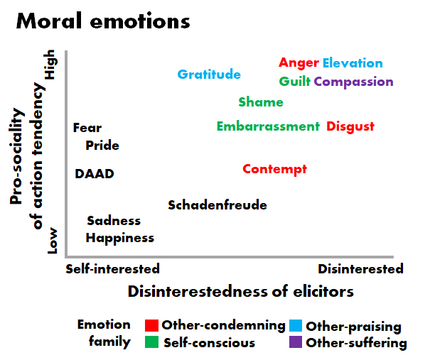

# Week 8

This week, we will be discussing the four families of moral emotions: condemning-other, praising-other, suffering-other, and self-conscious emotions.

.highlight-blue[In week 8:]

- What makes an emotion moral?
- What emotions are characteristic of witnessing a moral violation? A heroic moral action?
- **What emotions are characteristic of committing a moral violation? Of witnessing suffering?**
---

# From last class...

.footnote[Haidt (2003)]

**Moral emotions** are emotions that are commonly elicited when a person witnesses a behavior that is (or behaves in a way that is) consistent or inconsistent with ones moral beliefs. Prototypical moral emotions have the following two properties:

  - **Disinterested elicitors**: triggered by events that are not happening to the self
  
  - **Pro-social action tendencies**: motivate one to act pro-socially
  
---

# Families of moral emotions
.footnote[Haidt (2003)]
.smaller-picture[]

---

# Self-conscious family
.footnote[Haidt (2003)]
Self-conscious emotions are felt when we ourselves violate a moral or social norm. Self-conscious emotions allow us to to cooperate in groups without triggering the anger, disgust, and contempt of others

- Shame

- Embarrassment

- Guilt 

???

Shame and embarrassment are not seen as different emotions in some cultures (e.g., cultures with interdependent construal of the self)

---

# Shame
.footnote[Haidt (2003)]
.pull-left[
####Elicitors

- In western cultures, shame is most often triggered when one violates a norm and at least one person knows about the violation

- When someone feels shame, they appraise that their action(s) reveal that they have a flawed and defective *self*
]
--

.pull-right[
####Action tendencies
- Shame motivates people to hide and withdraw from society 

- The urge to withdraw is dark and painful 
]

???

- In a cultures with strong social hierarchies, one can feel shame just by being in the presence of people who are ranked higher

The opposite of shame is pride

---

# Embarrassment
.footnote[Haidt (2003)]
.pull-left[
####Elicitors
.smaller[- In western cultures, embarrassment is also most often triggered when someone violates a norm 

- However, when someone feels embarrassed rather than ashamed, they appraise that their action(s) reveal something negative about themselves *in this particular situation*
 ]
]

--

.pull-right[
####Action tendencies

- Embarrassment also motivates one to hide, but the urge to withdraw is less dark and painful

- One might want to cover their face or leave the interaction, but not to withdraw completely from society 
]

???

Question: Which emotion would be more common in internalizing mental health disorders, like depression?

---

# Guilt
.footnote[Haidt (2003)]
.pull-left[
####Elicitors
- Guilt is elicited in situations where one believes  they have harmed a relationship partner or otherwise caused them distress

- It is most intensely triggered when the harm was so severe that it has threatened the relationship
]

--

.pull-right[
####Action tendencies
- Guilt motivates one to help the victim, apologize, confess, or to do something that will make up for the action 
]

???
Guilt can be triggered by strangers but is most commonly triggered by those we are close to 

One is appraising their actions as bad (not their self, like with shame)

---
# Self-conscious family
.footnote[Tracy & Robins (2004)]
#### Process model of self-conscious emotions

???

If the event is related to survival (e.g., a bear is in front of you, there is a diseased person coughing up blood), then you will experience a basic emotion, like fear, anger, disgust... 

Maslow's needs hierarchy 
---
# Self-conscious family
.footnote[Tracy & Robins (2004)]
#### Process model of self-conscious emotions

???

If the event is not directly related to one's survival AND the self is not activated (i.e., the event focuses ones attention instead to the environment), then this model suggests that you feel no emotion
---
# Self-conscious family
.footnote[Tracy & Robins (2004)]
#### Process model of self-conscious emotions

???

An event also can activate the self-concept, e.g., you get a test back with a poor grade and you consider what it says about your intelligence , you are late to pick up your friend and they call you unreliable 

Next, the individual appraises whether the event is related to your identity goals, i.e., does this event say something meaningful about my identity? If you appraise that it does not, then you feel no emotion (e.g., a murderous psychopath)

---
# Self-conscious family
.footnote[Tracy & Robins (2004)]
#### Process model of self-conscious emotions

???

Then, one appraises whether the event is congruent with the person that they are or want to be. This appraisal determines the valence of the final emotion (e.g., positive like pride or negative like shame), e.g., if you think of yourself as a good person but do something bad, this would be a identity-incongruent event

Next, one appraises the internality of the event, i.e., did the event occur because of me (internal) or someone or something else (external)? Self-conscious emotions occur when we attribute the cause of the event to us 

Events that are appraised externally (as someone else's fault), can produce basic emotions, e.g., anger produced at teacher for writing an impossible test rather than shame at oneself

---
# Self-conscious family
.footnote[Tracy & Robins (2004)]
#### Process model of self-conscious emotions

???

Finally, when the individual attributes the event to the permanence and globality of the cause, i.e., was the event caused by something unchanging about the person or something unstable (e.g., ability vs. effort)? Was it caused by a global attribute of the person or something more context-specific (e.g., being bad a math vs. being unintelligent it all contexts)? 

---

# Self-conscious family
.footnote[Tracy & Robins (2004)]
#### Process model of self-conscious emotions

- **Shame** arises when one attributes the cause of the event to stable, global aspects of the self

- **Guilt** arises when one attributes the cause of the event to unstable, specific aspects of the self

- **Embarrassment** arises when one attributes the cause of the *public* event to the self, and the event is appraised as relevant and incongruent to one's *public* identity 

???

Shame vs. guilt - "Shame involves negative feelings about the stable, global self, whereas guilt involves negative feelings about a specific behavior or action taken by the self"

---

# Self-conscious family
#### Disgust-shame and anger-guilt asymmetry

.footnote[Giner-Sorolla & Espinosa (2011)]

- Sometimes, two emotions have an asymmetrical relationship such that an emotional response in one person can cue an emotional response in another (e.g., anger can trigger a person to be afraid)

- It's been theorized that there is an asymmetric relationship between anger and guilt, and between disgust and shame

---
# Self-conscious family

.footnote[Giner-Sorolla & Espinosa (2011)]

.pull-left[

#### Method

- Participants were asked to imagine that they are walking into a 
room in their university dormitory and found three peers looking at them

]

.pull-right[]

---

# Self-conscious family

.footnote[Giner-Sorolla & Espinosa (2011)]

.pull-left[

#### Method

- Participants saw a picture of three people of the same gender and about the same age as them

- All of the people in the picture looked either disgusted (the disgust condition) or angry (the anger condition)

]

.pull-right[]

---
# Self-conscious family

.footnote[Giner-Sorolla & Espinosa (2011)]

.pull-left[
#### Method

- All of the people in the picture looked either disgusted (the disgust condition) or angry (the anger condition)

- Participants then self-reported how guilty/ ashamed they would feel after seeing the faces ]

.pull-right[]

---

# Self-conscious family

.footnote[Giner-Sorolla & Espinosa (2011)]

.pull-left[
Results

- Shame was felt more intensely than guilt when people saw disgusted faces, but guilt was felt more intensely than shame when people saw angry faces (see right)

]

.pull-right[
]

---
# Self-conscious family

.footnote[Giner-Sorolla & Espinosa (2011)]

.pull-left[
#### Results

- Shame was felt more intensely than guilt when people saw disgusted faces, but guilt was felt more intensely than shame when people saw angry faces (see right)

]

.pull-right[

.dq-c[.smaller[Why do you think this is? What do shame + disgust and anger + guilt have in common? ]]

]

---

# Self-conscious family

.footnote[Giner-Sorolla & Espinosa (2011)]

.pull-left[
#### Results

- Shame was felt more intensely than guilt when people saw disgusted faces, but guilt was felt more intensely than shame when people saw angry faces (see right)

]

.pull-right[

.dq-c[.smaller[Does this finding support the CPM or the CAD-triad hypothesis?]]]

---

# Self-conscious family
.footnote[Inbar et al. (2013)]

.left-column-med[#### Research questions

- Do people seek out punishment when they feel guilty?

- Does that pain in turn reduce their guilty feelings?
]
.right-column-med[]

---

# Self-conscious family
.footnote[Inbar et al. (2013)]

.left-column-med[#### Method

- Participants described a time that they felt the most guilty (guilt condition), a time that they felt the most sad (sadness condition), or the last time they went grocery
shopping (control condition)

- Next, participants were told that they would receive 6 electric shocks on their left wrist]

.right-column-med[]

---

# Self-conscious family
.footnote[Inbar et al. (2013)]

.left-column-med[####Method

- The first shock was 30V and the participants could increase by up to 10V every shock 

- Shocks begin to feel painful around 56V and the shocks could be as strong as 80V by the sixth trial

- Participants rated how guilty they felt before and after the shock task ]

.right-column-med[]

???

(PANAS)
---

# Self-conscious family
.footnote[Inbar et al. (2013)]

.left-column-med[#### Results
- Participants in the guilty condition (M = 53.5V) gave themselves stronger shocks than participants in the sadness (M = 43.7V) and control conditions (M = 43.1V) 

- There was a negative association (r = -.57) between guilt reduction and average shock intensity, suggesting the shocks alleviated guilt 
]
.right-column-med[
]

---
# Other-suffering family

.footnote[Haidt (2003)]
Other-suffering emotions are felt when we witness the suffering of others. Other-suffering emotions motivate us to help those who are suffering

- Compassion

---

# Compassion
.footnote[Haidt (2003)]
.pull-left[
####Elicitors
- Compassion is elicited when one believes that another is suffering 
]

--

.pull-right[
####Action tendencies
- Compassion motives one to alleviate the suffering of the person in distress, usually through helping or comforting 
]

---
# Other-suffering family

#### What is *not* an emotion in the other-suffering family?

- DAAD (distress at another's distress)

- Empathy (the ability or tendency to feel what another person is feeling)

???

Both of these aren't considered emotions

DAAD is an affective precursor to an emotion, but it is not considered an emotion because it doesn't have separate physiology, facial expressions, action tendencies, etc., from general distress 

Empathy is the ability/tendency to feel what another person is feeling (e.g., feeling happy when someone else is happy, feeling sad when someone else is sad...). For the same reasons, this isn't considered an emotion

---

#  Other-suffering family

Empathy allows us to take the *perspective* of another person and feel what they are feeling, and in turn, can move us to act

.smallest-picture[]

- For example, being white and taking the perspective of a Black man being targeted, assaulted, or murdered by a police officer

- Pictured: empathy for George Floyd inspired Black Lives Matter protests in Summer 2020

---

#  Other-suffering family

#### What people think empathy can do 

Many scholars argue that solution to many of the world's problems is *empathy*. They argue (among many other claims):

- Training bullies (and bystanders) to be more empathetic will stop bullying 

- Training parents of LGBT+ kids to be more empathetic will increase acceptance

- Training Israelis and Palestinians to be more empathetic towards each other will stop the war

---
#  Other-suffering family

.right-column-small[]

.left-column-big[
> .smaller2[There's a lot of talk in this country about the federal budget deficit. One of the things I think we should talk more about is our **empathy** deficit. The ability to put ourselves in somebody else's shoes. To see through their eyes. The child whose hungry, or the steel worker whose been laid off, or the family whose lost the entire life they've built together when the storm came to town. When you think like this, it becomes harder not to act. It becomes harder not to help. ] .right[.smaller[-President Barack Obama,  *2006 Commencement speech*]]]

???

https://www.youtube.com/watch?v=-Uc3Xdry4SM

---

#  Other-suffering family
.footnote[Bloom (2016)]

Paul Bloom and other scholars have argued against empathy and for *rational compassion* 

<iframe width="560" height="315" src="https://www.youtube.com/embed/S1zZ_eKSAAI" frameborder="0" allow="accelerometer; autoplay; clipboard-write; encrypted-media; gyroscope; picture-in-picture" allowfullscreen></iframe>

.right[https://www.youtube.com/watch?v=S1zZ_eKSAAI]

---

#  Other-suffering family
.footnote[Bloom (2016)]

 
.left-column-med[ 
Bloom claims that empathy is **biased**; it favors people in our ingroups and people that we know 
- For example, many conservatives opposed the BLM protests not because they lacked *empathy* but because they were empathizing with police officers rather than Black men
]

.right-column-med[
]

---

#  Other-suffering family
.footnote[Bloom (2016)]

Bloom claims that empathy is **shortsighted**; it motivates us to relieve suffering in the short term and ignore long term consequences

  - For example, whenever there is a natural disaster, relief floods to the place affected, while less aid and attention is given to stop the underlying cause (climate change) 

  
---

#  Other-suffering family

.footnote[Bloom (2013)]
> .smaller["Newtown, in the wake of the Sandy Hook massacre, was inundated with so much charity that it
became a burden. More than eight hundred volunteers were recruited to deal with the gifts that were
sent to the city—all of which kept arriving despite earnest pleas from Newtown officials that charity be
directed elsewhere. A vast warehouse was crammed with plush toys the townspeople had no use for; millions
of dollars rolled in to this relatively affluent community. We felt their pain; we wanted to help. Meanwhile—
just to begin a very long list—almost twenty million American children go to bed hungry each night, and the
federal food-stamp program is facing budget cuts of almost twenty per cent."] .right[-Paul Bloom (3013)]

---
#  Other-suffering family
.footnote[Bloom (2016)]

Bloom claims that empathy is:

  - **Biased**; it favors people in our ingroups and people that we know 
  
  - **Shortsighted**; it motivates us to relieve suffering in the short term and ignore long term consequences
  
  - **Innumerate**; it favors one over many 
  
  
---

#  Other-suffering family

.footnote[Small, Loewenstein, and Slovic (2007)]
**The identifiable victim effect** is the tendency to be moved by the plight of a single individual than by a large number of individuals

---

#  Other-suffering family

#### Method

- Researchers gave participants $5 and then recorded how much of it they donated to the *Save the Children* organization

- Half of the participants were given statistics about starvation in Africa and half of the participants saw a picture of a girl and read a description about her

???

The intervention condition means that they learned about the identifiable victim effect before donating

---
#  Other-suffering family
.footnote[Small, Loewenstein, and Slovic (2007)]

.pull-left[#### Results
- People donated over twice as much for an identifiable victim than for statistics about the issue]
.pull-right[
]

--

.dq-l[Do you think empathy is mostly good or mostly bad?]
.dq[.smallish[Would the world be more moral if people were more empathetic, or if people were more rationally compassionate?]]

---

# Other moral emotions?

.dq[Could these be considered moral emotions?]
.dq[Do they cause one to act pro-socially? Are they elicited by events unrelated to the self?]

- Fear

- Schadenfreude

- Empathy 

- Warm glow

???

Fear may cause more law-abiding behavior in certain situations but it is a self interested emotion 

Schadenfreude (joy at another's misfortune) does not appear to motivate pro-social action

Empathy is not considered an emotion - broadly, it's to feel what another person is feeling  

Warm glow is the feeling of joy when you help others

---

#Summary

.smaller[
- Self-conscious emotions are felt when we  violate a moral or social norm
  - Guilt is a very negative emotion that we desperately try to alleviate, whether that be through making amends, or through self-punishment 

- Other-suffering emotions are felt when we witness the suffering of others
  - Compassion is the only true other-suffering emotion; we can feel it towards strangers and it can lead us to want to help reduce their suffering
  - Empathy (feeling what another person is feeling) is not considered an emotion, and while it has been argued to be biased, shortsighted, and innumerate, it has also historically been an important tool in moral progress
  
.highlight-blue[Due Sunday:] Homework 4
  ]