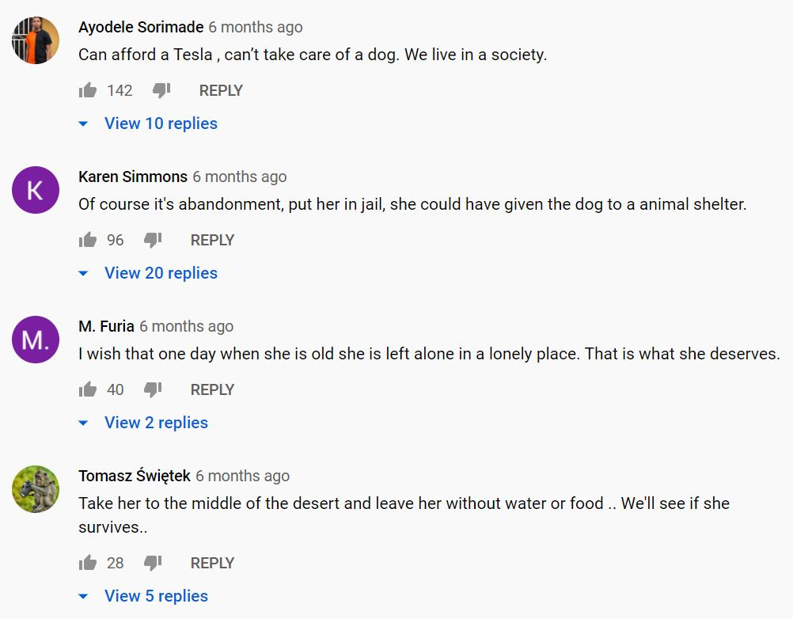

# Week 8

This week, we will be discussing moral emotions 

.highlight-gray[In week 8:]

- 

---

# Dog abandoned by Tesla owner
 

<iframe width="560" height="315" src="https://www.youtube.com/embed/Jk2xDpcuxOY?start=38" frameborder="0" allow="accelerometer; autoplay; clipboard-write; encrypted-media; gyroscope; picture-in-picture" allowfullscreen></iframe>

https://www.youtube.com/watch?v=Jk2xDpcuxOY

???

This video was shot in Vancouver in August 2020
How does this action make you feel? 
What are you motivated to do?

---
# Dog abandoned by Tesla owner

.pull-left[]

.pull-right[]
---

# Dog abandoned by Tesla owner

---
# Moral emotions

.footnote[Haidt (2003)]

**Moral emotions** are emotions felt in response to the actors or actions in a moral situation

  - Feeling angry at injustice
  - Feeling guilty for hurting your friend
  - Feeling grateful for an act of kindness 

The most prototypical moral emotions have two prominent features: **disinterested elicitors** and **pro-social action tendencies**

---

# Disinterested elicitors

.footnote[Haidt (2003)]

- Typically, an emotion is elicited in a situation when something good or bad happens to the self

  - E.g., I am happy that I did well on the test
  - E.g., I am afraid that I will fall and hurt myself

- The elicitor is the event that causes the emotion; moral emotions have disinterested elicitors, meaning that they are frequently triggered for actions unrelated to the self
---

# Moral emotions
.footnote[Haidt (2003)]
.smaller-picture[]