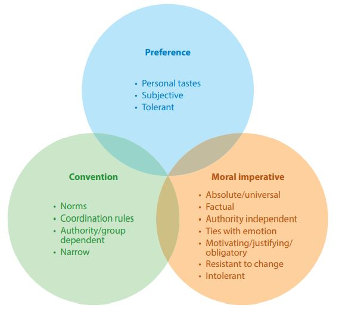
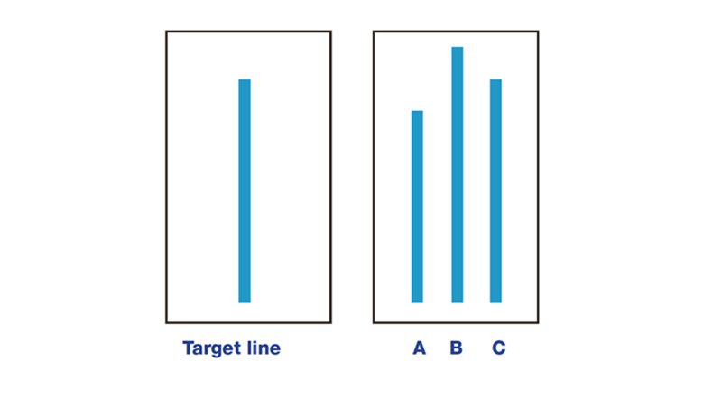
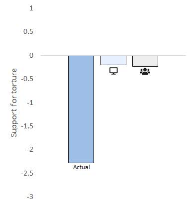
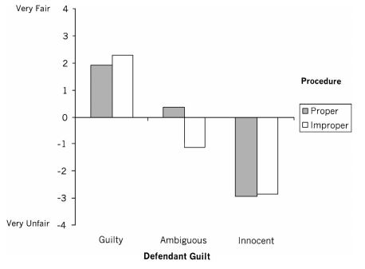
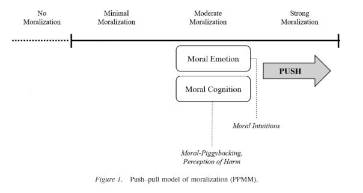
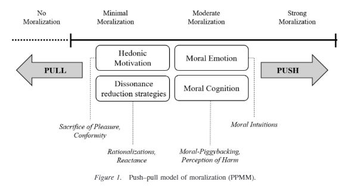
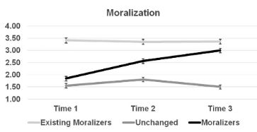
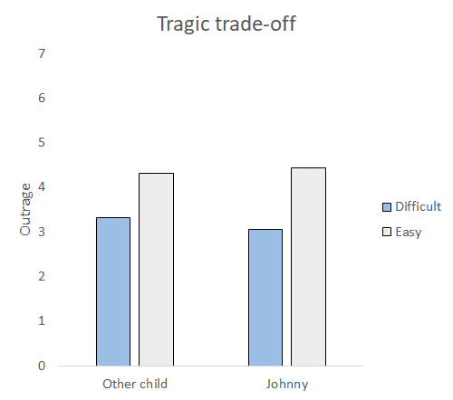
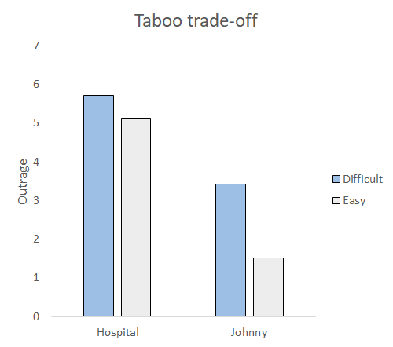
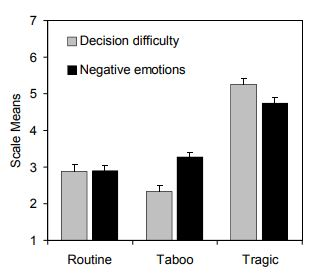

# Week 9

This week, we will be discussing religious and otherwise moral convictions and values

.highlight-gray[In week 9:]

- **What qualifies as a moral conviction or a sacred value?**

- **How does an attitude become a moral imperative, rather than just a convention or preference? **

- Do people perceive atheists as less moral than theists?

- Does religion make us behave more morally?

---

# The Domain Theory of Attitudes
.footnote[Skitka (2021); Nucci (2001)]

- An **attitude** is a positive or negative evaluation of an object/ subject that has affective, cognitive, and behavioral components

- The Domain Theory of Attitudes posits that there are three domains of attitudes that people reliably distinguish between

  - Preference domain
  
  - Convention domain
  
  - Moral imperative domain 

---
# The Domain Theory of Attitudes
.footnote[Skitka (2021)]

.pull-right[]

.pull-left[
- **Preference domain**: attitudes that are perceived as personal preferences (e.g., pickles are bad) 

- **Convention domain**: attitudes dictated by cultural norms/ what others believe (e.g., driving on the left side of the road is bad) 

- **Moral imperative domain**: attitudes that are experienced as universal (e.g., killing is bad)]

???

Note that the domains overlap, suggesting that different people may not moralize an issue while others will 

---

# Moral convinctions
.footnote[Skitka (2021)]

Attitudes that fall under the **moral imperative domain** are called *moral convictions* and they have unique properties

- Perceived Objectivity and Universality

- Authority and Peer Independence

- Ends Justify the Means Thinking

- Intolerance and Unwillingness to Compromise

- Emotional

---

# Moral convictions 
.footnote[Skitka (2021)]

#### Perceived Objectivity and Universality

- Moral convictions are perceived as **true facts** that **transcend time and space**

- For example, the moral conviction "slavery is wrong" would lead one to believe:

  - It is a fact that slavery is wrong (objectivity)

  - Slavery was wrong in colonial America and modern slavery in other cultures is wrong (universality)
  
---

# Moral convictions
.footnote[Skitka (2021)]

####Authority and Peer Independence

- Moral convictions are independent of the attitudes of the establishment, convention, rules, or authorities

- For example, someone who has a strong moral conviction that "harming the earth is wrong" will:

  - Fight to progress pro-environmental legislature, regardless of the current conventions or laws

---

# Moral convictions
.footnote[Asch (1956)]

####Asch's Conformity Study

.smaller-picture[]

---
# Moral convictions
.footnote[Aramovich et al. (2012)]

####Authority and Peer Independence

Method 

.pull-left[
- Participants showed up to the lab in small groups and were told that they would be sharing opinions in their group about the use of torture online and then in person

- "To what extent does your attitude about whether stress interrogation techniques should be allowed reflect your core moral values and convictions?"]

--

.pull-right[

`r fontawesome::fa("desktop", fill = "gray")` Participants talked in chat rooms with people that they thought were their group members

- No social support condition vs. social support condition

`r fontawesome::fa("users", fill = "gray")` Participants talked in person with actual group members
]

???

No social support condition: Their group mates strongly supported, moderately supported, slightly supported, and strongly supported the use of torture, and they reported last

Social support condition: slight opposition instead of slight support

- Participants always gave their opinion last in the computer condition 

---

# Moral convictions
.footnote[Aramovich et al. (2012)]

####Authority and Peer Independence

Results
.pull-left[

- Consistent with other conformity studies, participants tended to conform to the beliefs of the group after learning about their opinions (see right)

- However, people with **strong moral convictions** were less likely to conform, suggesting that moral convictions are peer independent 
]
.pull-right[]

---
# Moral convictions

#### Ends Justify the Means Thinking
.footnote[Skitka (2021)]

.pull-left[- Moral convictions lead people to tolerate any means (including violence) if they think it will lead to a morally preferred ends

  - A system (e.g., the legal system, judicial system, election) is only fair when it leads to one's own moral conclusions] 

.pull-right[]
---

# Moral convictions

#### Ends Justify the Means Thinking
.footnote[Skitka & Houston (2001)]
Method

- Participants read about a burglary that lead to the death of a young married couple

- The details of the story varied depending on random assignment

  - Defendant guilt (presumed guilty, presumed innocent, or ambiguous)
  
  - Procedural propriety (proper or improper)

- Rated “The outcome of the defendant’s trial was fair.”

???
Defendant guilt - in presumed guilty condition, the defendant bragged to his friends about committing the crime. In presumed innocent condition, someone else bragged to their friends about committing the crime. Police did not know about either of the bragging. In ambiguous, people knowledgeable about the case were torn about whether the defendant was guilty.

Procedural propriety - in proper condition, the informant who gave the tip was not a known informant, which means that there was a question about whether there was truly probable cause for the search warrant. The warrant was granted through the proper channels. However, later the trial judge said that the warrant should not have been granted. In the improper condition, the detective lied to get the search warrant, saying that the source was reliable. 

---

# Moral convictions

#### Ends Justify the Means Thinking
.footnote[Skitka & Houston (2001)]
Results

.pull-left[
- When the defendant was guilty or innocent, it did not matter whether or not there was a proper trial

- A fair trial only mattered when whether the defendant was guilty or innocent was *ambiguous*
]
.pull-right[]

---

# Moral convictions

#### Ends Justify the Means Thinking

Discussion questions

1. What would we have observed if people cared about procedural justice? 

2. Can you think of an example of ends justify the means thinking, where someone resorted to unethical behavior (e.g., lying, violence) to try to achieve a moral end?  

???

vigilante justice
heroic acts like hiding jews from nazis
suicide bombers

---

# Moral convictions

#### Intolerence and unwillingness to compromise
.footnote[Skitka (2021)]

- When someone has a moral conviction, they believe anyone who doesn't hold the conviction is wrong, or even immoral

- People try to avoid people with opposing moral convictions; they are motivated to stay physically distant from them

- People are very unwilling to compromise on their moral conviction 
---

# Moral convictions

#### Emotional
.footnote[Skitka (2021); Skitka & Wisneski (2011)]

- Moral convictions can cause really strong emotions

- For example, people feel stronger negative and positive emotions when thinking about an issue if they have moral convictions for that issue

---
# Moral convictions

Discussion questions

1. Is it good that we have moral convictions? What are the upsides and downsides of moral convictions?

2. How do you think people develop a moral conviction?

---

# Moralization

Consider the following positions on abortion

  1. It is wrong to abort a child (moral position - against)
  
  2. It is wrong to force a woman to birth a child she does not want or cannot provide for (moral position - for)
  
  3. I want a back up form of birth control in case I get pregnant (amoral position - for)

--

.highlight-gray[How does an attitude become a "moral conviction"?] 

---

# Moralization 

.footnote[Feinberg et al. (2019)]

#### The push-pull model of moralization 

When an individual encounters a morally evocative stimulus (e.g., a political speech, a video, a conversation), they experience two competing forces:

.pull-left[
**PUSH**

Experiencing moral emotions and moral cognitions **push** individuals to moralize an issue 
]
.pull-right[
**PULL**

Hedonic (pleasure) motivations and dissonance reduction strategies **pull** individuals not to moralize an issue
]
---

# Moralization 

.footnote[Feinberg et al. (2019)]

#### The push-pull model of moralization 

.smaller-picture[]

???

Moral piggybacking: moralization can occur when people experience new info that links something that was previously unrelated to morality to a moral belief (e.g., linking eating meat to the pre-existing belief that killing is wrong)

---

# Moralization 

.footnote[Feinberg et al. (2019)]

#### The push-pull model of moralization 

.smaller-picture[]

???

Reactance: arousal that occurs when someone experiences a loss to their freedoms; it motivates one to try to gain back their freedoms from the threat

Note that this model suggests that an issue is NOT either moralized or not moralized (it lies on a continuum from no moralization to strong moralization)

---
# Moralization 

.footnote[Feinberg et al. (2019)]

Method
- Most Americans do not think of eating meat as a moral issue but rather a personal preference; others do consider it a moral issue, that animals are raised in inhumane conditions just to be slaughtered 

- Feinberg et al. (2019) exposed students to how animals suffer from human meat consumption across a semester 

- At three time points in the semester, the researchers collected attitudes towards meat consumption

---

# Moralization 

.footnote[Feinberg et al. (2019)]

Measures

**Moralization** “To what extent is your position on eating meat are a reflection of your core moral beliefs and convictions?

**Meat emotions** Rated how strongly they felt each of the following emotions when they think about eating meat: guilt, shame, disgust, anger, outrage, and sadness. 

**Animal emotions** Rated how strongly they felt the following  emotions when they thought about the animals involved in humans eating meat: sympathy, compassion 

---

# Moralization 

.footnote[Feinberg et al. (2019)]

Measures

**Suffering** “How much do you believe eating meat causes suffering to animals? By “meat” we mean any animal parts whether from a cow, pig, chicken, fish, or any other animal.”

**Moral piggybacking** : "When Professor [name] talks about issues regarding animal welfare and meat consumption, to what extent does this lead you to think about moral values in general?" 

**Hedonic motivations** “Overall, when thinking about most meats, how would you rate them on tastiness?”
---

# Moralization 

.footnote[Feinberg et al. (2019)]

.pull-left[Results

- Meat emotions, animal emotions, moral piggybacking, and suffering  all positively predicted moralization

- Hedonic motivations negatively predicted moralization

- A cluster analysis showed that there were three types of people: existing moralizers (n = 40), moralizers (n = 48), and unchanged (n = 47)
]
.pull-right[]

???

No demographic variables (gender, age, and ethicity) predicted moralizers

---

# Exercise  
.footnote[Tetlok (2003)]

.pull-left[Consider the following:

- How much money is one of your kidneys worth?

- How much money is your life worth?

- Would you pay $1000 if it would save your best friend's life?

- Should you discriminate on the basis of race, gender identity, or sexual orientation if you find that it would be more profitable for your company?]

--

.pull-right[
**Sacred values**
> "Sacred values (are)... values that
a moral community treats as possessing transcendental
significance that precludes comparisons, trade-offs, or
indeed any mingling with secular values." - Tetlok (2003)]

---

# The Sacred Value Protection Model
.footnote[Tetlok (2003); Tetlok et al. (2000)]

The SVPM predicts three features of sacred values

- Moral outrage

- Moral cleansing

- Reality-constraint

---

# The Sacred Value Protection Model
.footnote[Tetlok (2003); Tetlok et al. (2000)]
**Moral outrage** 

When an individual learns that someone has traded a secular value (e.g., money) for a sacred value (e.g., love), they experience *moral outrage*

- An individual should not even *entertain* the idea of sacrificing a sacred value from a secular value

---

# The Sacred Value Protection Model
.footnote[Tetlok (2003); Tetlok et al. (2000)]

**Moral cleansing**

When an individual merely considers trading a sacred value for a secular value, they are motivated to symbolically cleanse and reaffirm their moral values 

- The longer one contemplates trading a sacred value, the more contaminated they feel

---

# The Sacred Value Protection Model
.footnote[Tetlok (2003); Tetlok et al. (2000)]

**Reality-constraint hypothesis**

Upholding a sacred value is inevitably restricted by reality

- For example, a parent cannot bankrupt themselves by spending millions of dollars ensuring that their child is safe

---

# Sacred Values
.footnote[Tetlok et al. (2000)]

#### A tragic trade-off

> Robert can either save the life of Johnny, a five year old boy who needs a liver transplant, or he can save the life of an equally sick six year old boy who needs a liver transplant. Both boys are desperately ill and have been on the waiting list for a transplant but because of the shortage of local organ donors, only one liver is available. Robert will only be able to save one child.

---

# Sacred Values
.footnote[Tetlok et al. (2000)]

#### A taboo trade-off

> Robert can save the life of Johnny, a five year old who needs a liver transplant, but the transplant procedure will cost the hospital $1,000,000 that could be spent in other ways, such as purchasing better equipment and enhancing salaries to recruit talented doctors to the hospital. Johnny is very ill and has been on the waiting list for a transplant but because of die shortage of local organ donors, obtaining a liver will be expensive. Robert could save Johnny's life, or he could use the $1,000,000 for other hospital needs.

---

# Sacred Values
.footnote[Tetlok et al. (2000)]

Method

- Participants read about Robert, who either had to choose between the two boys (tragic trade-off condition) or between Johnny and the hospital (taboo trade-off condition)

- Half of the participants read that the decision was easy and half of the participants read that the decision was difficult

- Half read that Johnny was saved and half read that Johnny was not saved

---

# Sacred Values
.footnote[Tetlok et al. (2000)]

.pull-left[
Results

- In the tragic trade-off condition (choosing to save one of the two boys), individuals were more outraged when the decision was *easy*

- Outrage did not depend on whether the decision maker ultimately chose to save Johnny (the 5 year old boy) or the 6 year old boy
]
.pull-right[]

---

# Sacred Values
.footnote[Tetlok et al. (2000)]

.pull-left[
Results
- Individuals were more outraged when the decision maker chose the secular value (the hospital) over the sacred value (saving Johnny)

- Individuals were more outraged when choosing Johnny over the hospital was a difficult decision than when it was an easy decision, suggesting that merely *considering* the taboo option provoked outrage
]
.pull-right[]

---
# Sacred Values
.footnote[Hanselmann & Tanner (2008)]

**Research questions:** How difficult are taboo, tragic, and routine trade-offs? How much negative affect do they produce? 

Method 
- Participants read a scenario with either a taboo, tragic, or routine trade-off

- They, they rated how difficult the decision is and how strongly they are experiencing negative emotions

---
# Sacred Values
.footnote[Hanselmann & Tanner (2008)]
#### Taboo trade-off

> Imagine that you are the president of the local authority of a village that has been severely affected by a flood. The local authority is discussing whether to invest a considerable
amount of the annual budget in improved flood protection measures. In this case, however, the village would have to forego a planned facelift for the village square. As president, you have to
decide between the improvements in flood protection (option 1) and the facelift for the village square (option 2).

---
# Sacred Values
.footnote[Hanselmann & Tanner (2008)]

#### Tragic trade-off

> Imagine that you are the CEO of a global company that has been criticized for poor working conditions in a Chinese factory The management is discussing whether substantial investments to improve safety at work should be made. In this case, however, you would have to accept the layoff of a third of the workforce due to financial reasons, thereby jeopardizing the future of many families. As CEO, you have to decide between investing in safety at work (option 1) and preserving jobs (option 2).

---
# Sacred Values
.footnote[Hanselmann & Tanner (2008)]

#### Routine trade-off

> Imagine that you, as a parent, are solely responsible for your family’s livelihood. You have made several applications to find a new job. You have just received two offers, and it is now up to
you to select one of them. Company A offers you an annual salary of CHF 80,000 [USD 66,000] and 20 vacation days per year, whereas company B offers you an annual salary of CHF 60,000 [USD 50,000] and 30 vacation days per year. You now have to decide between the job with a greater annual salary (option 1) and the job with a greater number of vacation days per year (option 2).

---
# Sacred Values
.footnote[Hanselmann & Tanner (2008)]

.pull-left[
Results

- Tragic trade-offs were the most difficult decisions and produced the most negative affect

- Taboo trade-offs were the easiest decisions, and they elicted less negative affect that tragic trade-offs
]
.pull-right[]

---

# Summary

- Moral convictions are perceived as objective and universal, are held regardless of the convictions of authority and peers, push one to believe that ends justify the means, make one more intolerant and less willing to compromise, and elicit strong emotions 

- Sacred values produce moral outrage when they are traded for secular values like money

- It's difficult and emotional to decide between two sacred values, but easy to decide between a sacred value and a secular value