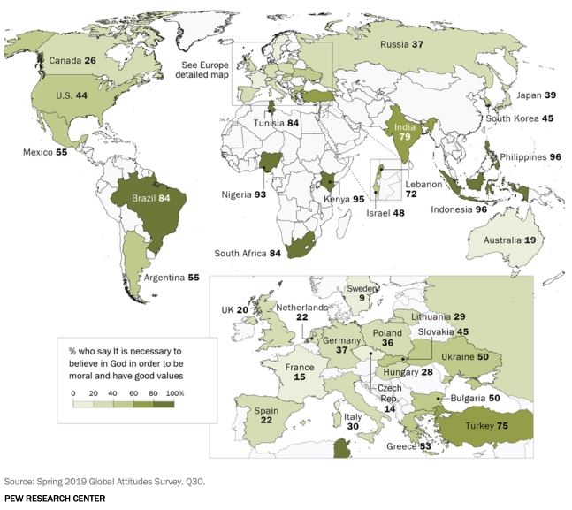
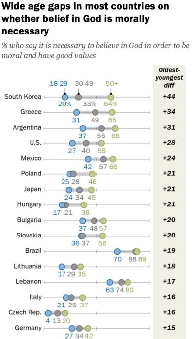
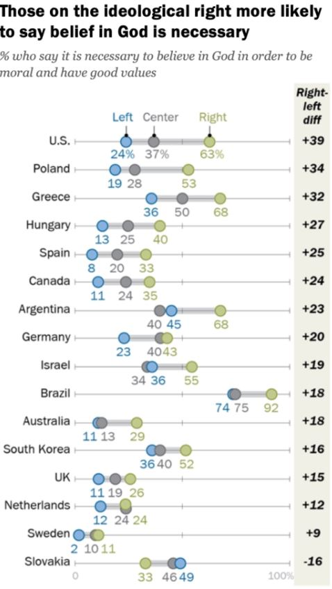
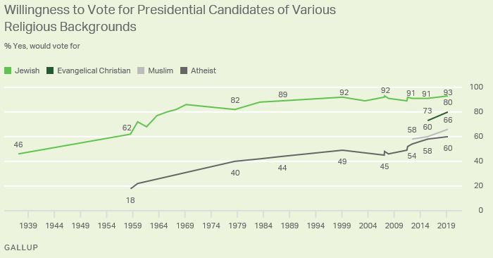
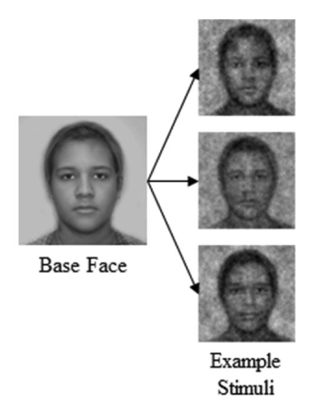
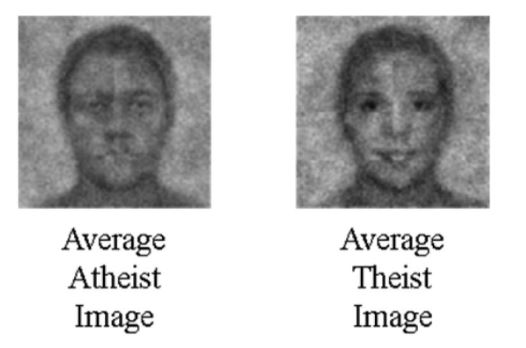
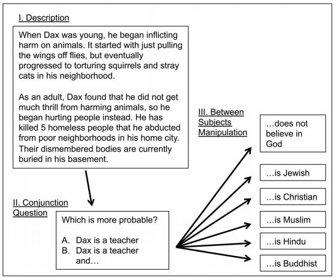
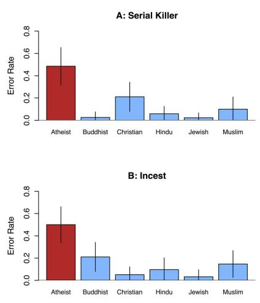
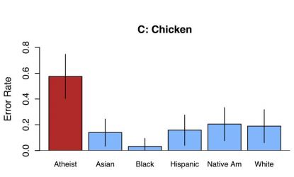

# Week 9

This week, we will be discussing religious and otherwise moral convictions and values

.highlight-gray[In week 9:]

- **What qualifies as a moral conviction or a sacred value?

- How does an attitude become a moral imperative, rather than just a convention or preference?

- **Do people perceive atheists as less moral than theists?**

- **Does religion make us more moral?**

---

Perceptions of atheists

Ways to define religion

Findings about religious beliefs 

Findings about religions and altruism 

---
# Religion and morality
.footnote[Pew Research Center (2020)]
.smaller-picture[]
---

# Religion and morality
.footnote[Pew Research Center (2020)]

.pull-left[.small-picture-two-column[]]
.pull-right[.small-picture-two-column[]]

---
# Religion and morality
.footnote[Gallup (2020)]

---

# Perceptions of atheists and theists
.footnote[Brown-Iannuzzi, McKee, & Gervais (2018)]

.pull-left[
####Image generation phase

- 800 stimuli were created by adding random noise to a base face 

- The base face was a composite of a black woman, black man, white woman, and black man

- Thus the stimuli varied on the prominence of feminine and racial features  
]
.pull-right[]

---

# Perceptions of atheists and theists
.footnote[Brown-Iannuzzi, McKee, & Gervais (2018)]

.pull-left[
#### Image generation phase
- Participants were presented with two faces at a time and asked to choose which face looks like a person who does not believe in God

- The researchers averaged the faces of the people who look like they believe in God (theists) and who do not look like they believe in God (atheists)
]

.pull-right[]

---

# Perceptions of atheists and theists
.footnote[Brown-Iannuzzi, McKee, & Gervais (2018)]

.pull-left[
#### Image rating phase

- New participants rated the composite atheist face and the composite theist face on different traits

  - Religious, trustworthy, moral, competent, warm, gentle, human, hardworking, likable, happy, attractive, gender, race
]
.pull-right[]

--

**Discussion question**

Where do you expect to see differences in ratings of the atheist face vs. the theist face? 

---

# Perceptions of atheists and theists
.footnote[Brown-Iannuzzi, McKee, & Gervais (2018)]

.smaller-picture[]

???

All differences are significant (95% CI not overlapping)

---

# The representativeness heuristic
.footnote[Kahneman (2011); Gervais (2014)]
.pull-left[
- The **representativeness heuristic** is a biased mental shortcut that occurs when one categorizes something by judging how similar 
it is to its prototype 

  - When someone is representative of a group, we assume that they must be a member 
of that group]

--

.pull-right[
.red[
**Consider the following...**   
Linda is a politically active, single, liberal woman who cares deeply about social justice. Is it more probable that Linda is: 

(a) a bank teller  
(b) a bank teller who is active in the feminist movement 
]
]

---
# The representativeness heuristic
.footnote[Kahneman (2011); Gervais (2014)]

.pull-left[
- If you chose b (a bank teller who is active in the feminist movement), then you made a **conjunction error**

- It is more probable that Linda is only a bank teller than it is that she is a bank teller AND a feminist

]

.pull-right[
.red[
**Consider the following...**   
Linda is a politically active, single, liberal woman who cares deeply about social justice. Is it more probable that Linda is: 

(a) a bank teller  
(b) a bank teller who is active in the feminist movement 
]
]

---

# The representativeness heuristic
.footnote[Kahneman (2011); Gervais (2014)]

.pull-left[
- People commit **conjunction errors** when they feel that the less probable description (e.g., a bank teller who is active in the feminist movement) is representative of group membership  

]

.pull-right[
.blue[
**Consider the following...**   
Linda is a politically active, single, liberal woman who cares deeply about social justice. Is it more probable that Linda is: 

(a) a bank teller  
(b) a bank teller and an avid hunter
]
]

---

# The representativeness heuristic
.footnote[Kahneman (2011); Gervais (2014)]

.pull-left[
- People commit **conjunction errors** when they feel that the less probable description (e.g., a bank teller who is active in the feminist movement) is representative of group membership  

- Researchers can use conjunction errors to test if people view that a description is representative of a group of people
]

.pull-right[
.blue[
**Consider the following...**   
Linda is a politically active, single, liberal woman who cares deeply about social justice. Is it more probable that Linda is: 

(a) a bank teller  
(b) a bank teller and an avid hunter
]
]

???

i.e., if you give a description of an immoral act, do people make a conjunction error because they think that immoral acts are representative of atheists?

---

# Perceptions of atheists and theists
.footnote[Gervais (2014)]

**Serial killer scenario**

.small-picture[]

???

Method of the study

---

# Perceptions of atheists and theists
.footnote[Gervais (2014)]

**Incest scenario**

> Graeme and his sister were traveling together in France. One night they
were staying alone in a cabin near the beach. They decided that it would be interesting and fun if they tried making love. At very least it would be a new experience for each of them. Graeme’s sister was already taking
birth control pills, but Graeme used a condom too, just to be safe. They both enjoyed it, but they decided not to do it again. They keep that night as a special secret between them, which makes them feel even closer to
each other.

**Chicken scenario**

> On the way home from work, Jack decided to stop at the butcher shop to
pick up something for dinner. He decided to roast a whole chicken. He
got home, unwrapped the chicken carcass, and decided to make love to it.
He used a condom, and fully sterilized the carcass when he was
finished. He then roasted the chicken and ate it for dinner alongside a
nice glass of Chardonnay.

---

# Perceptions of atheists and theists
.footnote[Gervais (2014)]

.pull-left[

]
.pull-right[

]

---

# Perceptions of atheists and theists

**Discussion questions**

1. Why do you think people perceive atheists so negatively?

2. Do you think atheists are more likely to commit crimes than theists? Do you think that theists are more charitable than atheists? 

---
# Perceptions of atheists and theists

"If there is no God, everything is permitted." - Fyodor Dostoevsky  

Without God and the future life? It means everything is
permitted now, one can do anything?
-Dostoevsky, The Brothers Karamazov

---

# 

What does it mean to be a `theist`? 