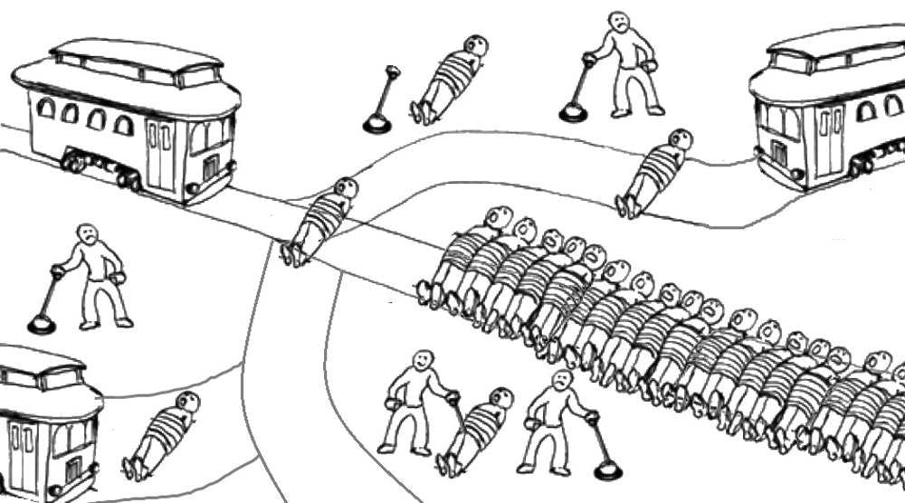

PSYXXX Moral Psychology (CRN: XXXXXX)  
Department of Psychology, University of Oregon  
Term, meeting days and times, location of course

 

You can download a copy of the syllabus <u>[here](syllabus.pdf).</u>

# Course description

From the dawn of civilization, philosophers have debated how we ought to behave. More recently, scientists have begun to systematically test how people *think* they ought to behave, and how they *actually* behave. Moral psychology is the *scientific study* of how everyday people determine right from wrong, judge each other as good or bad, punish others for wrongdoing, sacrifice their lives for a stranger, develop their moral convictions throughout their lifespan, and maintain that they are good even as they fail to live up to their own moral standards. In this course, we will explore questions like: 

- How do we come to the conclusion that a behavior is *wrong*?
- How do we determine if the stranger we just met is a good or bad person?
- Why do different groups of people come to different conclusions about what is right?
- Why are people willing to sacrifice their time, money, effort, and sometimes even their lives, to help people they have never met, or might not meet again?
- How do we lie, cheat, steal, and hurt others with a clear conscience?

This course is an introduction into moral psychology and therefore assignments do not presume prior knowledge, although prior experience reading psychology research is highly recommended. This course draws heavily from social psychology research, as most topics covered pertain to morality within social contexts, e.g., thinking about, reacting to, and judging the behavior and character of others. However, the course is interdisciplinary in nature, drawing from research in philosophy, behavioral economics, cognitive psychology, developmental psychology, neuroscience, biology, and other social science fields. 

# Learning objectives

In this course, you will be developing important skills that are transferable outside of the classroom, like introspection, critical thinking, writing, and speaking. You will be developing skills in consuming and evaluating research, collaborating with peers, and communicating scientific research. Additionally, upon completion of this course, you will be able to describe and identify important theories and research findings in moral psychology, read novel research in moral psychology from academic journals, and apply moral psychology theory and research findings to novel situations. 

# Estimated student workload

When you complete this course, you will earn **4 credits** toward your degree. Four credits is equivalent to 120 hours of work across the term, or 12 hours per week for 10 weeks. You will spend 3 hours in class per week, and the remaining 90 hours will be split evenly between readings, homework assignments, and studying for and taking quizzes and exams.

# Required readings

There is no assigned textbook for this course. PDFs of each reading are posted on the course website under the <u>[Course Schedule](schedule.html)</u>
 tab. Readings should be completed before the class date indicated on the schedule. 

# Grading {.tabset .tabset-pills}

## Grading scale

The following grid provides the letter grade associated with each percent:

|          |             |           |            |
|:---------|:------------|:----------|:-----------|
| A 93-100% |   B 83-86.99%   | C 73-76.99% | D 63-66.99% |
| A- 90-92.99% | B- 80-82.99% | C- 70-72.99% | D- 60-62.99% |
| B+ 87-89.99% | C+ 77-79.99% | D+ 67-69.99% | F 59.99% or below |

**Note**: Grade cutoffs are set so that there is no automatic “rounding up.” I may assign an “A+” if a student demonstrates outstanding understanding of the material (on assignments and in class discussions).  

 

## Graded assignments

Your course grade will be determined by the following assignments:

Assignment | Points| Percentage |
| ---: | :---: | :----: |
Midterm exam | 100 points| 25% |
Final paper | 100 points| 25% |
Homeworks (5) | 100 points | 25% |
Quiz 1 | 20 points| 5% |
Quiz 2 | 20 points| 5% |
Quiz 3 | 40 points| 10% |
Participation| 20 points| 5% |

###

# Assignments {.tabset .tabset-pills}
## Midterm

There is one, in-person exam for this course, a midterm exam, which is scheduled on **the second day of the sixth week** of the course. The exam will consist of 5 matching, 5 fill-in-the-blank, 30 multiple choice, and 4 short answer questions. You will have the entire class period to complete the exam. You can bring one 8x10 piece of paper of notes to the exam. A study guide will be posted one week prior to the exam, which will help you focus your studying.

## Term paper
Your term paper will be due during **finals week**. The recommended page count is 4-6 pages double spaced. You will choose a research question, read relevant research on the topic, and discuss how the research findings answer or fail to answer the research question. You will be working on your term paper slowly throughout the course as homework assignments. 

## Quizzes
There will be three quizzes throughout the course, each due on Canvas at **11:59pm on Sunday** the week the quiz is assigned. Quiz 1 (end of week 2) will contain material from weeks 1-2, quiz 2 (end of week 5) will contain material from weeks 3-5, and quiz 3 (end of week 10) will contain material from weeks 7-10. The quizzes will test comprehension for reading and lecture material. Since the content is somewhat cumulative, it's important that you keep up with the readings and lectures, and these quizzes are to help keep you accountable. You may use readings, notes, the internet, etc., to succeed on the quiz (but you cannot use another person). The quizzes will be timed. Quiz 1 and 2 will have 10 multiple choice questions (20 minutes, or 2 minutes per question) and quiz 3 will have 20 multiple choice questions (40 minutes, or 2 minutes per question.

## Homework
There are five structured homework assignments throughout the course, each due on Canvas at **11:59pm on Sunday** the week the homework is assigned. The assignments are designed to dive deeper into and sometimes extend what we are learning in class. Three out of the five homework assignments will guide you through choosing a research topic from your term paper, writing a draft of your term paper, and reviewing the term paper of a peer.

## Participation
Attending class, turning in your assignments on time, and actively participating in group and class discussion are incredibly important to succeed in this course, so participation has been given a part of your grade to reflect its importance.

###

# Policies {.tabset .tabset-pills}
## E-mail 
If you email me, I will get back to you within 24 hours, or 48 hours at the latest. If I do not respond to your email within 24 hours, please resend it because I may have not received it. I recommend attending my office hours (or making an appointment with me) if you have multiple questions, or you would like to brainstorm with me about an assignment, or you would like to go over a past quiz/exam.

## Late assignments
Please reach out to the instructor in advance to a deadline if you need an extension on an assignment, including a time frame for when you think you can finish the assignment by. I will not ask for a reason or a doctor’s note. The standard late penalty is 10% off of the assignment per day, although you will receive a warning about late assignments before I enforce it.

## Learning Accommodations
The University of Oregon works to create inclusive learning environments. If there are aspects of the instruction or design of this course that result in disability-related barriers to your participation, please notify me as soon as possible. If you have a documented disability, please request that a counselor at the Accessible Education Center (uoaec@uoregon.edu, 541-346-1155) send a letter verifying the type of accommodation that is appropriate. For a list of resources provided by the Accessible Education Center, please see http://aec.uoregon.edu.

## Dishonesty
Please do not be a cheater. Any form of academic dishonesty, including getting outside help on assessments and plagiarizing of any kind are not productive to your learning and therefore will not be tolerated in this class. If you have questions about what is considered academic dishonesty for this course, please reach out to the instructor and ask. Instances of suspected cheating or plagiarizing will be reported to the University, and at the very least, will earn you a zero on the assignment. Please familiarize yourself with the University of Oregon’s conduct code, found at http://conduct.uoregon.edu. You are responsible for behaving in accordance with this policy and continued enrollment in this class will be considered implicit agreement that you have read and accepted the terms of that policy. 

## Class climate
While studying moral psychology, we are bound to hear from others who do not agree with our moral values. I do not expect to agree with you on everything, and I do not expect you to agree with your classmates on everything. We are a group with diverse backgrounds and experiences. We must therefore make it a priority that everyone in this class (students and instructor) have the opportunity to offer opinions, hear one another’s opinions, and make arguments and challenge ideas. This is only possible when we respect each other. Here are a few ground rules that I propose that we follow, and I am open to discussing more:

+ Criticize ideas and not people.  Instead of “you are wrong and dumb for thinking that,” say “I don’t think that theory is supported by the research.”

+ Avoid making assumptions about others. Without complete information about other people, we try to fill in the missing information but fall short. When we sit back and listen, we learn things we do not expect.

+ Allow others to make mistakes and learn from them. Learn from each other’s mistakes. We don’t always say what we mean, and we are all learning and growing in this class.

+ Keep an open mind - don’t assume your beliefs are fully formed and that you can’t learn from others.

+ Treat others with respect, even when you disagree. Always treat others how you would like to be treated.

That being said, if you do not feel comfortable participating in a class discussion or believe there is more that I could be doing to promote a more effective learning environment, I urge you to come talk to me. I will always listen to your concerns with respect and an open mind and will make adjustments when appropriate.

###